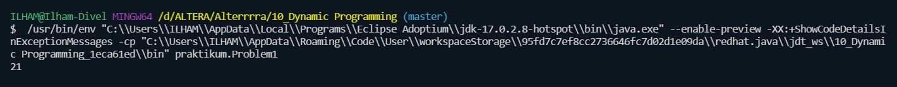
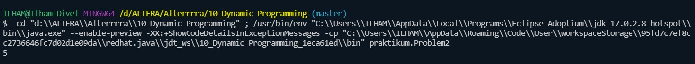
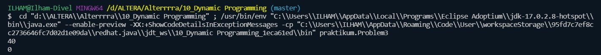
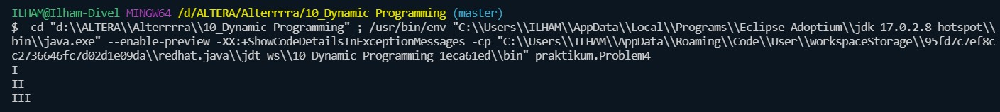

# 10_Dynamic Programming

## Resume
Dalam materi ini mempelajari:
1. Dynamic Programming
2. Top-down with Memoization
3. Bottom-up with Tabulation

### 1. Dynamic Programming
Dynamic Programming merupakan salah satu teknik perancangan algoritma yang dikembangkan untuk menyelesaikan permasalahan yang sangat kompleks dengan memecah permasalahan tersebut menjadi banyak sub-permasalahan. Perbedaan utama dari DP dengan D&C adalah DP melakukan penyimpanan hasil penyelesaian sub-masalah sehingga kita tidak perlu menyelesaikan sub-masalah yang sama berulang kali.
### 2. Top-down with Memoization
Suatu masalah dipecah menjadi submasalah, dan tiap submasalah ini dipecahkan, kemudian solusinya disimpan, jika suatu waktu diperlukan lagi. Ini adalah rekursi dan memoisasi digabungkan menjadi satu. 
### 3. Bottom-up with Tabulation
Semua submasalah yang mungkin diperlukan diselesaikan terlebih dahulu lalu digunakan untuk membangun solusi untuk masalah yang lebih besar. Pendekatan ini sedikit lebih baik dalam penyimpanan stack dan jumlah pemanggilan fungsi, namun kadang tidak intuitif untuk memperkirakan semua submasalah yang diperlukan untuk menyelesaikan masalah.

## Task

### Task 1
Pada task pertama ini saya disuruh membuat kembali program fibonacci tetapi menggunakan method Top-down dari alogoritma dynamic programming.

Source code dari program ini [task1](./praktikum/Problem1.java)

Output dari program ini

### Task 2
Pada task kedua ini saya disuruh membuat kembali program fibonacci tetapi menggunakan method Bottom-up dari alogoritma dynamic programming.

Source code dari program ini [task2](./praktikum/Problem2.java)

Output dari program ini

### Task 3
Pada task ketiga ini terdapat n stones dan tiap stones memiliki height (h). Terdapat frog yang berada di stone pertama. Dia bisa lompat ke stone i+1 atau i+2. Saya disuruh membuat program untuk menentukan minimum total cost yang mungkin sebelum frog mencapai stone n.

Source code dari program ini [task3](./praktikum/Problem3.java)

Output dari program ini

### Task 4
Pada task keempat ini saya disuruh membuat program untuk mengkonversi angka normal ke angka romawi.

Source code dari program ini [task4](./praktikum/Problem4.java)

Output dari program ini
