# 11&12_OOP

## Resume
Dalam task ini mempelajari:
1. Encapsulation
2. Inheritance
3. Polymorphism

### 1. Encapsulation
Membuat sebuah objek tersembunyi dari akses luar, dengan cara memberi modifier private pada field atau attributnya.

### 2. Inheritance
Inhiritance merupakan kemampuan untuk menurunkan sebuah class ke class lain. Class parent bisa memiliki banuak child sedangkan class child hanya bisa memiliki satu class parent.

### 3. Polymorphism
Dalam bahasa yunani artinya banyak bentuk. Jadi merupakan kemampuan sebuah objek berubah bentuk menjadi bentuk lain.

## Task

### Task 1
Pada task pertama ini saya disuruh membuat 4 class, dan terapkan konsep OOP Encapsulation.

Source code dari program ini : [Task1](./praktikum/Encapsulation/Application)

Ouput dari class Cat:
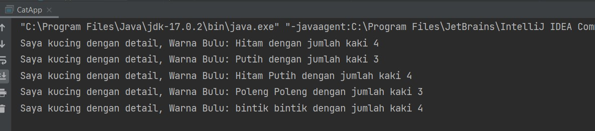

Ouput dari class Fish:
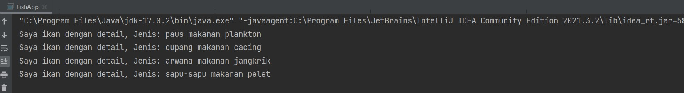

Ouput dari class Flower:
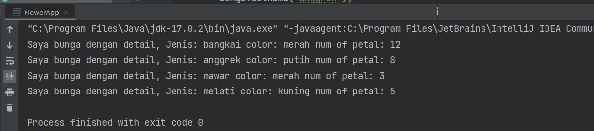

Ouput dari class Car:
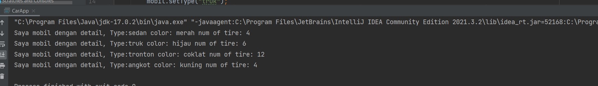

### Task 2
Pada task kedua ini saya disuruh membuat program kalkulator dan terapkan konsep OOP Data Abstraction.

Source code dari program ini : [Task2](./praktikum/Abstraction)

Output dari program ini :
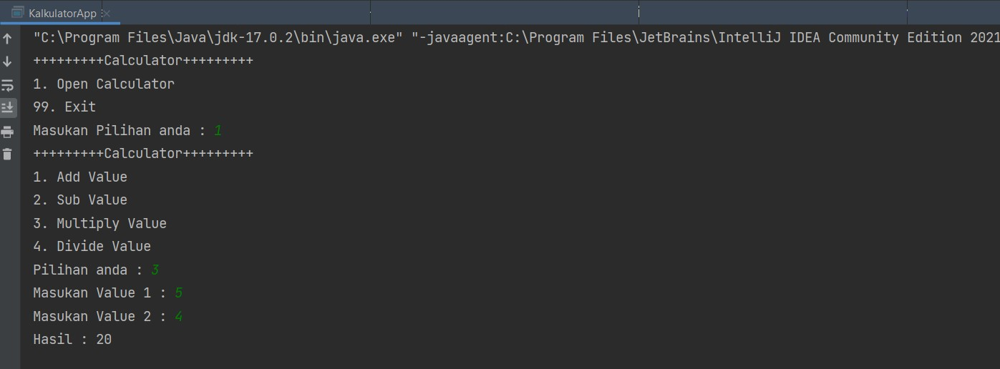

### Task 3
Pada task ketiga ini saya disuruh membuat program Vehicles dengan menerapkan konsep OOP Inheritance dan Polymorphism.

Source code dari program ini : [Task3](./praktikum/Vehicles)

Output dari program ini :
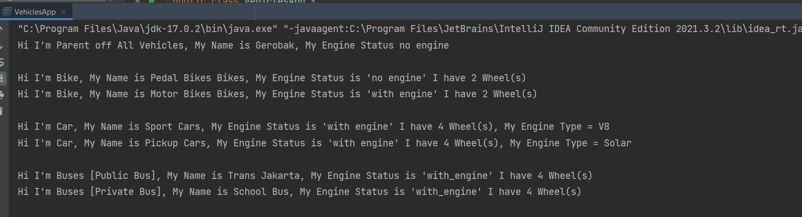

### Task 4
Pada task keempat ini saya disuruh membuat program Animals dengan menerapkan konsep OOP Inheritance dan Polymorphism.

Source code dari program ini : [Task4](./praktikum/Animals)

Output dari program ini :
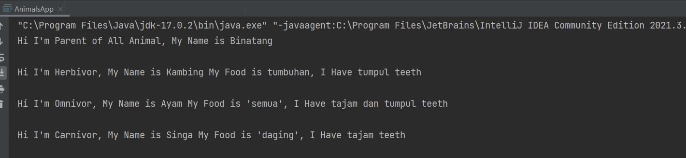

### Task 5
Pada task kelima ini saya disuruh membuat program tebakKandang. Tebak Kandang merupakan game untuk menebak isi dari kumpulan kandang. Pertama kita disuruh menentukan jumlah kumpulan kandang. Kondisi awal semua kandang tetutup, kita dusuruh menebak kandang nomor berapa berisi hewan apa. Jika tebakan benar, maka kandang akan terbuka dan menampilkan isi hewan. Apabila salah kandang akan menutup kembali. Permainan akan berakhir apabila kita sudah menebak dengan benar semua kandang.

Source code dari program ini : [Task5](./praktikum/TebakKandang)

Output dari program ini :

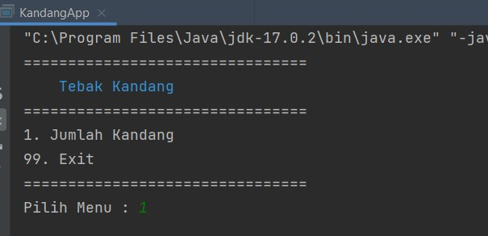

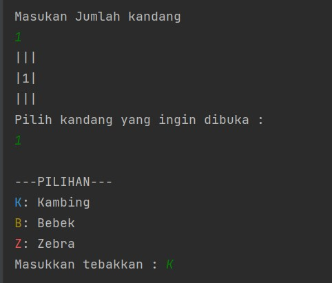

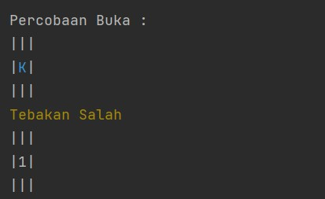

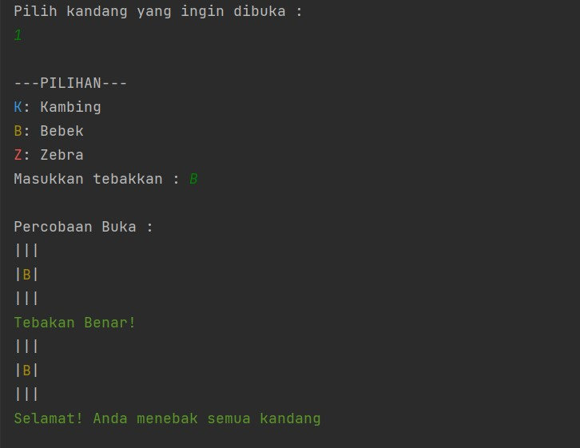

