# 13_Database Schema, DDL, DML

## Resume
Dalam materi ini mempelajari:
1. Database Schema
2. DDL
3. DML

### 1. Database Schema
Database Schema adalah suatu dokument cetak biru berupa design atau rancagan suatu database. Dalam pengembangan software yang dilakukan secara team suatu document yang dibagaikan pada rekan se-team sangata lah penting. Bertujuan untuk mengurangi miskomunikasi dan menudahkan anggota team yang lain untuk melihat racangan database tanpa harus membuka DBMS.

### 2. DDL
DDL adalah salah satu bentuk SQL yang bisa digunakan untuk menciptakan atau membuat database, tabel, struktur tabel, merubah struktur database, menghapus tabel, menghapus database serta membuat relasi antar tabel. Oleh sebab itu, DDL ini mempunyai sejumlah perintah dasar yang terdiri atas Create, Alter serta Drop.

### 3. DML
DML adalah adalah bahasa komputer yang merupakan perintah untuk membantu pengguna memanipulasi data dalam database. Manipulasi ini dilakukan dengan memasukkan data ke dalam tabel database, mengambil data yang ada, kemudian menghapus data dari tabel yang ada, dan memodifikasi data yang ada. DML sebagian besar tergabung dalam SQL database. Kemampuan fungsional DML diatur dalam perintah manipulasi seperti SELECT, UPDATE, INSERT INTO dan DELETE FROM,

## Task

### Task 1
Pada task pertama ini saya disuruh membuat schema database dari contoh kasus yang telah disesdiakan oleh alta.id

Link draw.io : [Link Draw.io](./praktikum/Link%20Schema.txt)

Gambar Schema database

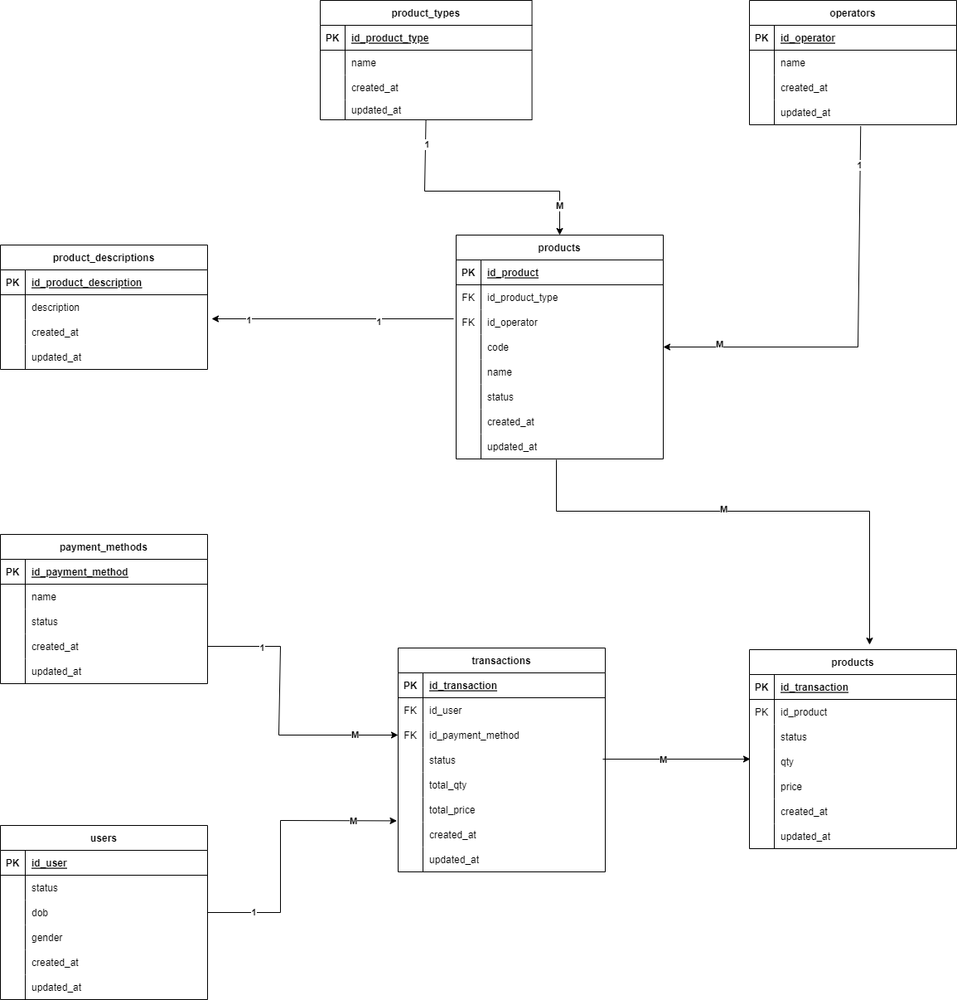

### Task 2
Pada task kedua ini saya disuruh mengimplementasikan schema yang telah dibuat menjadi tabel di mySQL.

Syntax mySQL : [mySQL](./praktikum/alta_online_shop.sql)

1. Create database alta_online_shop

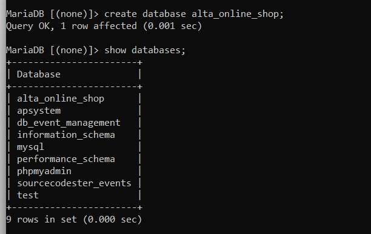

2. Create tabel user

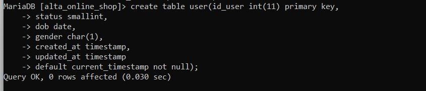

3. Create tabel products

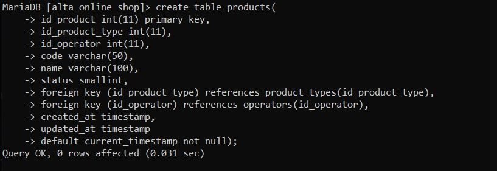

4. Create tabel products_type

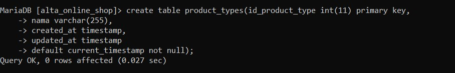

5. Create tabel operators

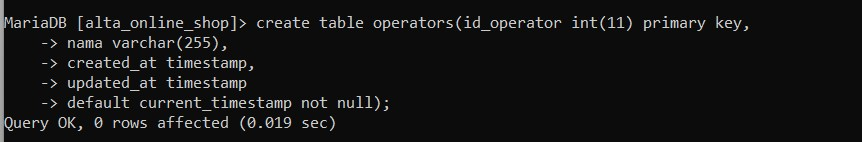

6. Create tabel product_descriptions

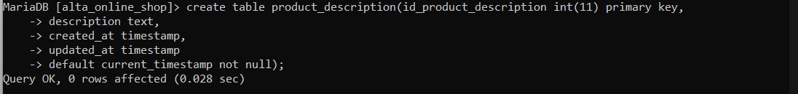

7. Create tabel payment_method

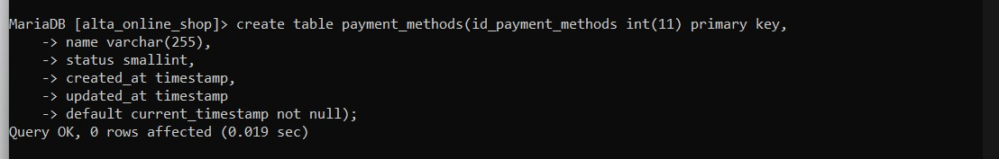

8. Create tabel transactions

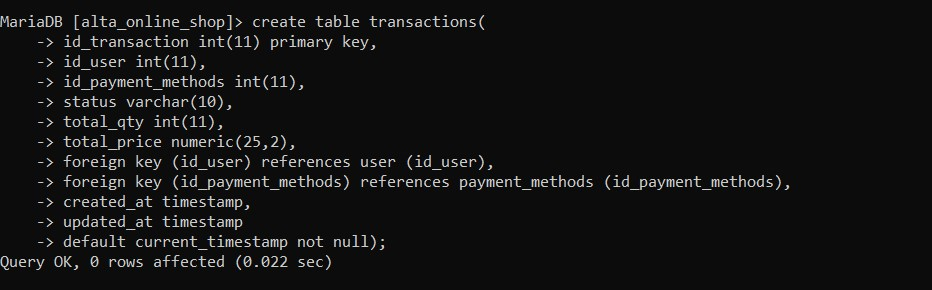

9. Create tabel transactions_detail

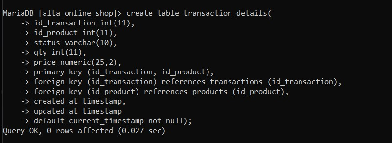

10. Create tabel kurir

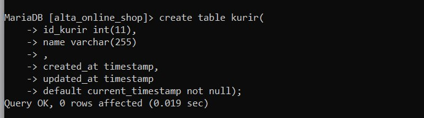

11. Tambahkan Column

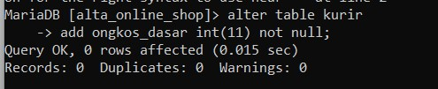

12. Rename tabel kurir to shipping

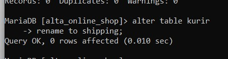

13. Drop tabel shipping

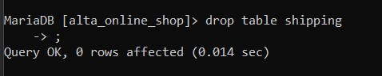

