# 14_Join, Union, Agregasi, Subquery, Function (DBMS)

## Resume
Dalam materi ini mempelajari:
1. Subquery
2. Union
3. Agregasi

### 1. Subquery
Subquery adalah ekspresi kueri yang terdapat di dalam tanda kurung. Subquery dapat digunakan dengan pernyataan SELECT, INSERT, UPDATE, atau DELETE. Subquery MySQL disebut queri dalam, sedangkan queri yang berisi subquery disebut queri luar.

### 2. Union
Union digunakan untuk menggabungkan 2 buah tabel atau lebih ke dalam sebuah hasil.
Sebagai contoh untuk menampilkan nama Dosen dan nama Mahasiswa ke dalam satu tabel maka kita dapat menggabungkan tabel dosen dan tabel mahasiswa menggunakan union operator

### 3. Agregasi
Agregasi adalah salah satu perintah yang bisa digunakan untuk melakukan penghitungan menjadi sebuah nilai dari beberapa nilai input. Aggregate dapat digabungkan dengan sebuah parameter seperti WHERE untuk menghasilkan suatu hasil yang lebih kompleks lagi.

## Task

Syntax MySQL bisa dilihat di : [source](./praktikum/alta_online_shop.sql)

### Task 1
1. Insert 5 operator pada tabel operator

   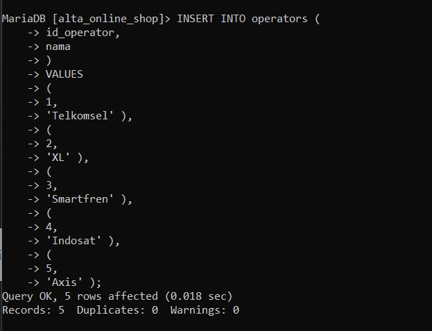

2. Insert 3 Product Type

   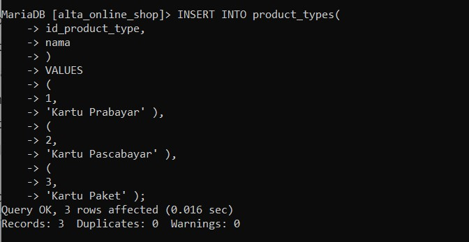

3. Insert 2 Product dengan product type id = 1 dan operator id = 3
4. Insert 3 Product dengan product type id = 2 dan operator id = 1
5. Insert 3 Product dengan product type id = 3 dan operator id = 4

   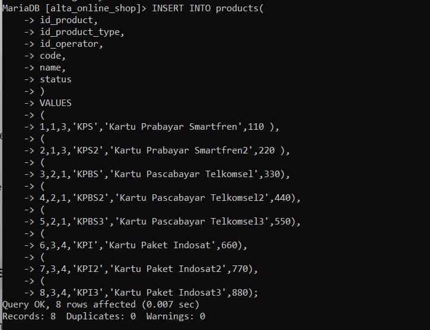

6. Insert product description pada setiap produk

   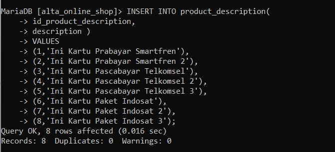

7. Insert 3 payment methods

   

8. Insert 5 user pada tabel user

   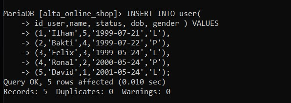

9. Insert 3 transaksi di masing masing user

    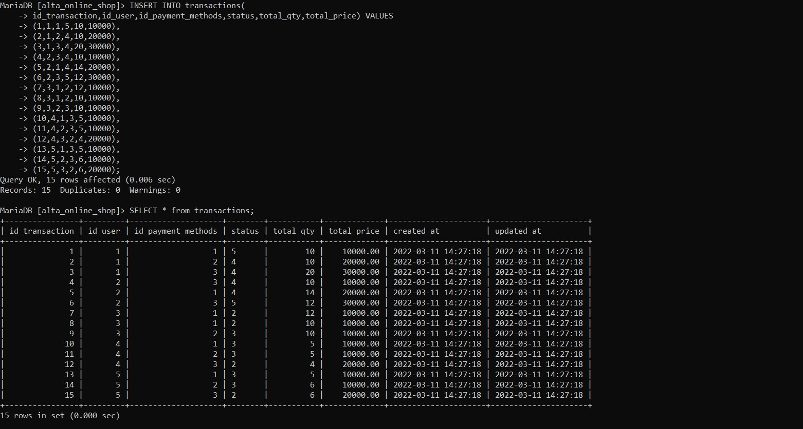

10. Insert 3 product di masing masing transaksi

    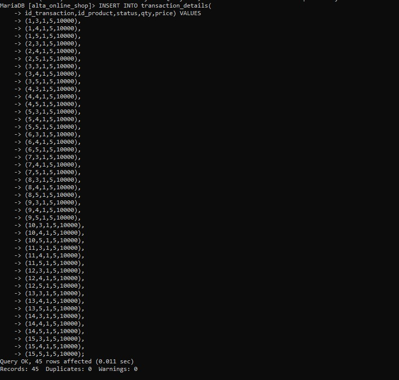

### Task 2

1. Tampilkan nama user dengan gender laki-laki

   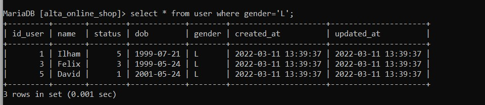

2. Tampilkan product dengan id = 3

   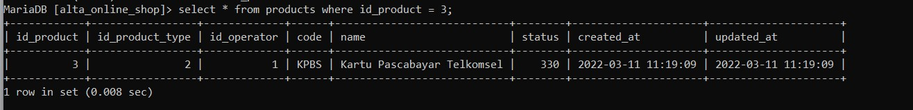

3. Tampilkan data user yang created_at dalam range 7 hari kebelakang dan nama mengandung kata 'a'

   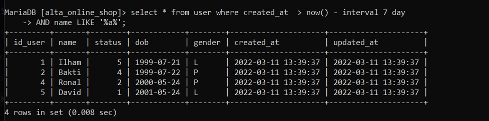

4. Hitung jumlah user dengan gender perempuan

   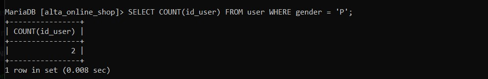

5. Tampilkan nama user sesuai abjad

   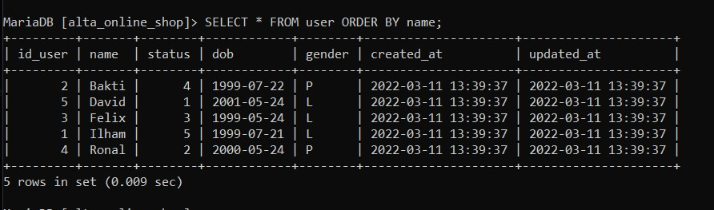

6. Tampilkan 5 data pada tabel products

   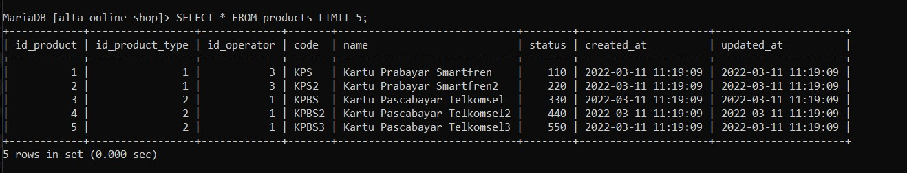

### Task 3

1. Ubah data product id 1 dengan nama 'product dummy'

   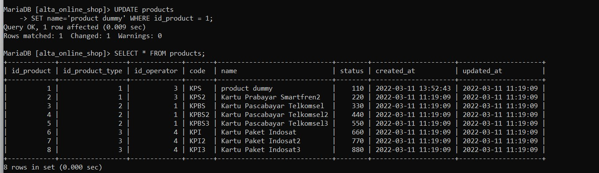

2. Ubah qty = 3 pada transaction detail dengan product id = 1

   

### Task 4

1. Delete data pada tabel product dengan id = 1
2. Delete data pada tabel product dengan product type id 1

   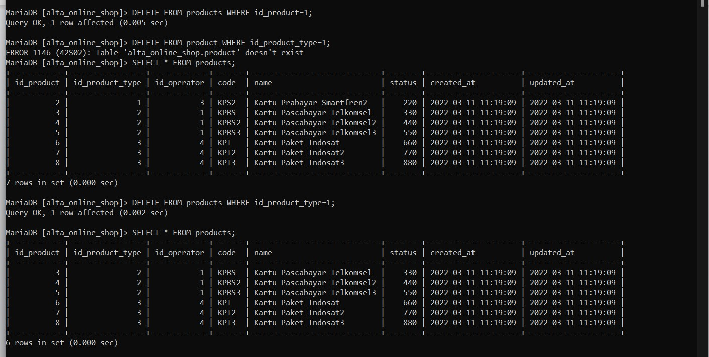

### Task 5

1. Gabungkan data transaksi dari user id 1 dengan user id 2

   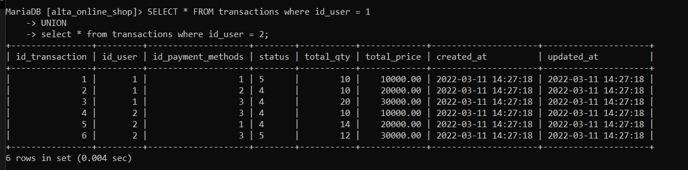

2. Tampilkan jumlah harga transaksi user id 1

   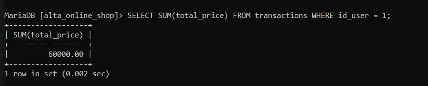

3. Tampilkan total transaksi dengan product type 2

   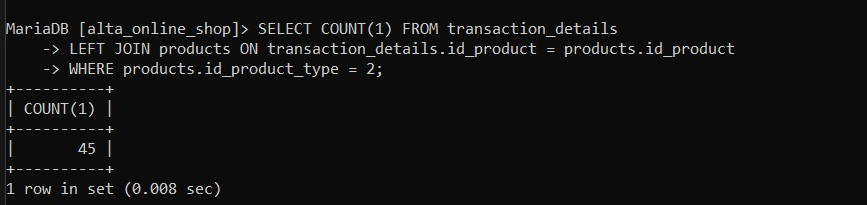

4. Tampilkan semua field tabel product dan field name tabel product type yang saling berhubungan

   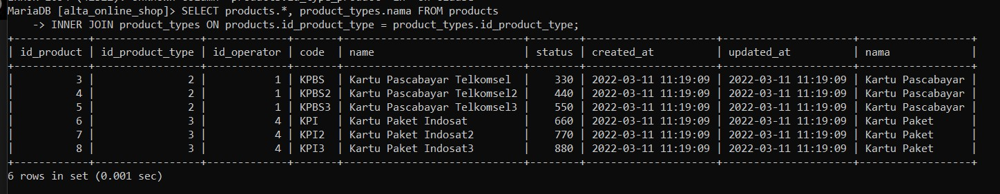

5. Tampilkan semua field tabel transaction, field name tabel product dan field name tabel user

   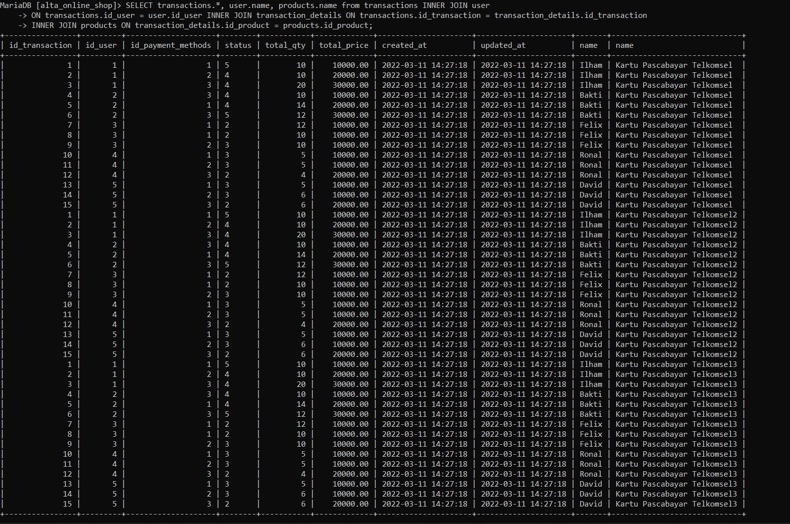

6. Buat function setelah data transaksi dihapus maka transaction detail terhapus juga dengan transaction id yang dimaksud

   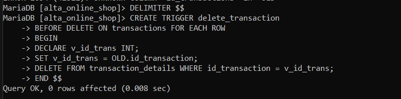

7. Buat function setelah data transaksi detail dihapus maka data total qty terupdate berdasarkan qty data transaction id yang dihapus

   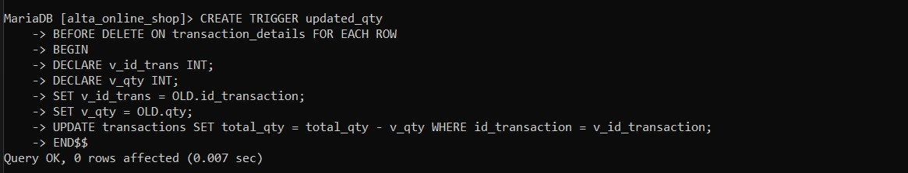

8. Tampilkan data products yang tidak pernah ada di tabel transaction_details dengan sub-query

   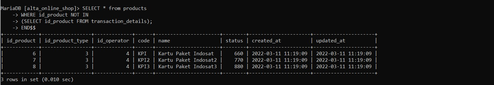

