# 16_Introduction NoSQL & MongoDB 1

## Resume
Dalam materi ini mempelajari :
1. MongoDB
2. Apa itu Document Oriented Database
3. Collection

### 1. MongoDB
MongoDB merupakan free dan opensource database management system. Dikembangkan oleh perusahaan bernama 10gen tahun 2007. MongoDB tidak menggunakan SQL, namun menggunakan JavaScript sebagai bahasa utama untuk manipulasi document

### 2. Apa itu Document Oriented Database
Document oriented database merupakan sistem database yang digunakan untuk memanipulasi data dalam bentuk document (semi structured data). Document oriented database biasanya menyimpan data dalam bentuk JSON atau XML, dan menyimpan relasinya sebagai embedded object di dalam document yang sama.

### 3. Collection
Collection adalah tempat menyimpan document. Maximum per document yang bisa disimpan adalah 16MB. Maximum level nested document yang bisa disimpan adalah 100 level 

## Task

Semua Collection bisa dilihat di [collection](./praktikum/Collections)

### Task 1
Create All Collections
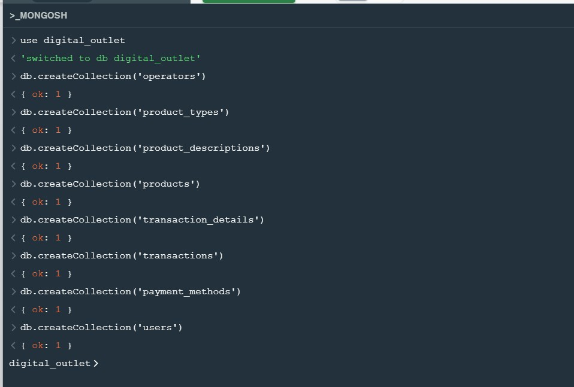

Insert 5 operator pada tabel operator

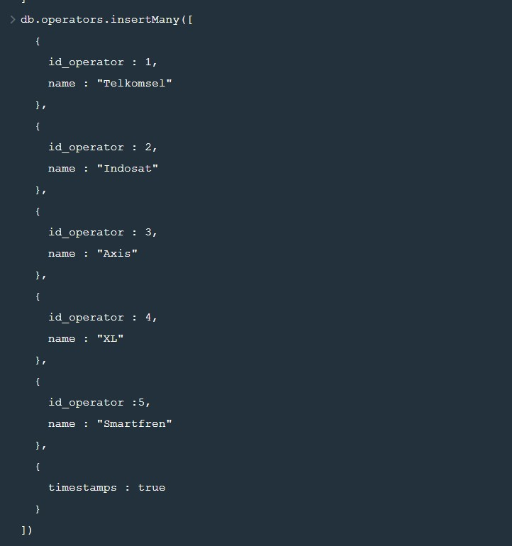

Insert 3 Product Type

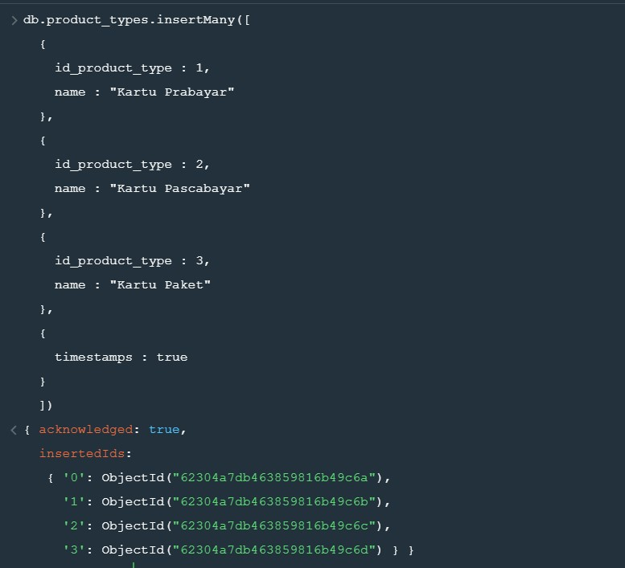

Insert 2 Product dengan product type id = 1 dan operator id = 3

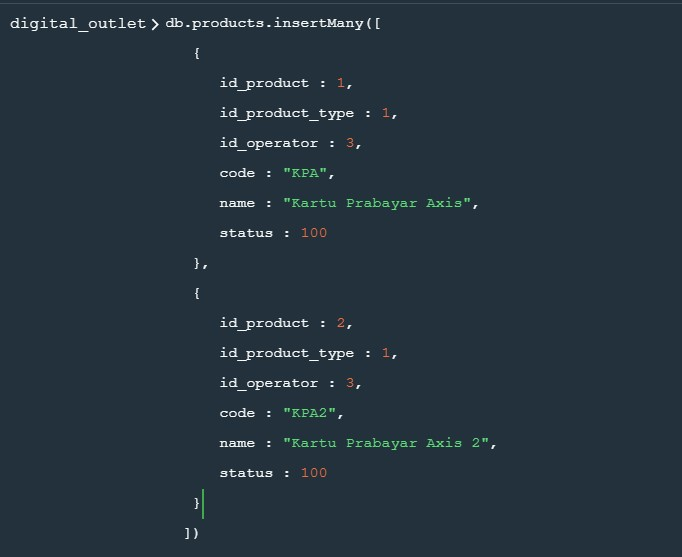

Insert 3 Product dengan product type id = 2 dan operator id = 1

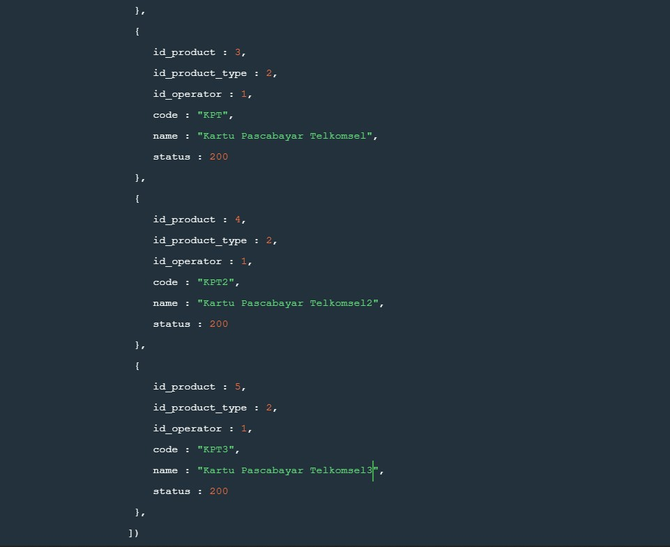

Insert 3 Product dengan product type id = 3 dan operator id = 4

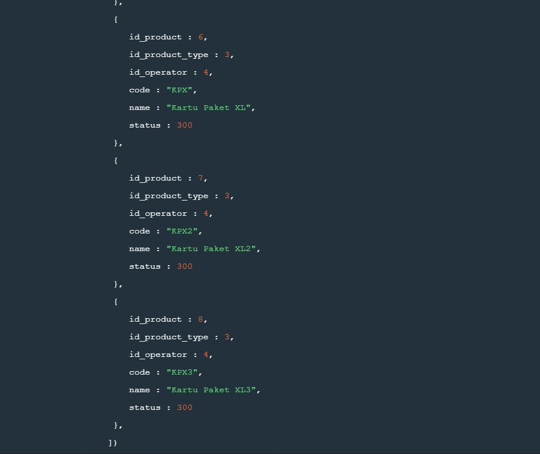

Insert product description pada setiap produk

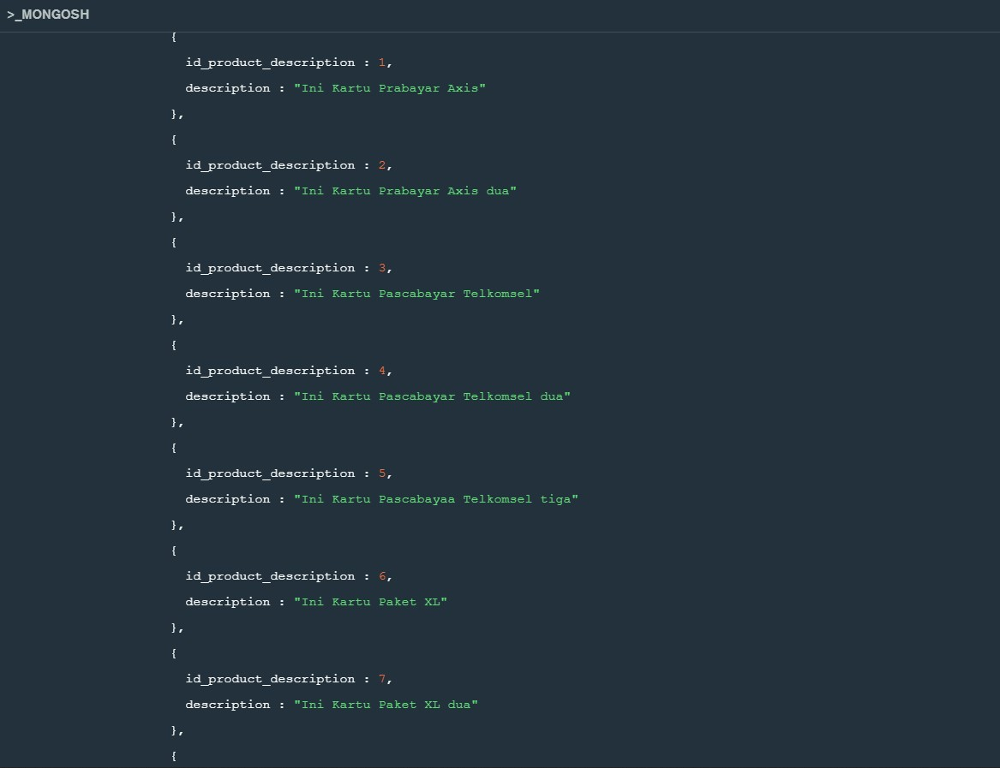

Insert 3 payment methods

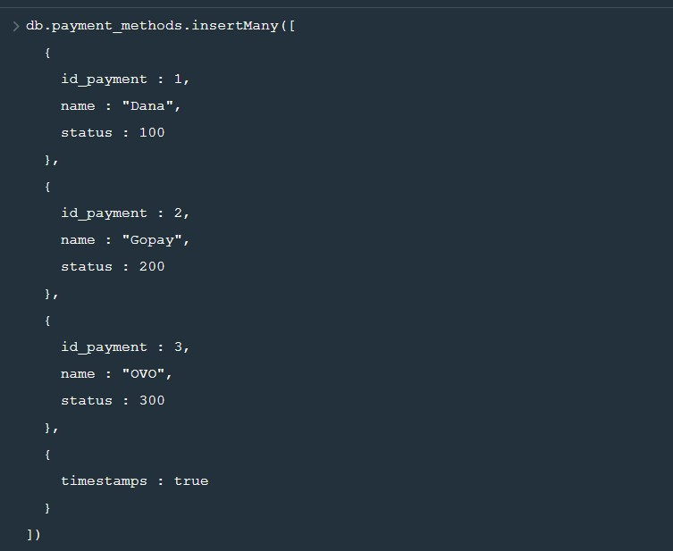

Insert 5 user pada tabel user

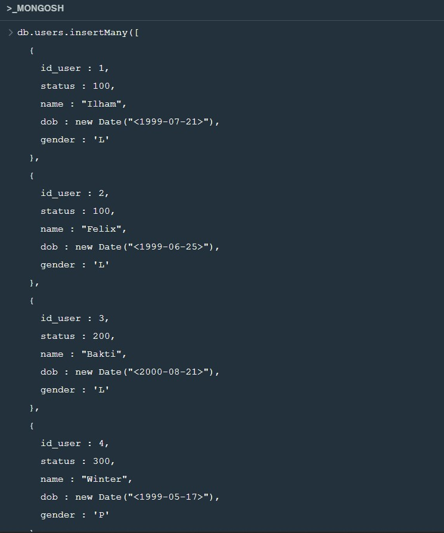

Insert 3 transaksi di masing masing user

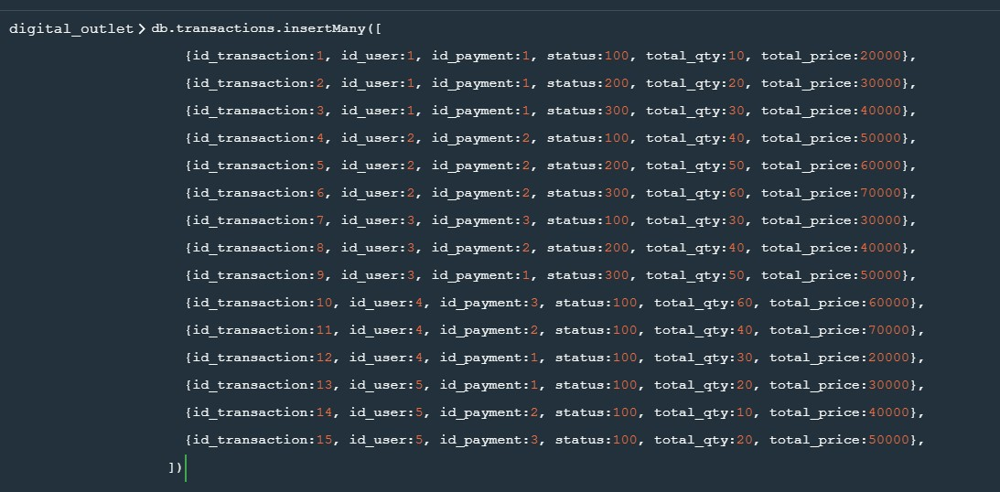

Insert 3 product di masing masing transaksi

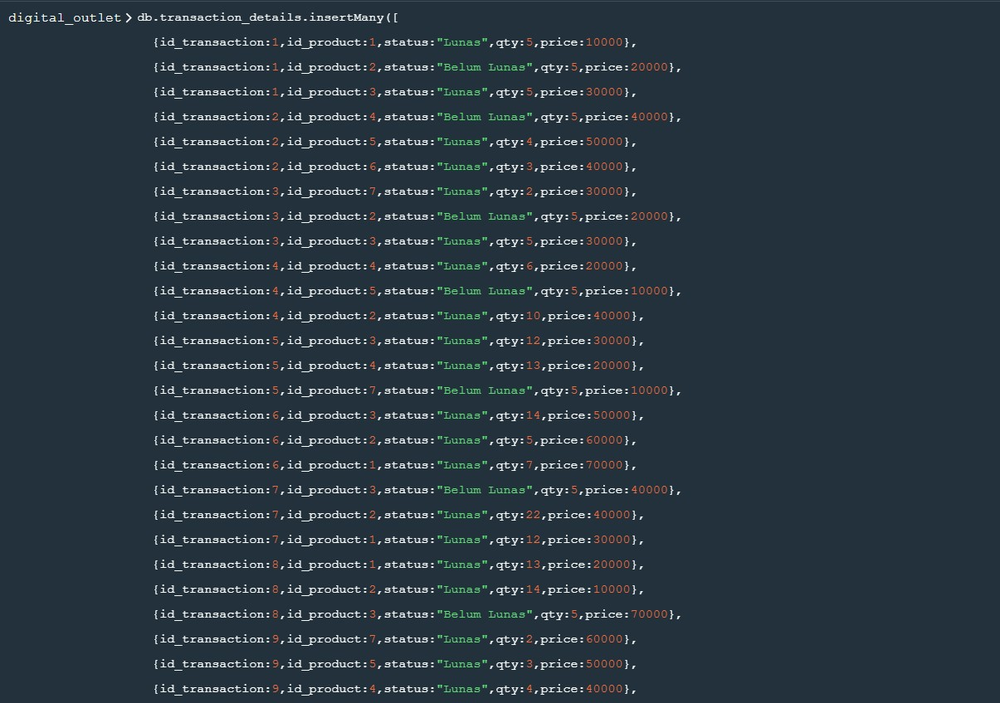

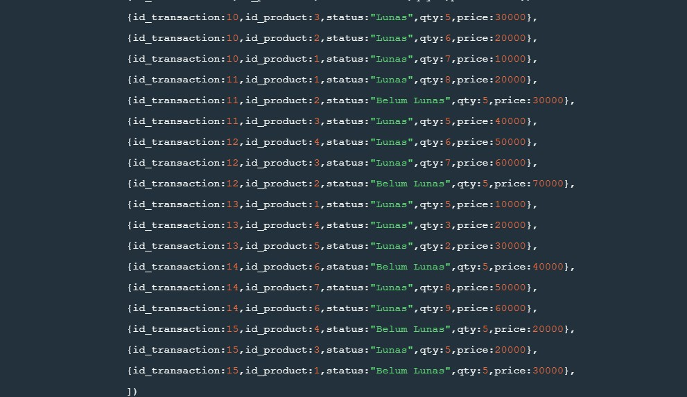

### Task 2

Tampilkan nama user dengan gender laki-laki

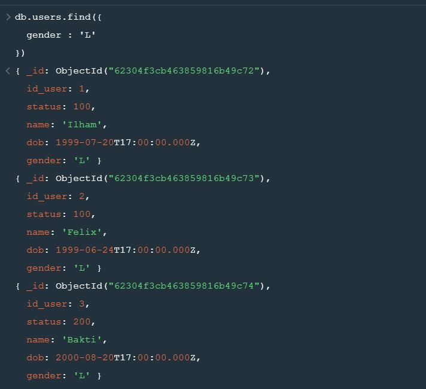

Tampilkan product dengan id = 3

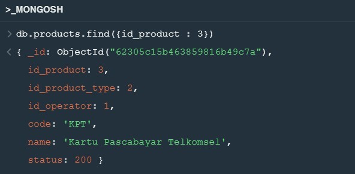

Hitung jumlah user dengan gender perempuan

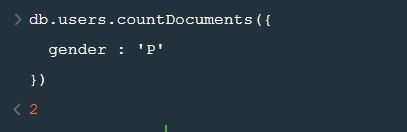

Tampilkan nama user sesuai abjad

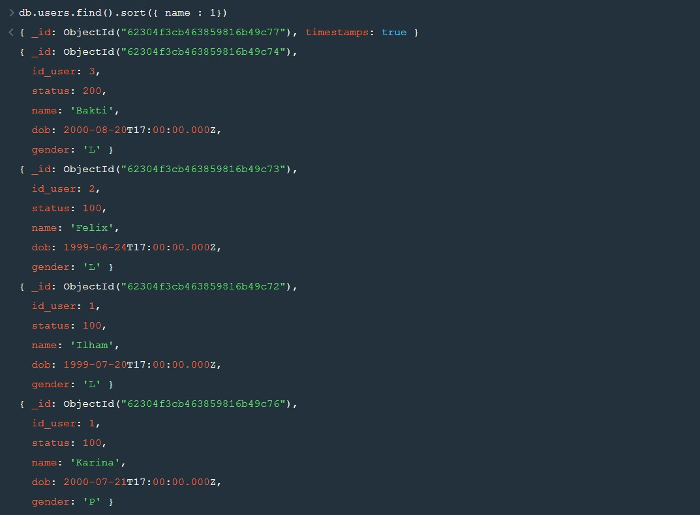

Tampilkan 5 data pada tabel products

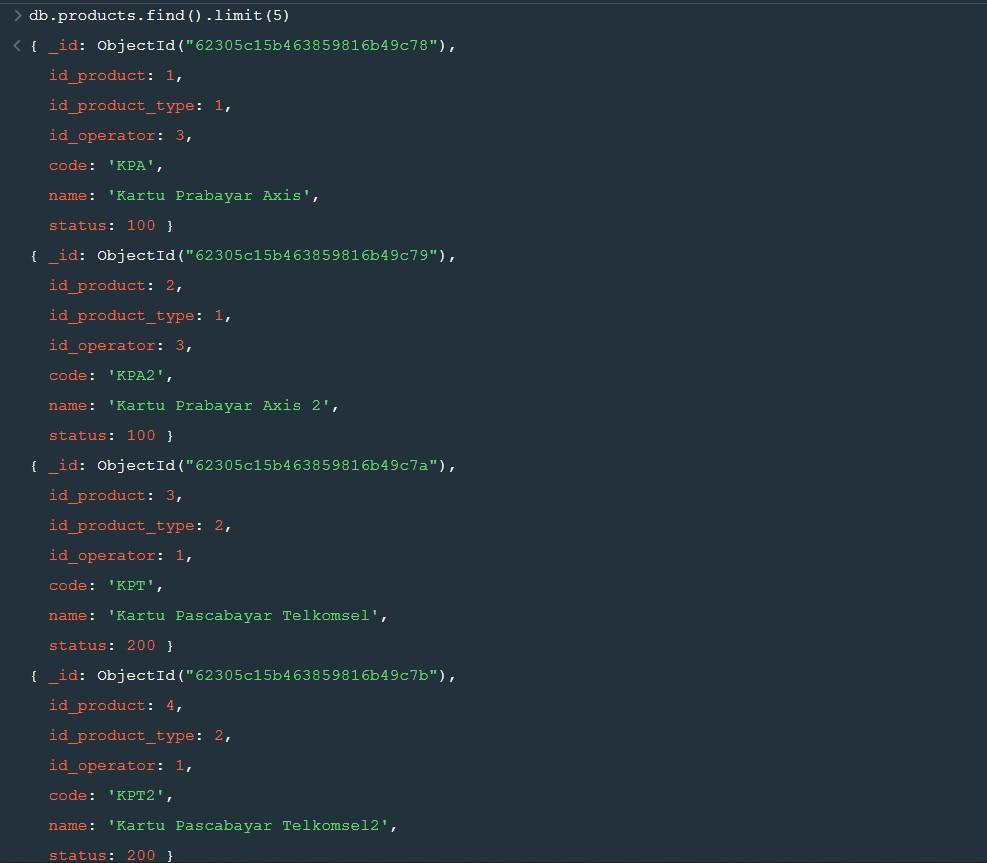

### Task 3

Ubah data product id 1 dengan nama 'product dummy'

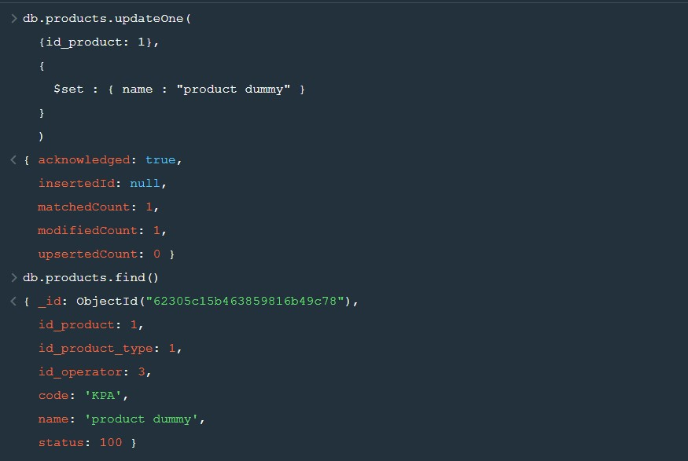

Ubah qty = 3 pada transaction detail dengan product id = 1

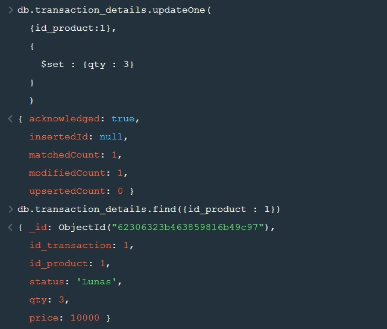

### Task 4

Delete data pada tabel product dengan id = 1

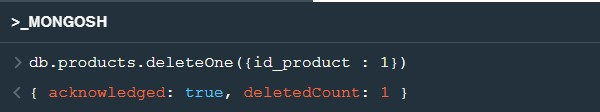

Delete data pada tabel product dengan product type id 1

