# 17_Introduction NoSQL & MongoDB 2

## Resume
Dalam materi ini mempelajari :
1. Projection Operator
2. Query Modifier
3. Aggregation

### 1. Projection Operator
Pada function find, terdapat parameter kedua setelah query, yaitu projection. Projection adalah memilih field mana yang ingin kita ambil atau hide. db.<collection>.find(query, projection)

### 2. Query Modifier
Query Modifier adalah memodifikasi hasil query yang telah kita lakukan. Untuk memodifikasi hasil query, kita bisa menambahkan function query modifier setelah menggunakan function find

### 3. Aggregation
MongoDB memiliki konsep aggregation yang bisa digunakan sebagai pengganti join namun terbatas untuk document, bukan collection. Aggregation adalah sebuah operasi dimana value dari berbagai document di kelompokan menjadi satu untuk selanjutnya diproses agar mendapatkan hasil yang diinginkan.

## Task

Semua Collection bisa dilihat di [collection](./praktikum/Collections)

### Task 1
Create All Collections

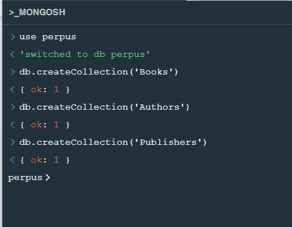

Insert Document ke Collection Books

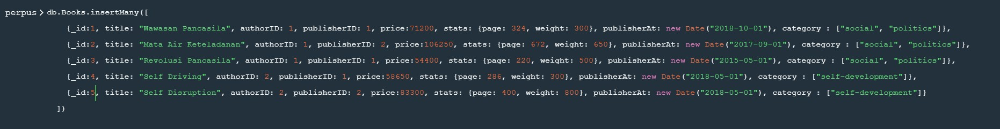

Insert Document ke Collection Authors

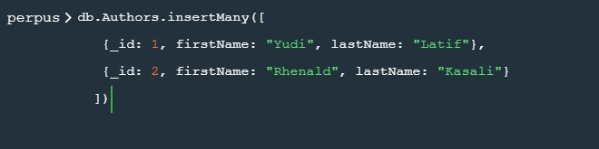

Insert Document ke Collection Publishers

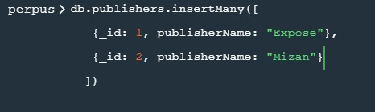

Tampilkan data buku dari author id 1 dan author id 2

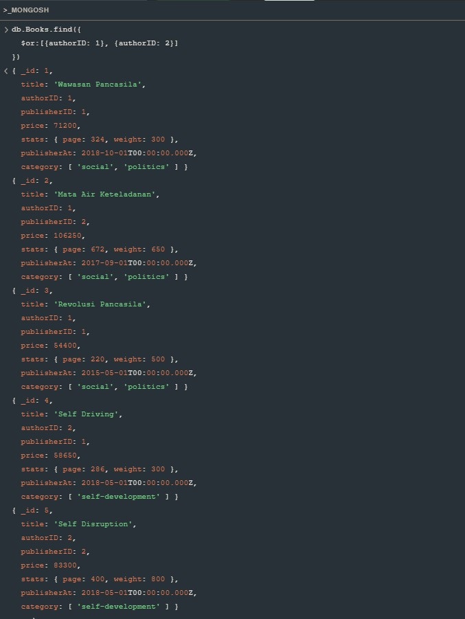

Tampilkan data buku dan harga author id 1

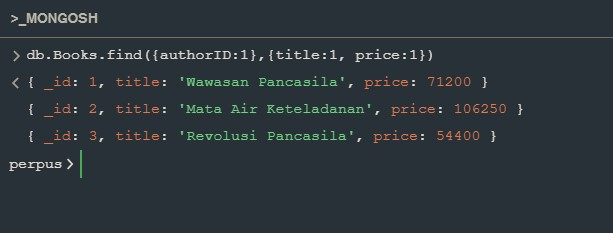

Tampilkan total jumlah halaman buku author id 2

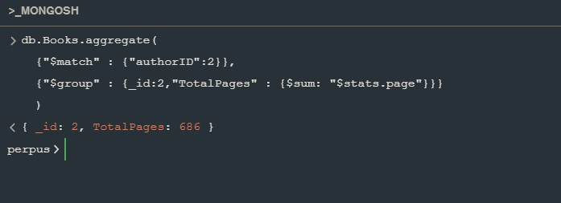

Tampilkan semua field books dan authors terakit

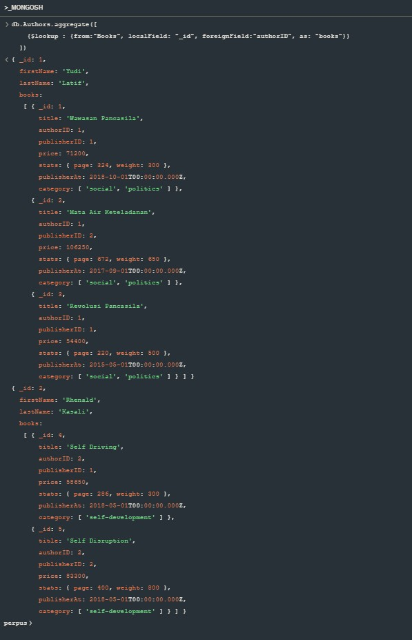

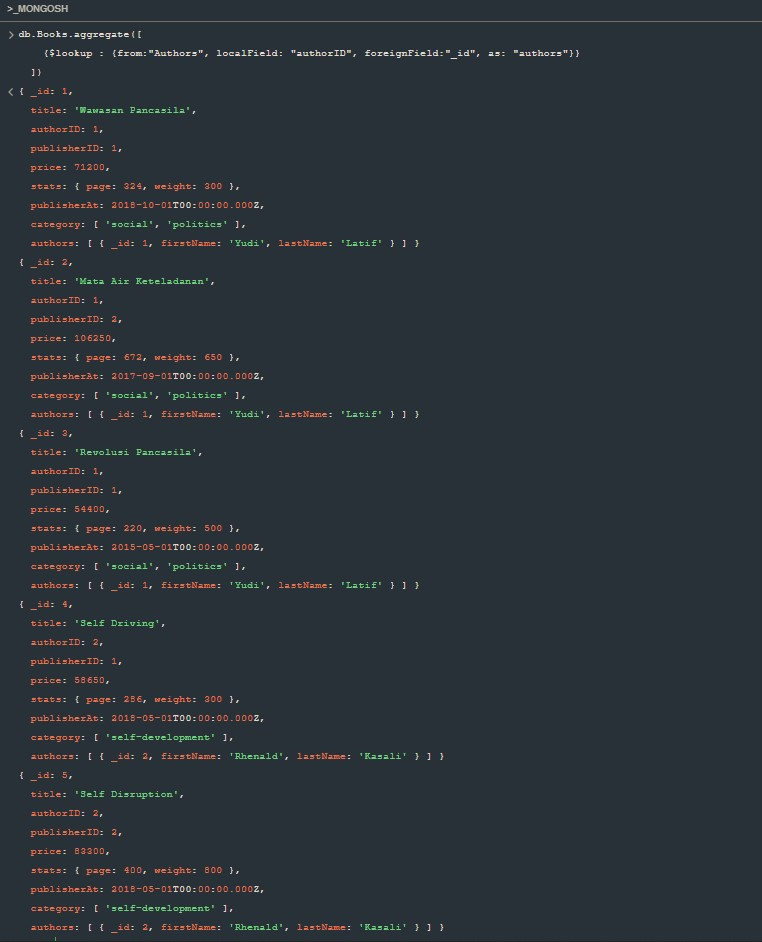

Tampilkan semua field books, authors dan publishers terakit

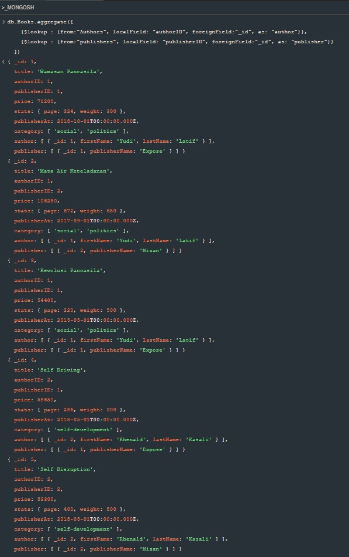

Tampilkan summary data authors, books dan publishers sesuai dengan Output

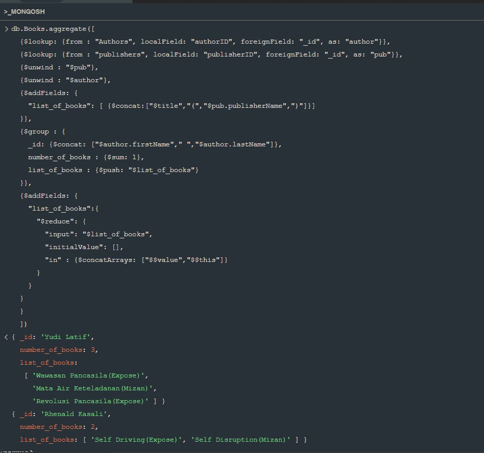

Digital_outlet ingin memberikan diskon untuk setiap buku,
price < 60.000 = 1 %,
60.000 < price < 90.000 = 2 %,
90.000 < price = 3 %,

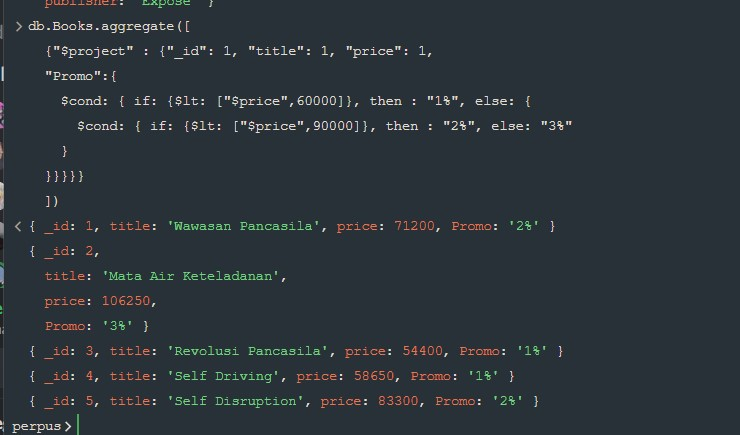

Tampilkan semua nama buku, harga, nama author dan nama publisher, urutkan dari harga termahal ke termurah.

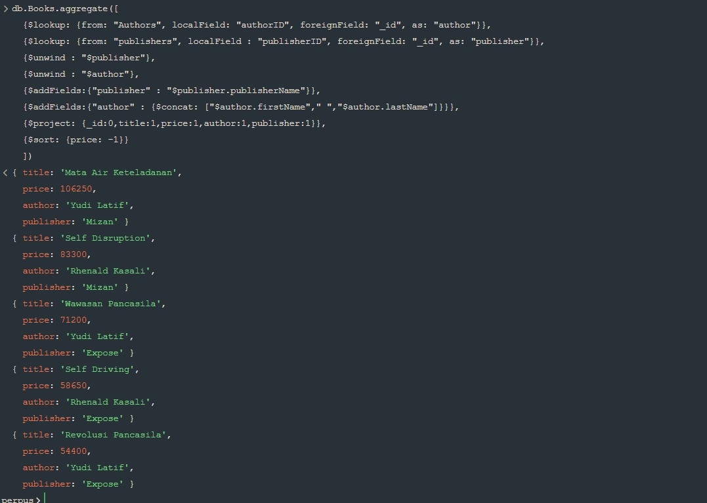

Tampilkan data nama buku harga dan publisher kemudia tampilkan hanya data ke 3 dan ke 4

