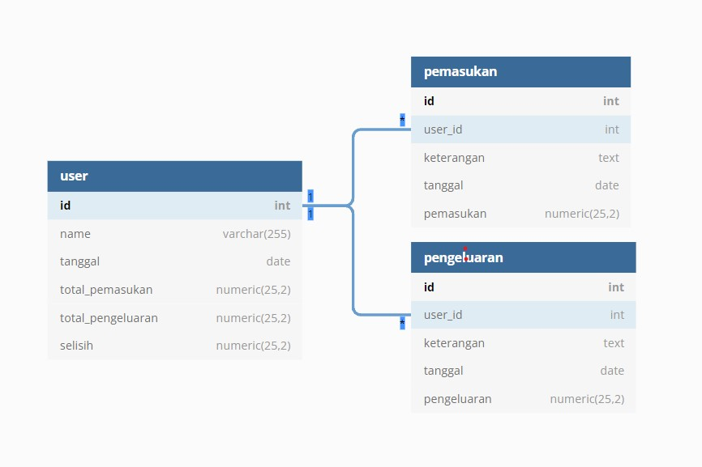
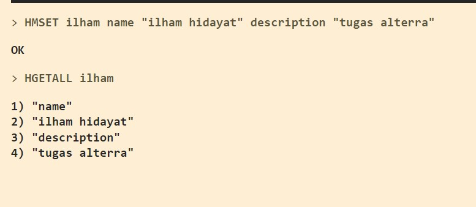
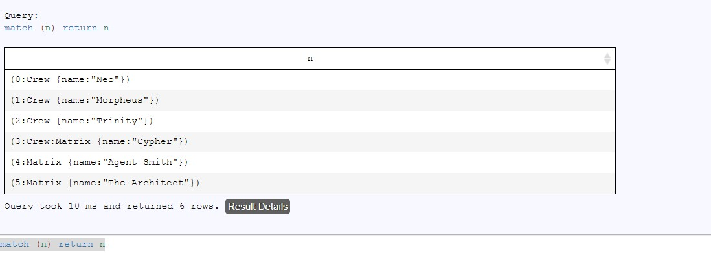
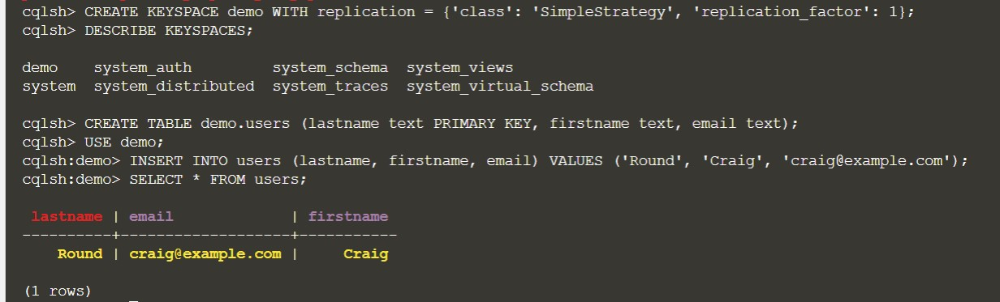

# 18_System Design

## Resume
Dalam materi ini mempelajari:
1. Diagram
2. Use Case Diagram
3. Entity Relationship Diagram

### 1. Diagram

Diagram dapat diartikan sebagai gambar sederhana yang menggunakan garis dan simbol untuk menggambarkan struktur dari obyek tertentu secara garis besar. Diagram juga merupakan lambang-lambang tertentu yang dapat digunakan untuk menjelaskan sarana, prosedur, serta kegiatan yang biasa dilaksanakan dalam suatu sistem.

### 2. Use Case Diagram

Use case diagram adalah satu dari berbagai jenis diagram UML (Unified Modelling Language) yang menggambarkan hubungan interaksi antara sistem dan aktor. Use Case dapat mendeskripsikan tipe interaksi antara si pengguna sistem dengan sistemnya.

### 3. Entity Relationship Diagram

ERD (Entity Relationship Diagram) atau diagram hubungan entitas adalah sebuah diagram yang digunakan untuk perancangan suatu database dan menunjukan relasi atau hubungan antar objek atau entitas beserta atribut-atributnya secara detail. Dengan menggunakan ERD, sistem database yang sedang dibentuk dapat digambarkan dengan lebih terstruktur dan terlihat rapi.

## Task

Link Design ERD dan Use Case : [link](./praktikum/Link%20diagram.txt)

### Task 1

Akan dikembangkan sistem yang dapat mencatat pengeluaran seseorang dalam jangka waktu harian.

Buatlah design ERD dari persoalan diatas

Gambarkan Use Case diagram dari persoalan diatas

### Task 2

Terdapat sebuah query dalam format SQL

SELECT * FROM users;

Dengan tujuan sama, tuliskan dalam bentuk perintah

Redis

Neo4J

Cassandra

