# 19_Configuration Management and CLI

## Resume
Dalam materi ini mempelajari:
1. Command Line Interface
2. Shell
3. Bash

### 1. Command Line Interface

CLI adalah akronim dari Command Line Interface. Dengan program ini, user bisa mengetikkan perintah dalam bentuk teks dan memberikan instruksi pada komputer untuk mengerjakan tugas tertentu. Saat ini penerapan CLI (command line interface) di komputer personal sudah sangat jarang. Alasannya karena banyak pengguna yang memilih untuk menggunakan GUI (graphic user interface) sebagai penghubung ia dengan sistem komputer.
    
### 2. Shell

Shell default di Windows adalah CMD dengan ekstensi exe atau Command Prompt. Bahkan, Microsoft sudah menggunakan Command Prompt sejak awal (saat itu MS-DOS masih menjadi sistem operasi utama). Command Prompt juga cukup serbaguna karena bisa mengelola banyak hal di sistem operasi Windows seperti Mengubah direktori, mencantumkan direktori, konten, dll

### 3. Bash

Bash atau Bourne Again Shell adalah tipe shell yang digunakan di distribusi Linux, dan dikembangkan oleh Free Software Foundation. Untuk menggunakannya, kita harus tahu sintaksisnya lebih dulu. Cara ini juga dikenal sebagai shell scripting, yaitu penggunaan script di CLI untuk menjalankan task tertentu.

## Task

### Task 1

Pada task pertama ini kita disuruh untuk menginstal oh-my-zsh, sesuai instruksi pada link berikut [Link](https://dev.to/vsalbuq/how-to-install-oh-my-zsh-on-windows-10-home-edition-49g2)

1. Activate "Windows for Linux Subsystem" Feature

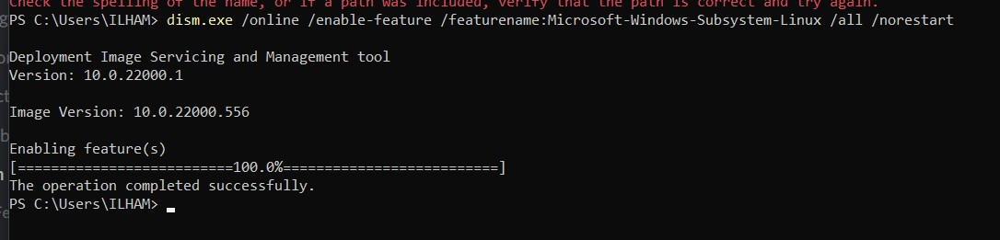

2. Install a Linux Distribution ( Debian )

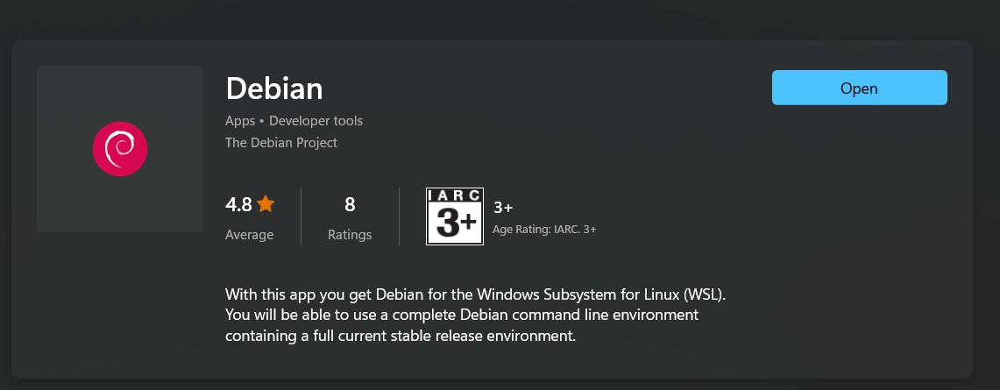

3. Install Zsh

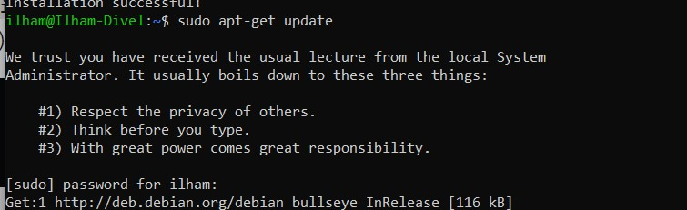

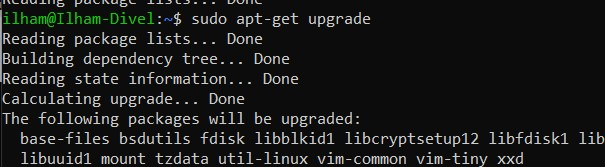

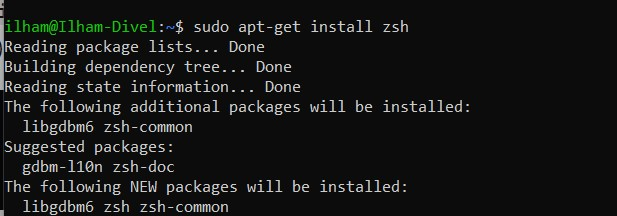

4. Install Oh My Zsh!

Install curl

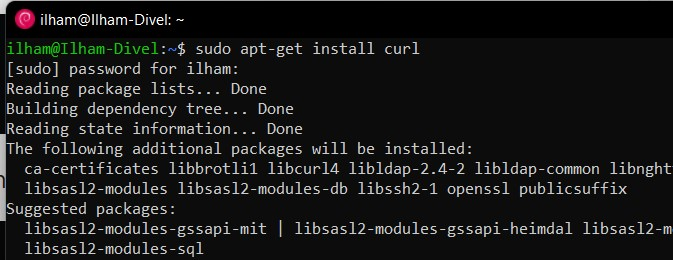

Install Oh My Zsh!:

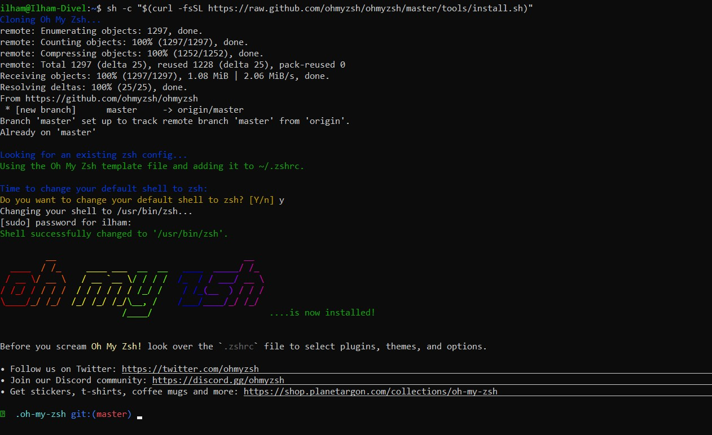

5. Set the theme Spaceship Prompt as default for Oh My Zsh!

Clone git

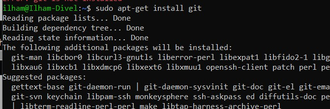

- Clone the theme's repository

- Symlink spaceship.zsh-theme to your oh-my-zsh custom themes directory

- Add this line at the end of your .zshrc file:

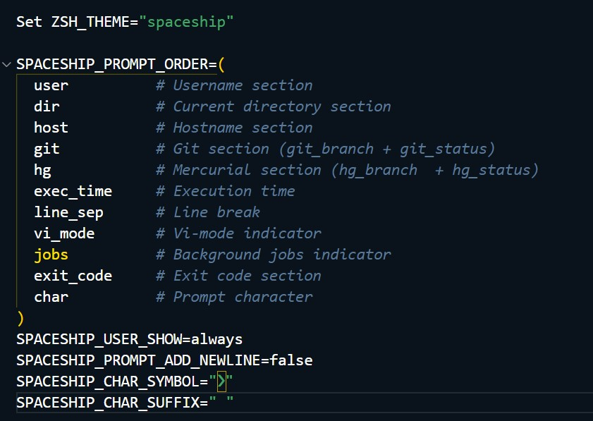

6. Install Hyper Terminal

Edit Preferences (CTRL + ,)

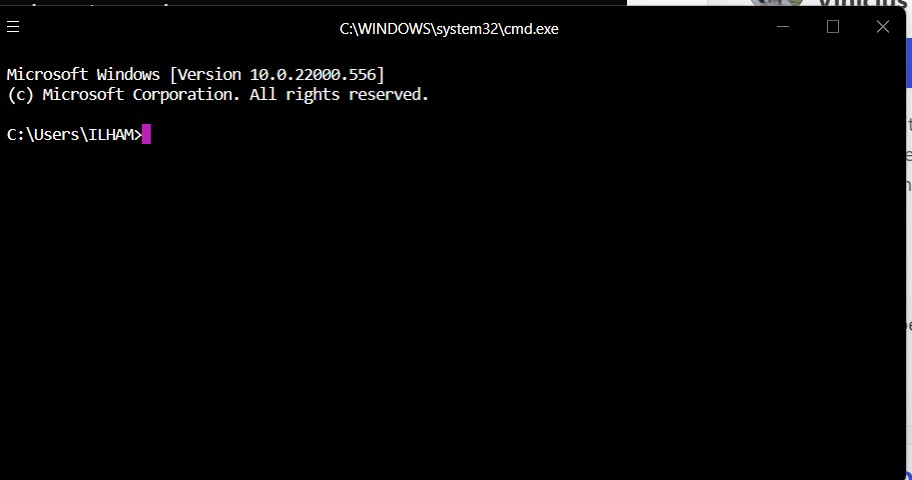

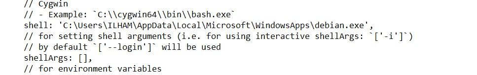

7. Add plugins to your terminal

Fetch and run zinit script:

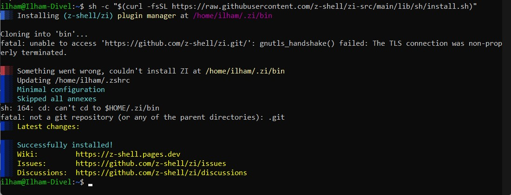

- Open zsh configuration file again:

- Add this line at the end of your .zshrc file:

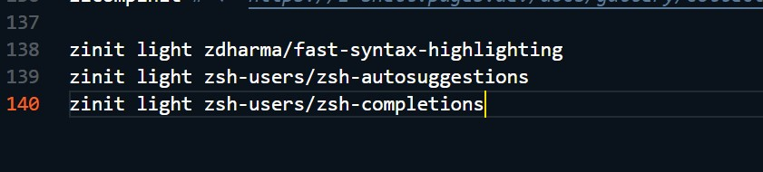

8. Set up Visual Studio Code shell integration

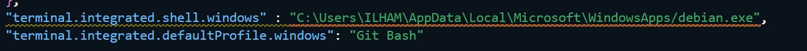

9. Don't Forget to set up Node

We need to install the basic build tools for node-gyp.

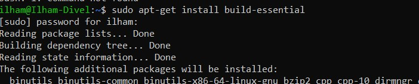

Then you'll have to download and run the script for installing NVM

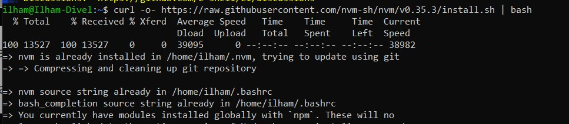

Paste this code at the end of the file:

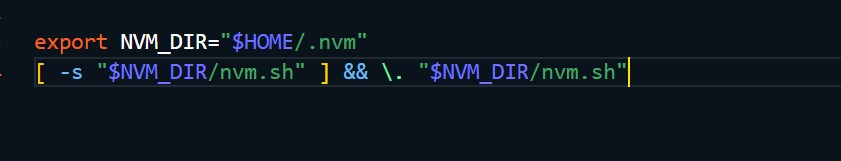

- Now, finally, we're ready to install node's lastest LTS version:

- Set this version as the version nvm should use as standard

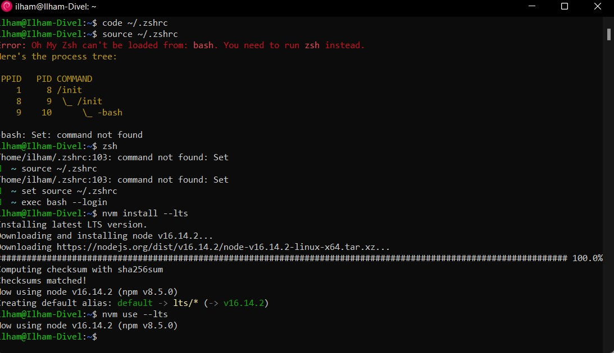

### Task 2
Pada task kedua ini kita disuruh membuat Automation Script, sesuai instruksi pada link berikut [Link](https://gist.github.com/tegarimansyah/e91f335753ab2c7fb12815779677e914)

Struktur folder dan File Script bisa dilihat di [Task](./praktikum)

Perintah ketika menjalankan script

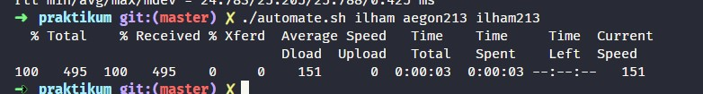

Struktur Folder

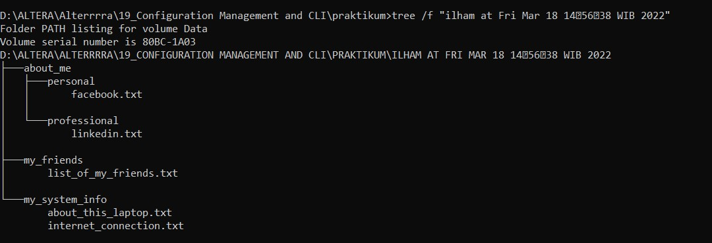

