# 20_Intro Rest API

## Resume
Dalam materi ini mempelajari:
1. Application Programming Interface
2. RESTful API
3. Kenapa RESTful API?

### 1. Application Programming Interface

API singkatan dari Application Programming Interface. API adalah perantara yang menghubungkan satu pihak dengan pihak lain agar bisa saling berkomunikasi. API berisi kumpulan prosedur, fungsi, cara berkomunikasi atau peralatan untuk komunikasi. Pihak yang terlibat dalam API bisa dalam bentuk perangkat lunak ataupun perangkat keras. 

### 2. RESTful API

REST singkatan dari REpresentational State Transfer. RESTful API merupakan salah satu implementasi API yang memanfaatkan HTTP sebagai protokol komunikasinya. RESTful API sangat mudah digunakan, dan bisa diadaptasi di semua bahasa pemrograman secara mudah. Saat ini RESTful API sudah menjadi standard API yang banyak digunakan ketika kita membuat sistem yang butuh menyediakan API untuk pihak lain. 

### 3. Kenapa RESTful API?

Menggunakan HTTP sebagai protokol komunikasi, dimana sudah sangat populer saat ini dengan banyaknya pengguna Internet. Pembuatan RESTful API sangat mudah karena seperti membuat web pada umumnya. Mudah digunakan oleh client baik itu berupa aplikasi web ataupun aplikasi non web seperti aplikasi desktop atau aplikasi mobile. Ringan dan mudah dimengerti oleh manusia

## Task

Semua collection dari postman bisa dilihat di: [postman](./praktikum)

### Task 1
Buat sebuah collection dan lakukan request terhadap api yang ada di API Documentation menggunakan postman. Lakukan request terhadap 3 target api berikut:

1. https://newsapi.org/

Lakukan request terhadap API minimal 5 API

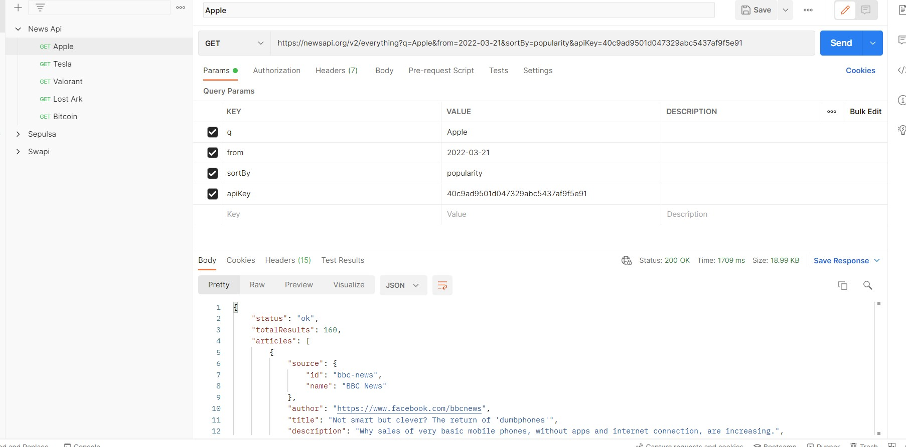

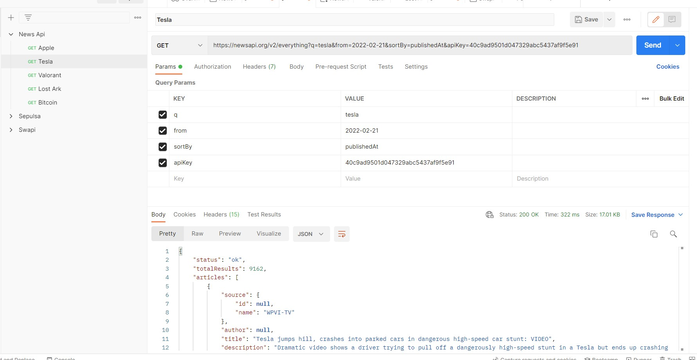

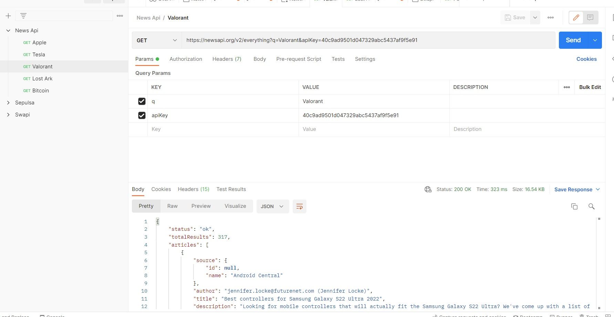

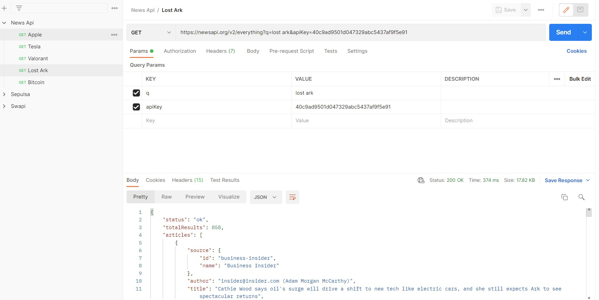

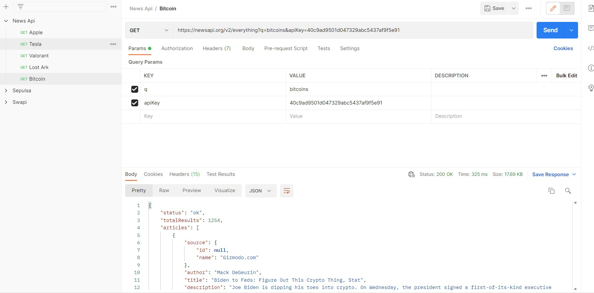

2. https://swapi.dev/

Lakukan request terhadap API minimal 5 API

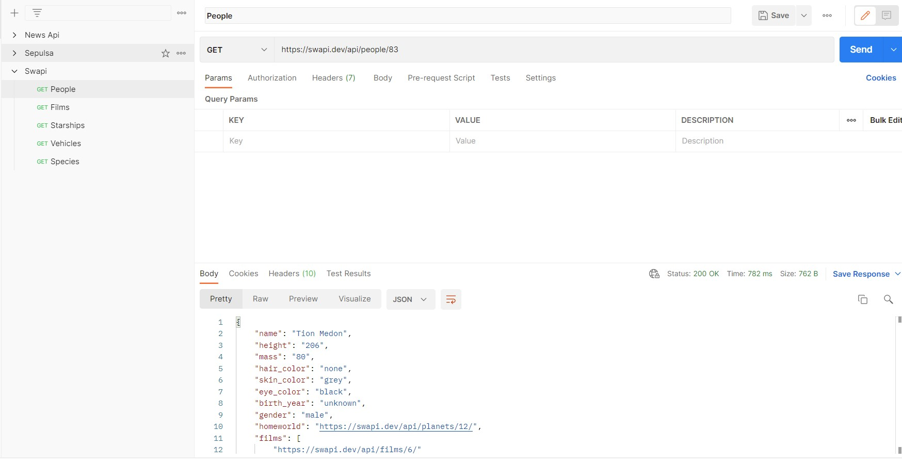

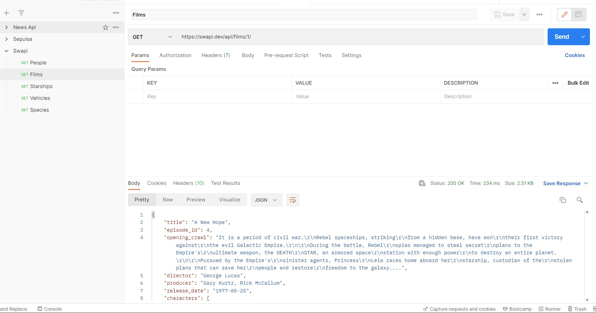

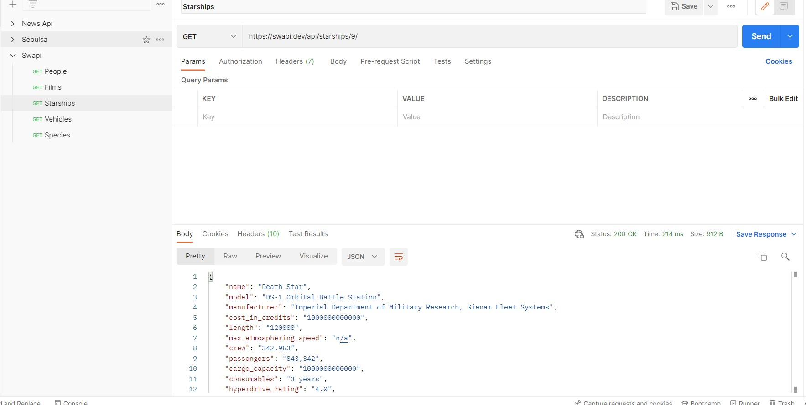

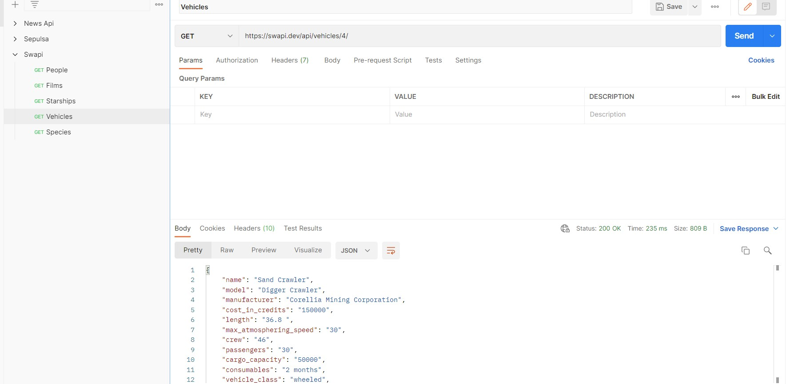

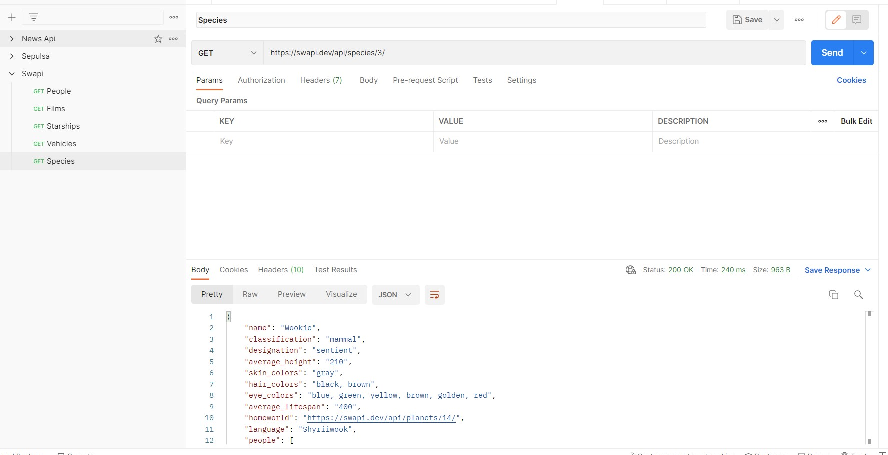

3. https://app.swaggerhub.com/apis-docs/sepulsa/RentABook-API/1.0.0

Lakukan request terhadap API dengan mengimplementasikan 4 Method GET, POST, PUT, DELETE

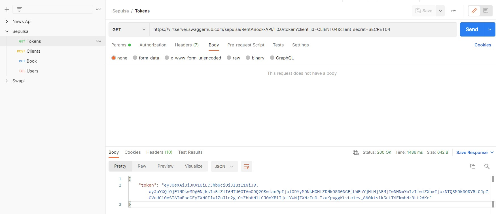

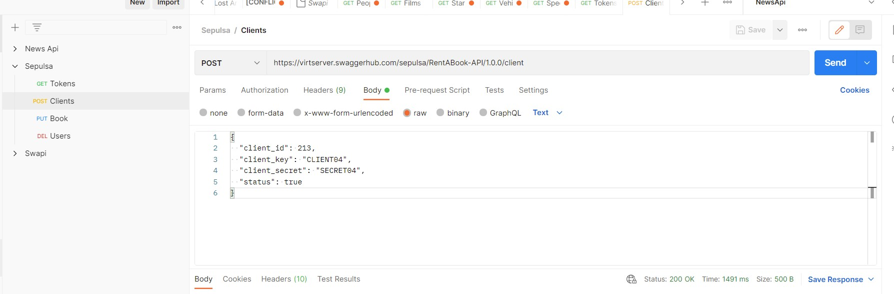

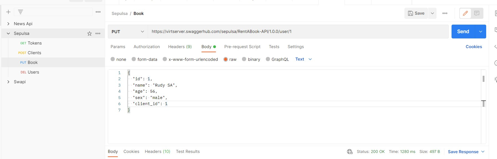

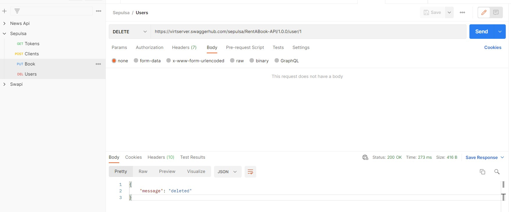