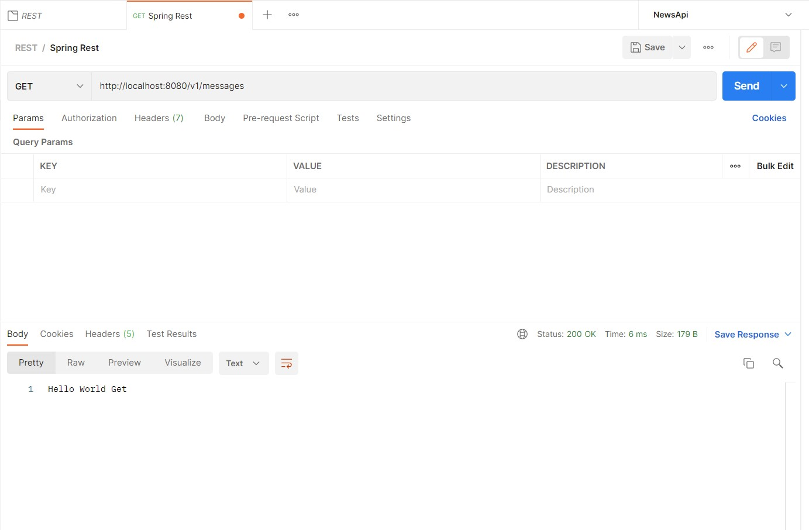
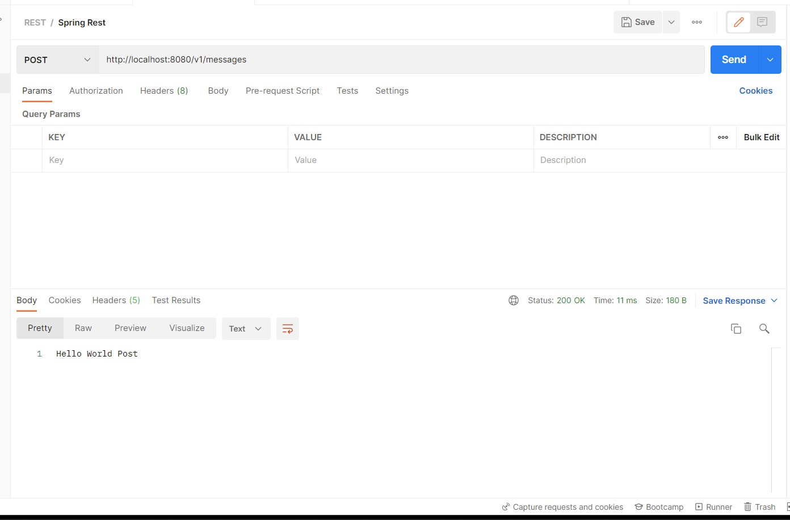

# 21_Intro Spring Boot (Maven - Dependency - Pom)

## Resume
Dalam materi ini mempelajari: 
1. Spring Framework
2. Spring Boot
3. Kenapa Menggunakan Spring?

### 1. Spring Framework

Spring Framework adalah framework paling populer di Java. Spring Framework dibuat sekitar tahun 2003 oleh Rod Johnson, yang dibuat sebagai alternative Java Enterprise. Spring Framework semakin populer karena sangat ringan dan mudah digunakan dibandingkan Java Enterprise,

### 2. Spring Boot

Spring Boot merupakan framework untuk mempermudah pembuatan aplikasi Spring Framework. Dahulu untuk menggunakan Spring Framework, untuk pemula tidaklah mudah, karena terlalu banyak yang harus dilakukan sebelum bisa membuat aplikasi. Spring Boot menjadikan kompleksitas tersebut ditangani secara otomatis oleh Spring Boot, sehingga kita bisa membuat aplikasi Spring Framework secara cepat tanpa harus melakukan pengaturan apapun. Spring Boot sekarang sudah menjadi salah satu framework wajib ketika kita ingin membuat aplikasi Spring Framework,


### 3. Kenapa Menggunakan Spring?

Saat ini Spring adalah satu-satunya framework paling populer di Java. Saking populernya, bahkan banyak perusahaan pindah ke JVM karena ingin menggunakan Spring-nya, bukan Java. Spring juga sudah banyak sekali diadopsi di banyak perusahaan, baik itu skala besar atau kecil. 

## Task

Source code bisa dilihat di: [Source](./praktikum/src/main/java/com/praktikum/HelloController.java)

### Task 1

Pada task pertama ini saya disuruh membuat project spring boot untuk menampilkan pesan hello world dalam 3 endpoint berikut

1. GET/v1/messages



2. POST/v1/messages



3. DELETE/v1/messages


### Task 2

Pada task kedua ini saya disuruh menjelaskan ketiga endpoint tersebut.

Ketika postman melakukan request GET, program akan menjalankan method yang memiliki anotasi getMapping dan akan mengembalikan "Hello World Get"

```java
 @GetMapping("/v1/messages")
    public String hello(){
        return "Hello World Get";
    }
```

Selanjutnya ketika postman melakukan request POST, program akan menjalankan method yang memiliki anotasi postMapping dan akan mengembalikan "Hello World Post"

```java
@PostMapping("/v1/messages")
    public String hello2(){
        return "Hello World Post";
    }
```

Terakhir ketika postman melakukan request DELETE, program akan menjalankan method yang memiliki anotasi deleteMapping dan akan mengembalikan "Hello World Delete"

```java
@DeleteMapping("/v1/messages")
    public String hello3(){
        return "Hello World Delete";
    }
```
