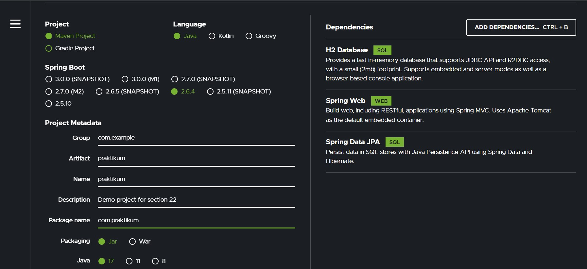
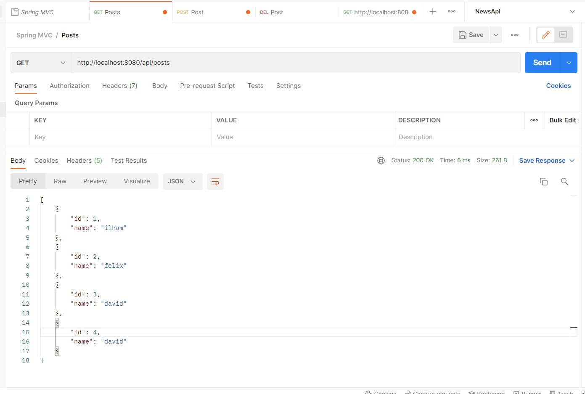
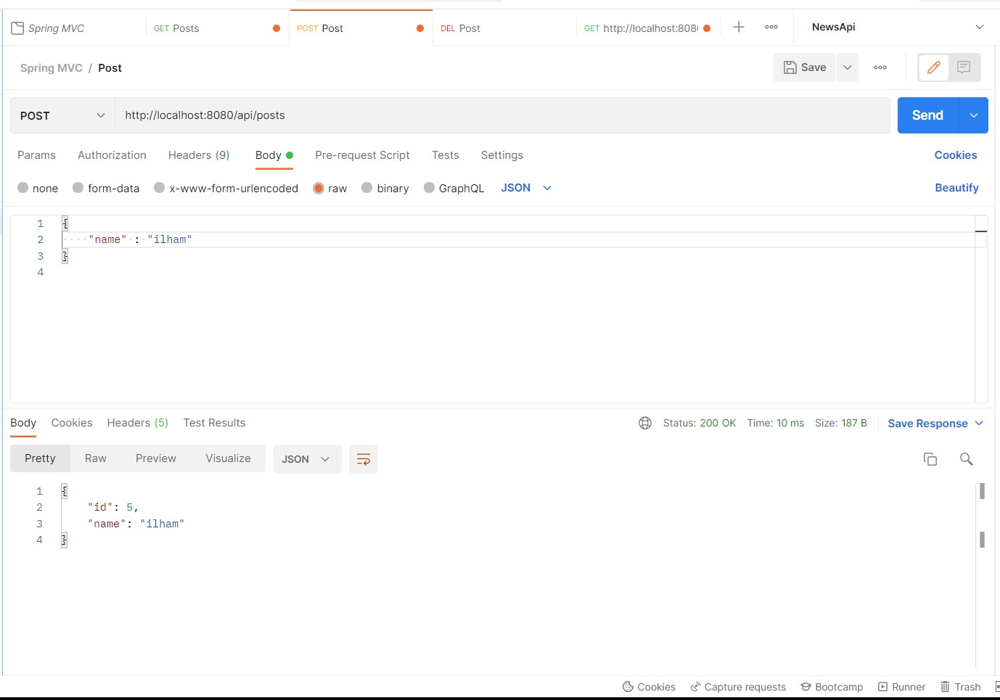
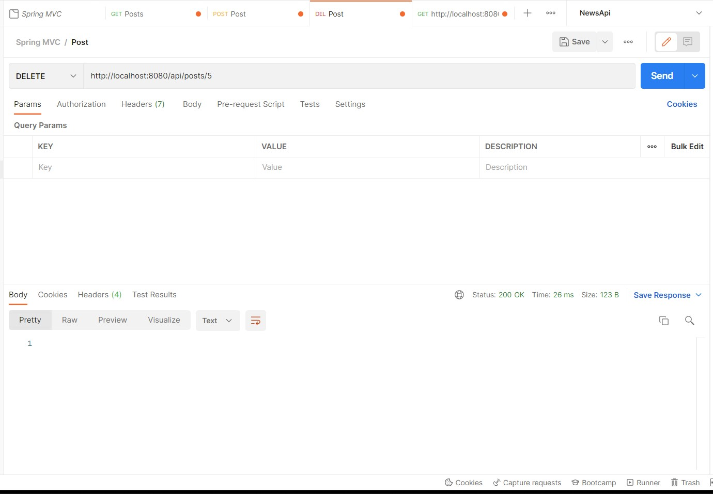

# 22_Getting Started REST Spring Boot (MVC)

## Resume
Dalam materi ini, mempelajari :
1. Model View Controller
2. JPA
3. JPA Repository

### Model View Controller

MVC atau Model View Controller adalah sebuah pola desain arsitektur dalam sistem pengembangan website yang terdiri dari tiga bagian, yaitu:

1. Model, bagian yang mengelola dan berhubungan langsung dengan database.
2. View, bagian yang akan menyajikan tampilan informasi kepada pengguna.
3. Controller, bagian yang menghubungkan model dan view dalam setiap proses request dari user.

### JPA

JPA adalah standar akses database untuk bahasa pemrograman Java. Karena Spring Boot menggunakan bahasa pemrograman Java, kita dapat menggunakan JPA untuk mengakses database. JPA diimplementasikan menggunakan framework Hibernate dan dapat digunakan untuk mempermudah proses pengaksesan database.

### JPA Repository

JpaRepository adalah repository dari Java Peristence API yang dapat memudahkan kita sebagai developer membuat CRUD pada String Data. JpaRepository memiliki method bawaan yang dapat digunakan pada semua interface repository. Untuk memakai JpaRepository cukup dengan membuat objek dari repository tersebut diikuti oleh anotasi @Autowired di atasnya.

## Task

Source code bisa dilihat di: [source](./praktikum/src/main/java/com/praktikum)

Kita bisa menggunakan [start.spring.io](https://start.spring.io/) untuk melakukan setup dan configuration pada project spring boot kita serta menambahkan dependencies sesuai kebutuhan.

### Task 1

Pada task pertama ini saya disuruh membuat project Springboot dengan database H2 dan struktur MVC yang memiliki 3 endpoint berikut

1. GET /v1/posts

Digunakan untuk melihat seluruh data post yang tersimpan dalam database

2. POST /v1/posts

Digunakan untuk menerima data posts dan menyimpannya dalam database

3. DELETE /v1/posts/{id}

Digunakan untuk menghapus data post berdasarkan id

### Task 2

Pada task kedua ini saya disuruh menjelaskan perbedaan antara CRUD Repository dan JPA Repository. Pada task pertama saya menggunakan JPA Repository, dan ketika saya menggunakan CRUD Repository tidak terdapat perbedaan yang signifikan. Perbedaanya hanyalah pada JPA repository ketika menggunakan FindAll() atau SaveAll() dia mengembalikan data List, sedangkan CRUD Repository dia mengembalikan data iterable. JPA Repository bisa extends PagingAndSotring Repository, sedangkan CRUD Repository tidak mempunyai method untuk implementasi pagination dan sorting.