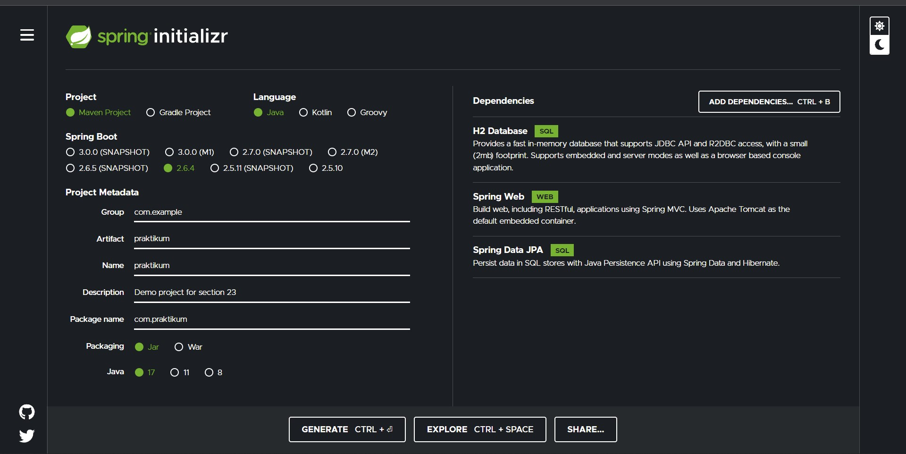
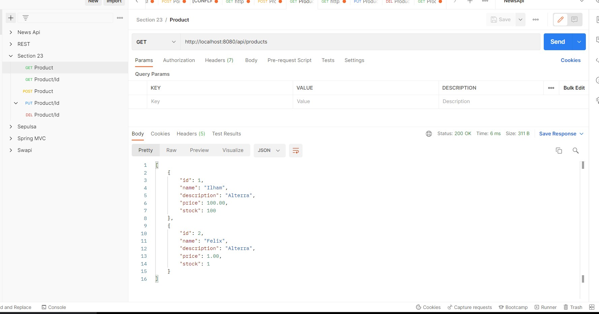
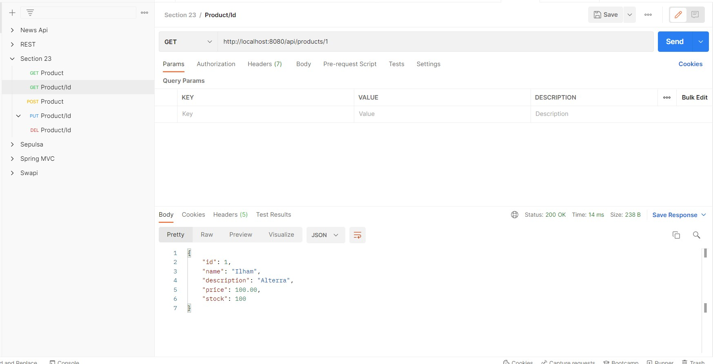
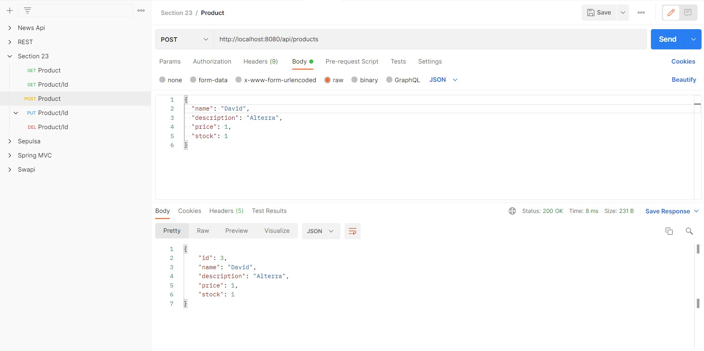
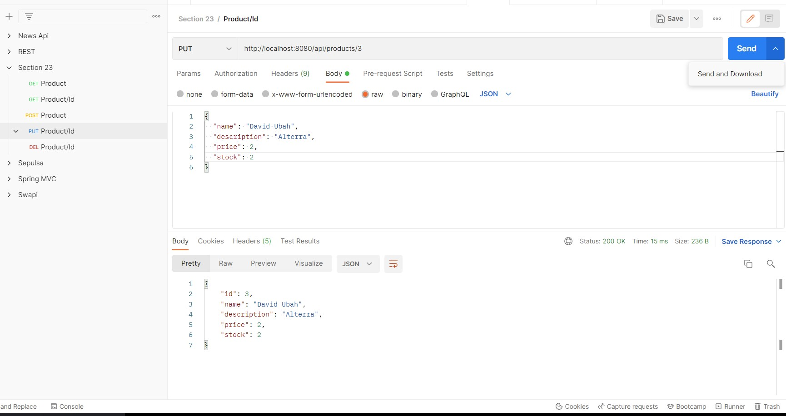
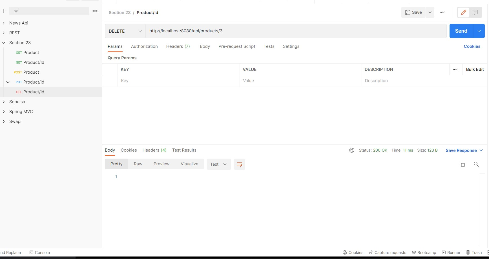

# 23_Configure Swagger Documentation Spring Boot

## Resume

Dalam materi ini, mempelajari :
1. API Documentation
2. OpenAPI Spesification
3. Swagger

### API Documentation

Dokumentasi API adalah konten teknis yang mengdokumentasi API yang digunakan. Sebuah dokumentasi juga memiliki instruksi untuk menggunakan dan mengintegrasikan API tersebut secara efisien. Dokumentasi API juga memberikan update terbaru tentang API tersebut seperti versi terbaru API.

### OpenAPI Spesification

OpenAPI Spesification adalah standar internasioanl interface RESTful. OpenAPI Spesification memungkinkan developer untuk mendesain API interface yang bersifat technology-agnostic yang membentuk dasar pengembangan dan pemakaian API nya.

### Swagger
Swagger merupakan open source project dan juga salah satu framework API populer yang digunakan untuk merancang, membangun, mendokumentasikan dan mengakses API. Dengan adanya swagger, kita bisa melakukan desain ulang atau membuat baru code API dengan editor yang memberikan log jika terjadi error secara real-time

## Task

Source code bisa dilihat di: [source](./praktikum/src/main/java/com/praktikum)

Kita bisa menggunakan [start.spring.io](https://start.spring.io/) untuk melakukan setup dan configuration pada project spring boot kita serta menambahkan dependencies sesuai kebutuhan.

### Task 1

Pada task pertama ini, saya membuat aplikasi CRUD untuk sebuah data mengenai product yang memiliki field ID, Name, Description, Stock, dan Price. 

Berikut output dari program CRUD diatas :

### Task 2

Error

Masih dalam tahap perbaikan

