# 24_JPA (Spring Database SQL)

## Resume
Dalam materi ini mempelajari:
1. JPA
2. Hibernate
3. Perbedaan JPA dan Hibernate?

### 1. JPA

Dalam JPA mencakup API (didefinisikan dalam javax.persistence), JPQL (Java Platform, Enterprise Edition) dan metadata yang diperlukan untuk objek relasional. Status entitas persistensi biasanya dipertahankan dalam tabel. Contoh entitas sesuai dengan baris tabel dari database relasional. Metadata digunakan untuk mengekspresikan hubungan antar entitas. Anotasi atau file deskriptor XML terpisah (diterapkan dengan aplikasi) digunakan untuk menentukan metadata dalam kelas entitas. JPQL, yang mirip dengan kueri SQL, digunakan untuk menanyakan entitas yang disimpan.

### 2. Hibernate

Hibernate adalah kerangka kerja yang dapat digunakan untuk pemetaan relasional objek yang ditujukan untuk bahasa pemrograman Java. Lebih khusus lagi, ini adalah pustaka ORM (object-relational mapping) yang dapat digunakan untuk memetakan model relasional objek ke model relasional konvensional. Sederhananya, ini membuat pemetaan antara kelas dan tabel Java dalam database relasional, juga antara tipe data Java ke SQL.

### 3. Perbedaan JPA dan Hibernate?

JPA memiliki keuntungan memiliki antarmuka yang terstandarisasi, sehingga komunitas pengembang akan lebih mengenalnya daripada Hibernate. Di sisi lain, API Hibernate asli dapat dianggap lebih kuat karena fiturnya adalah superset dari JPA. JPA adalah kerangka kerja untuk mengelola data relasional dalam aplikasi Java, sedangkan Hibernate adalah implementasi khusus JPA

## Task

Source code bisa dilihat di: [source](./praktikum/src/main/java/com/praktikum)

Kita bisa menggunakan [start.spring.io](https://start.spring.io/) untuk melakukan setup dan configuration pada project spring boot kita serta menambahkan dependencies sesuai kebutuhan.

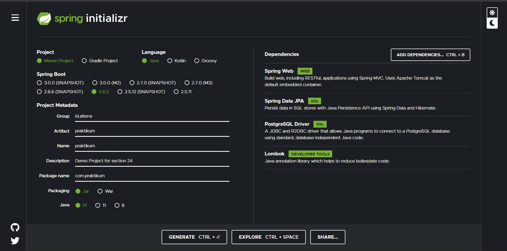

### Task 1

Pada task pertama ini saya disuruh membuat project yang dapat melakukan CRUD lengkap yang membuat REST API Endpoint, Repository dan Service.

Berikut adalah hasil dari project CRUD pada sebuah product

Create Product

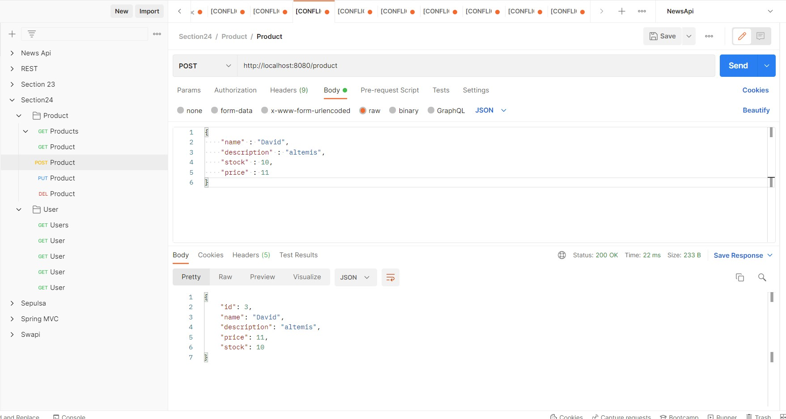

Get All Product

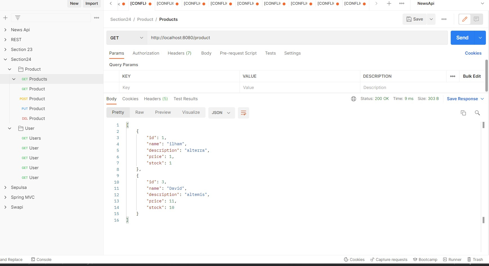

Get Product By Id

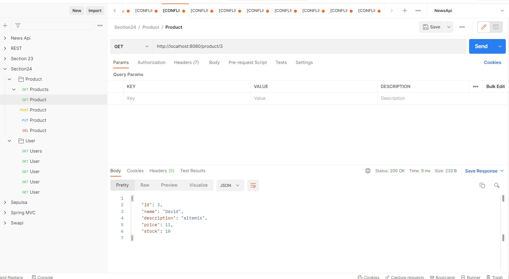

Update Product

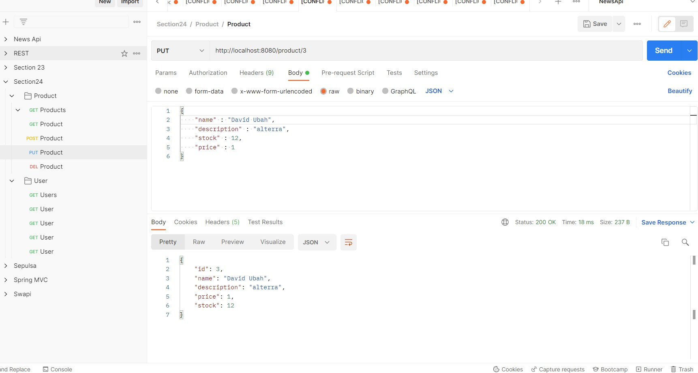

Delete Product

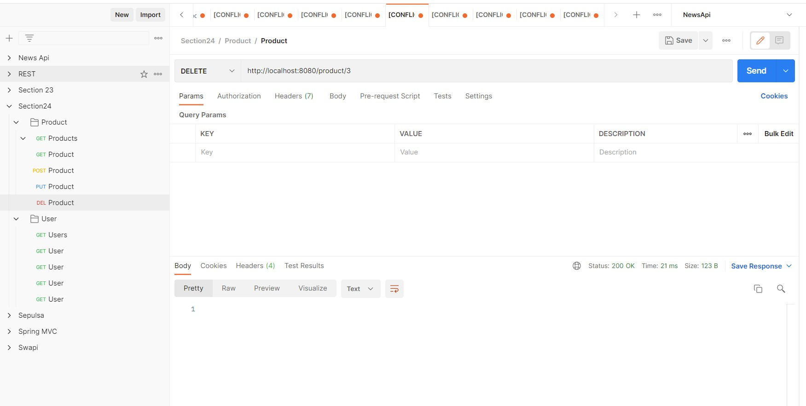

### Task 2

Pada task kedua saya disuruh membuat CRUD lagi dalam project yang sama, disini saya membuat CRUD untuk user

Create User

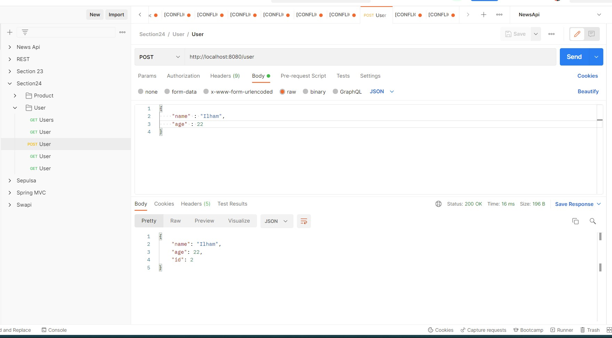

Get All User

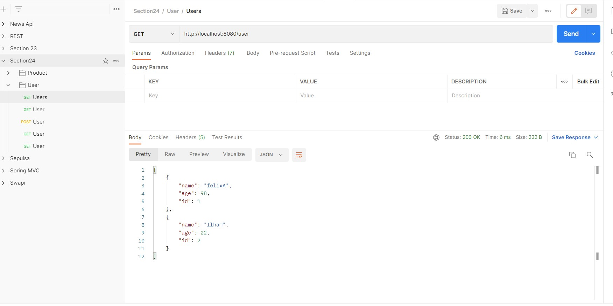

Get User By Id

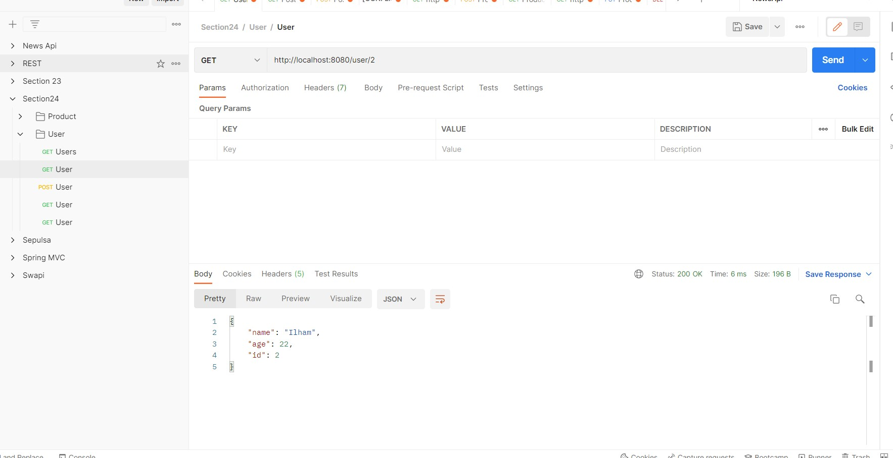

Update User

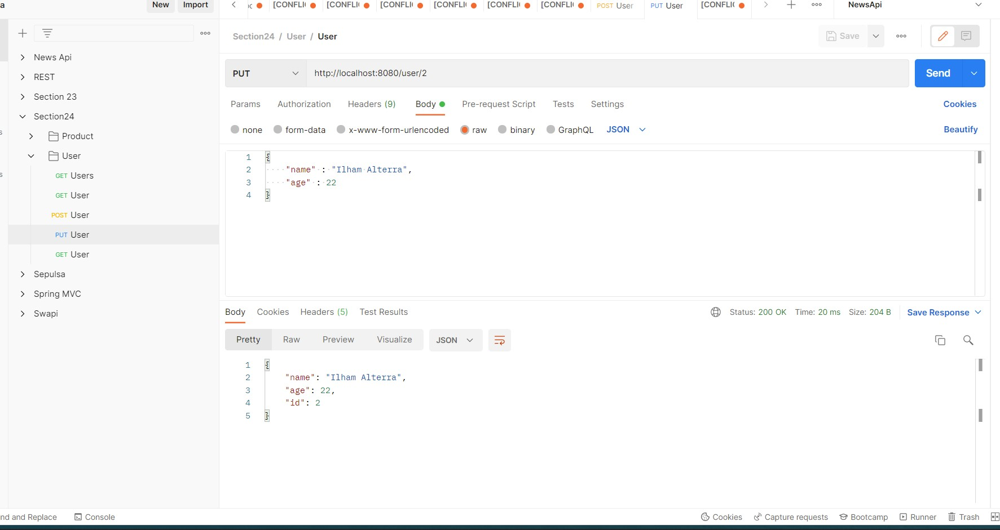

Delete User

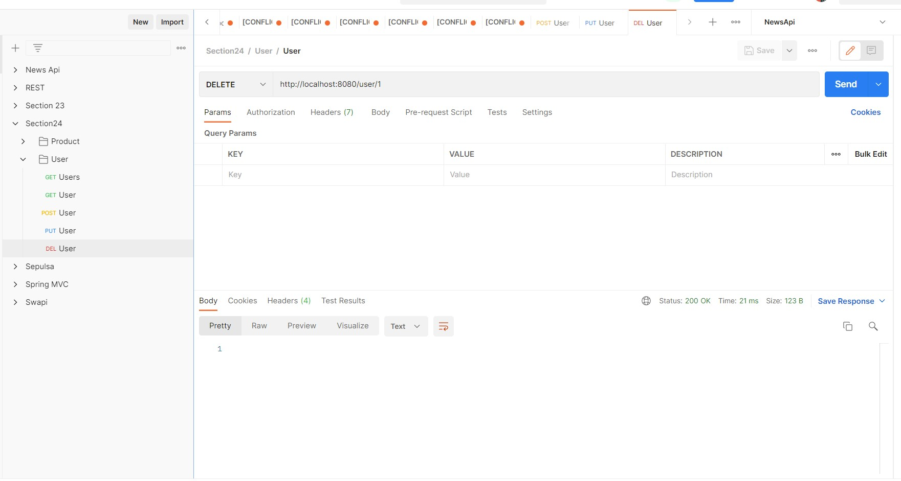

### Tampilan di PostgresSQL

Semua tabel di postgresSQL

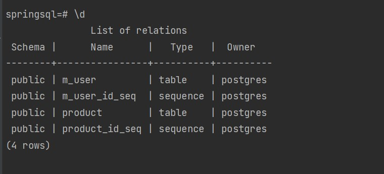

Melihat field di tabel Product dan User

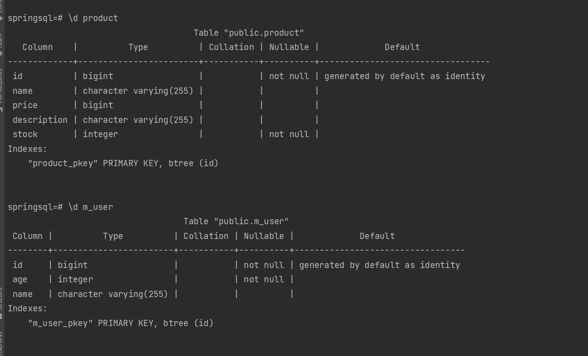

Melihat semua data di tabel Product dan User

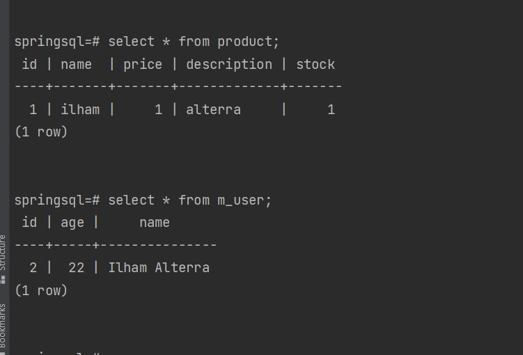