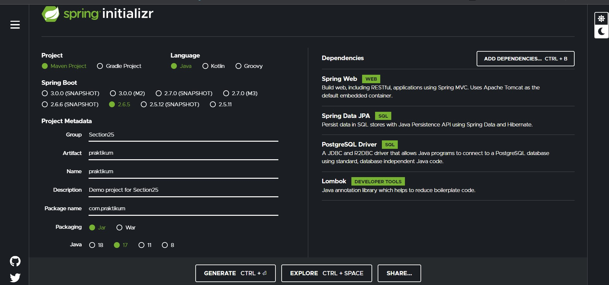
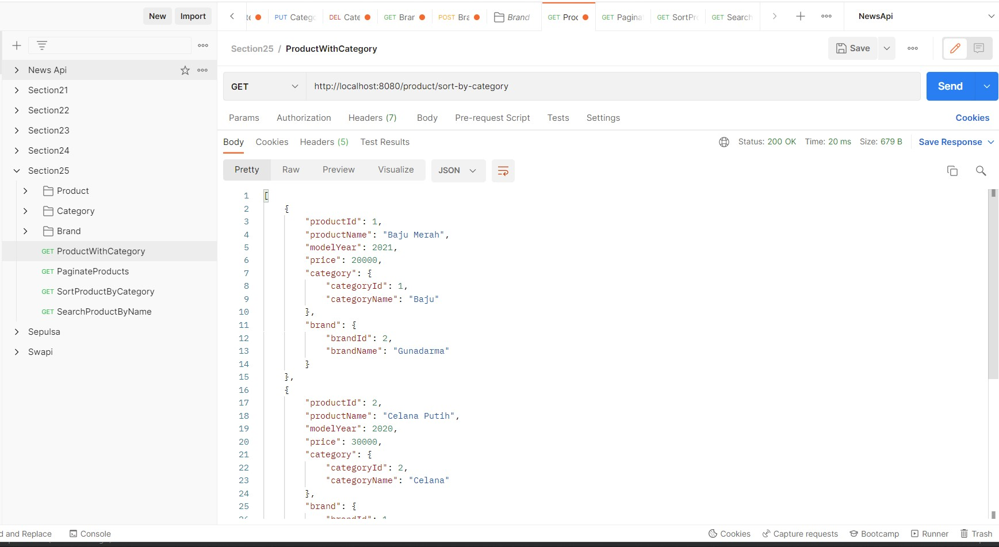
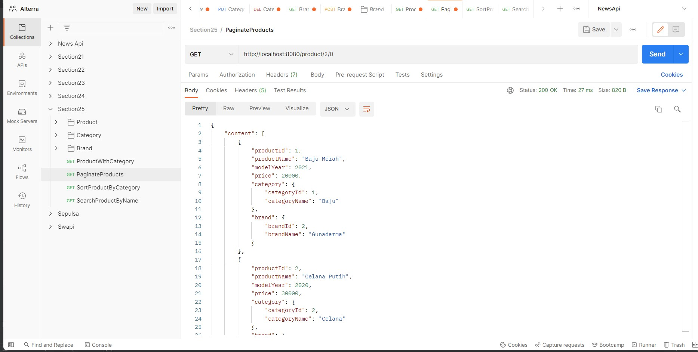
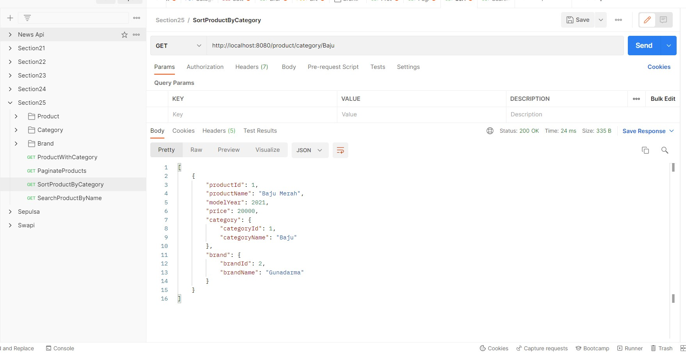
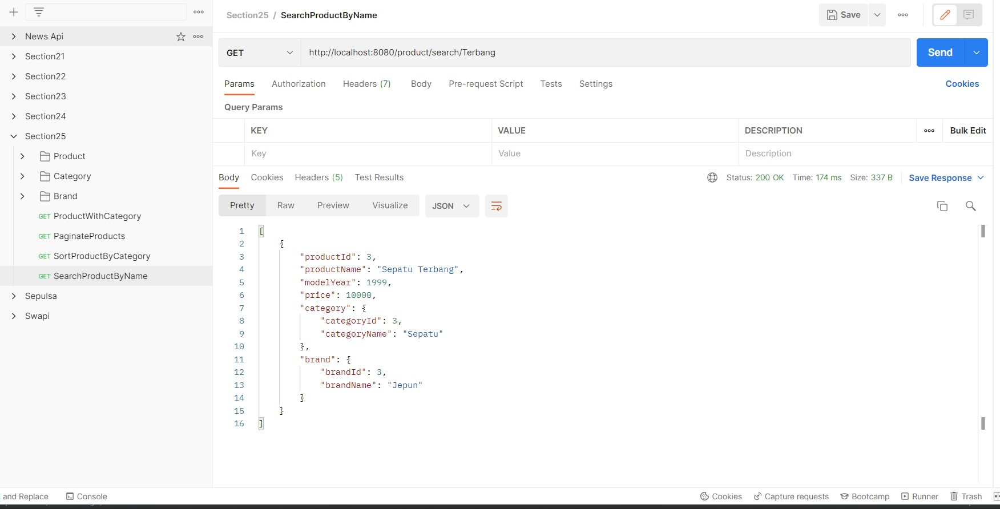

# 25_Implementation Relational (1o1 - 1oMany - ManyoMany)

## Resume
Dalam materi ini mempelajari:
1. One to One Relationship
2. One to Many Relationship
3. Many to Many Relationship

### 1. One to One Relationship

One-to-one Relationship adalah Suatu entiti hanya berhubungan dengan satu entiti lainnya. Contohnya adalah mahasiswa dengan NPM, satu mahasiswa hanya memiliki satu npm, dan satu npm hanya dimiliki oleh satu mahasiswa.

### 2. One to Many Relationship

One to Many Relationship adalah suatu entiti dapat berhubungan dengan  lebih dari satu  entiti lawan, tetapi satu  entiti lawan hanya dapat berhubungan dengan satu entiti tersebut. Contohnya adalah ibu dan anak. Seeorang ibu bisa memiliki banyak anak, sedangkan seeorang anak hanya dimiliki oleh ibu tersebut.

### 3. Many to Many Relationship

Many to Many Relationship adalah suatu entiti dapat berhubungan dengan satu atau lebih entiti lainnya. Contohnya adalah mahasiswa dan matakuliah. Satu mahasiswa bisa mengambil banyak matakuliah, dan satu matakuliah bisa diambil lebihd dari satu mahasiswa.

## Task

Source code bisa dilihat di: [source](./praktikum/src/main/java/com/praktikum)

Kita bisa menggunakan [start.spring.io](https://start.spring.io/) untuk melakukan setup dan configuration pada project spring boot kita serta menambahkan dependencies sesuai kebutuhan.



### Task 1

Pada task pertama ini saya disuruh untuk mengimplementasikan JPA relationship dari skema database yang telah diberikan, tabel yang saya buat hanya product, category dan brand. Untuk stock tidak saya buat karena dia berelasi dengan tabel lain tetapi gambar pada soal kepotong, jadi saya hanya membuat 3 tabel, dengan implementasi many to one dari product ke brand dan category

```java
@ManyToOne
private Category category;

@ManyToOne
private Brand brand;
```

### Task 2

Pada task kedua ini saya disuruh membuat beberapa query dari relationship yang telah saya buat.

1. Get all products with category



2. Paginate products using pageable



3. Sort products by category



4. Search products by name



