# 26_JPA (Spring Database No SQL)

## Resume
Dalam materi ini mempelajari:
1. NoSql
2. MongoDB
3. Lombok

### 1. NoSql

NoSQL adalah singkatan dari Not Only SQL. Database management system ini bersifat tanpa relasi (non-relational). Artinya, NoSQL bisa mengelola database dengan skema yang fleksibel dan tidak membutuhkan query yang kompleks.

### 2. MongoDB

MongoDB merupakan free dan opensource database management system. Dikembangkan oleh perusahaan bernama 10gen tahun 2007. MongoDB tidak menggunakan SQL, namun menggunakan JavaScript sebagai bahasa utama untuk manipulasi document

### 3. Lombok

Lombok adalah salah satu dependency yang dapat digunakan pada spring boot, lombok adalah library berbasis java yang dapat digunakan untuk membuat metode getter setter secara otomatis untuk atribut-atribut pada object class.

## Task

Source code bisa dilihat di: [source](./praktikum/src/main/java/com/praktikum)

Kita bisa menggunakan [start.spring.io](https://start.spring.io/) untuk melakukan setup dan configuration pada project spring boot kita serta menambahkan dependencies sesuai kebutuhan.

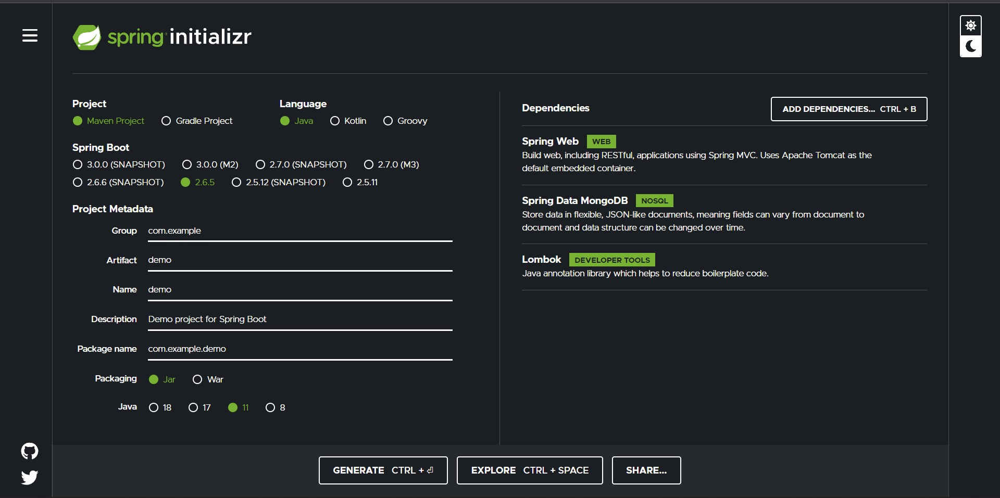

### Task 1

Pada task pertama ini saya disuruh membuat project spring boot menggunakan database mongodb yang dapat melakukan CRUD pada data yang telah disediakan.

Berikut hasil test API menggunakan Postman

GET Product

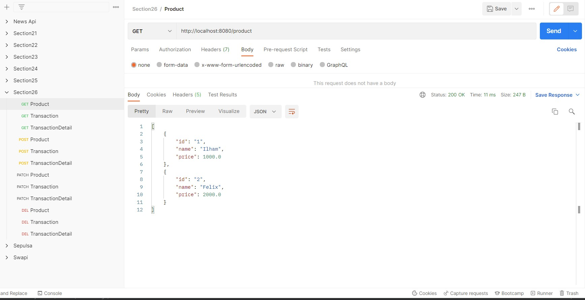

GET Transaction

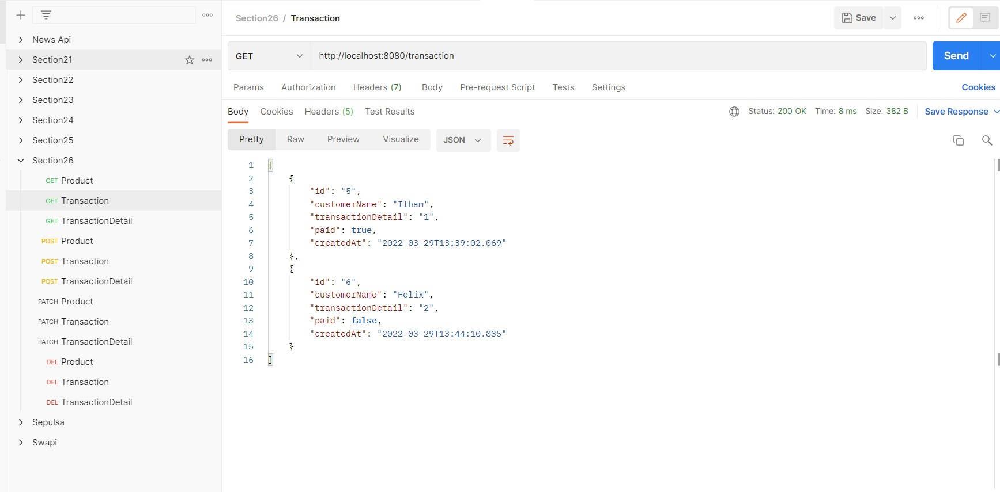

GET TransactionDetail

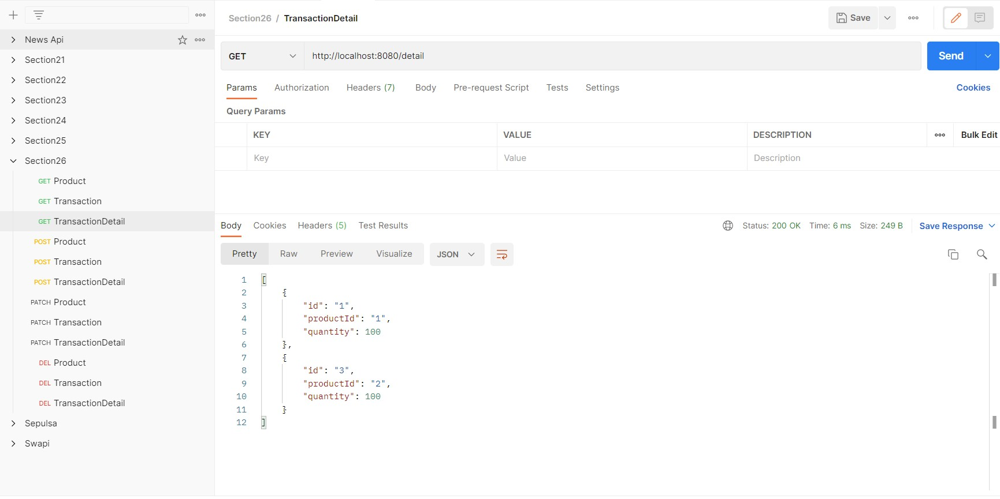

POST Product

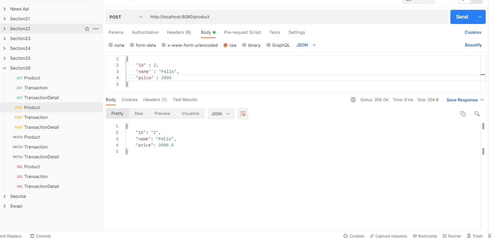

POST Transaction

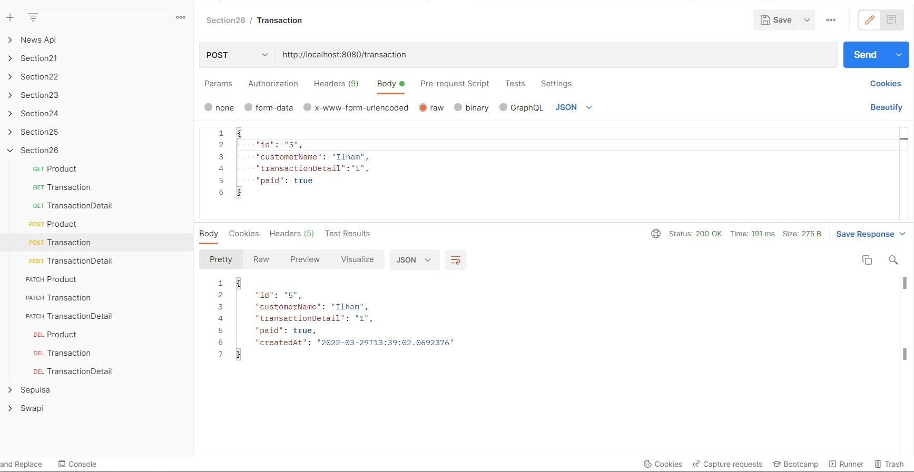

POST TransactionDetail

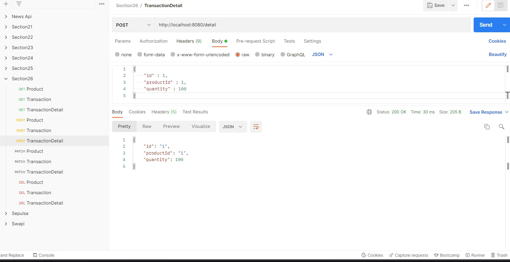

PATCH Product

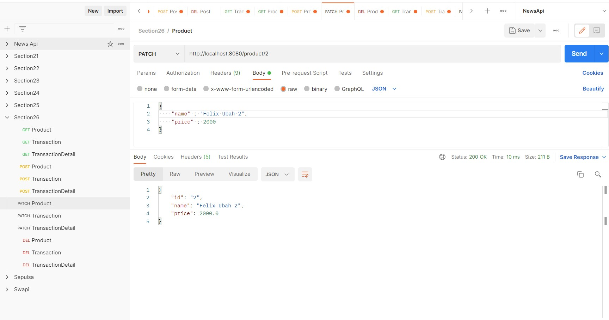

PATCH Transaction

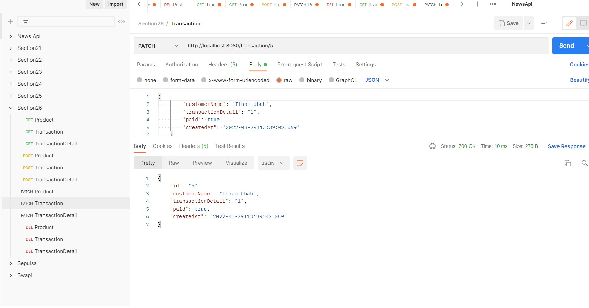

PATCH TransactionDetail

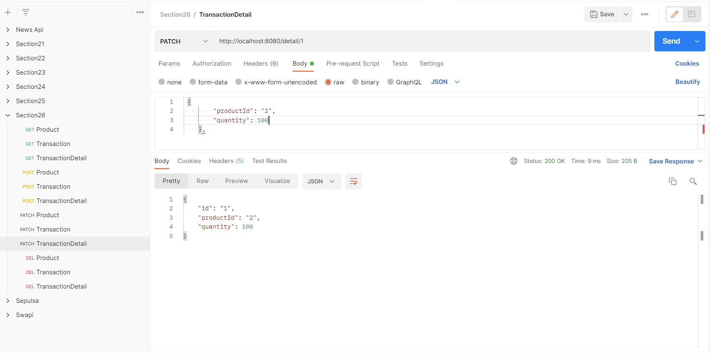

DELETE Product

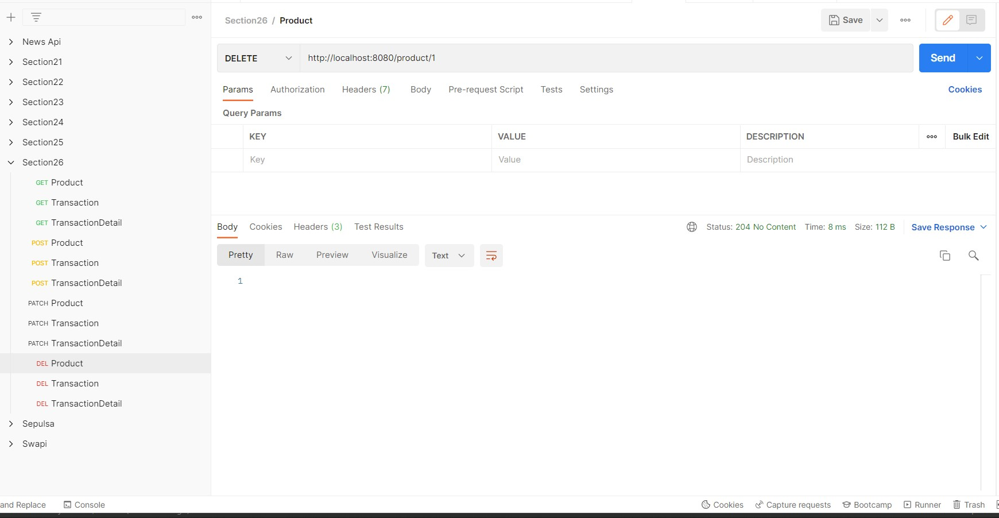

DELETE Transaction

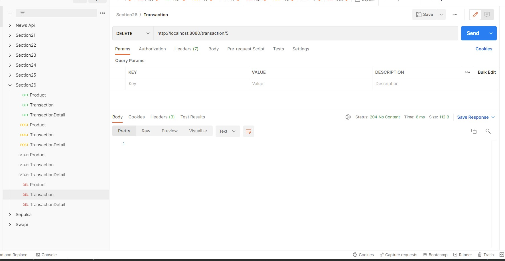

DELETE TransactionDetail

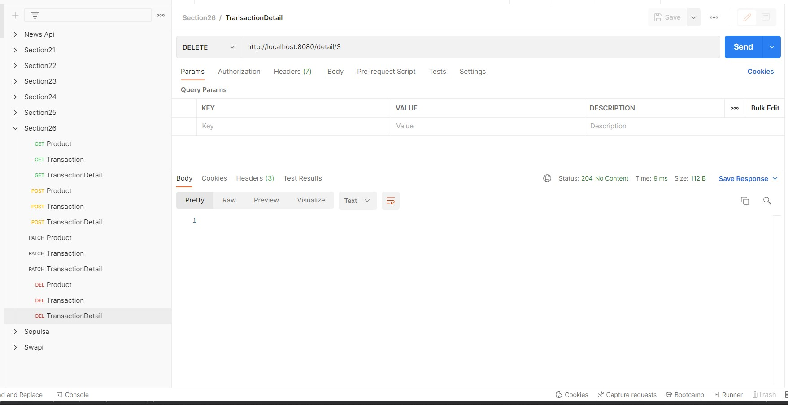