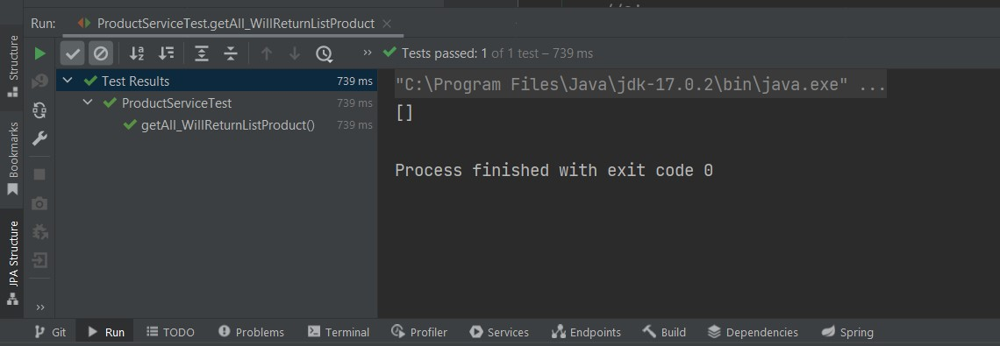
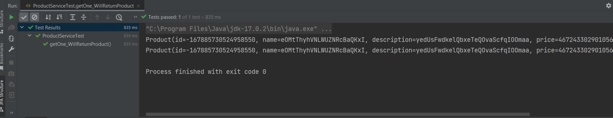
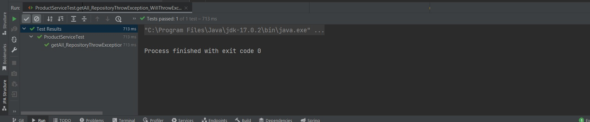

# 28_Unit Testing

## Resume
Dalam materi ini mempelajari:
1. Unit Testing
2. Teknik Unit Testing
3. Tools Unit testing

### 1. Unit Testing

Unit testing dilakukan untuk memastikan bahwa setiap unit kode yang kita buat sudah bisa bekerja sesuai harapan. Tujuannya adalah membantu menemukan bug lebih cepat dan memperbaikinya.

### 2. Teknik Unit Testing

Ada tiga teknik yang biasa digunakan dalam unit testing. Ketiga teknik unit testing tersebut adalah black box testing, white box testing, dan gray box testing.

### 3. Tools Unit testing

Unit testing adalah pengujian software yang dapat dilakukan secara manual maupun otomatis menggunakan tools tertentu. Pada tugas ini saya menggunakan JUnit dan JMockit. JUnit merupakan tools unit testing untuk bahasa pemograman java dan JMockit merupakan testing berbasis opensource.

## Task

Pada task kali ini saya disuruh melakukan unit test pada bagian service minimum 3 test case.

1. Test Get All Data

2. Test Get Data By Id

3. Test Database Error

