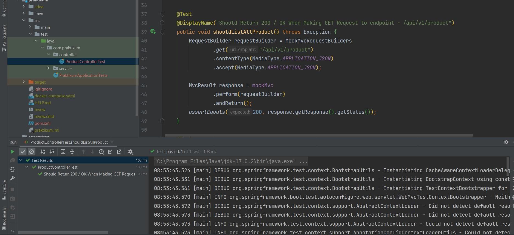
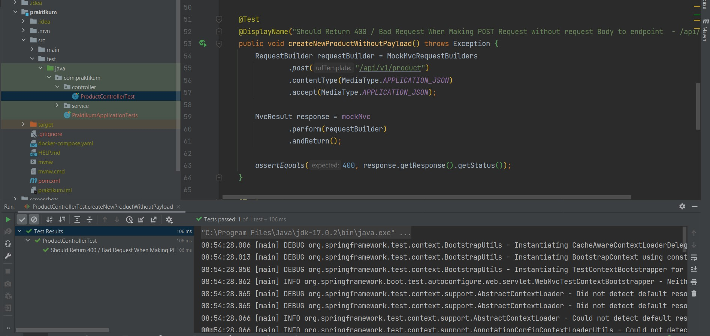
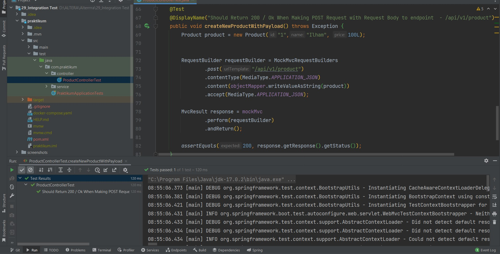

# 29_Integration Test

## Resume
Dalam materi ini mempelajari:
1. Software Testing
2. Functional Testing
3. Integration Testing

### 1. Software Testing

Software testing adalah cara menilai produk perangkat lunak untuk membedakan antara informasi yang diberikan dan hasil yang diharapkan. Selain itu, untuk mengevaluasi karakteristik suatu produk. Pada dasarnya software testing penting dilakukan untuk menjaga kualitas perangkat lunak tersebut

### 2. Functional Testing

Functional Testing adalah jenis pengujian yang memverifikasi bahwa setiap fungsi aplikasi telah beroperasi sesuai dengan requirement specification. Functional testing berfokus pada manual dan automation testing. Jenis jenis functional testing yang sudah kita bahas adalah unit testing dan integration testing. 

### 3. Integration Testing

Integration testing adalah salah satu tingkat dari software testing di mana masing-masing unit digabungkan dan diuji sebagai kelompok. Tujuan dari tingkat pengujian ini adalah untuk mengekspos kesalahan dalam interaksi antara unit yang terintegrasi.

Terdapat beberapa pendekatan dalam integration testing, antara lain :

- Top Down → Unit tingkat atas diuji terlebih dahulu.
- Bottom Up → Unit level bawah diuji terlebih dahulu.

## Task

Pada task kali ini saya akan melakukan intregation testing pada class Controller

1. Test endpoint GET

2. Test endpoint POST without payload

3. Test endpoint POST with Payload

