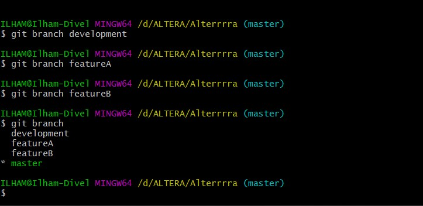
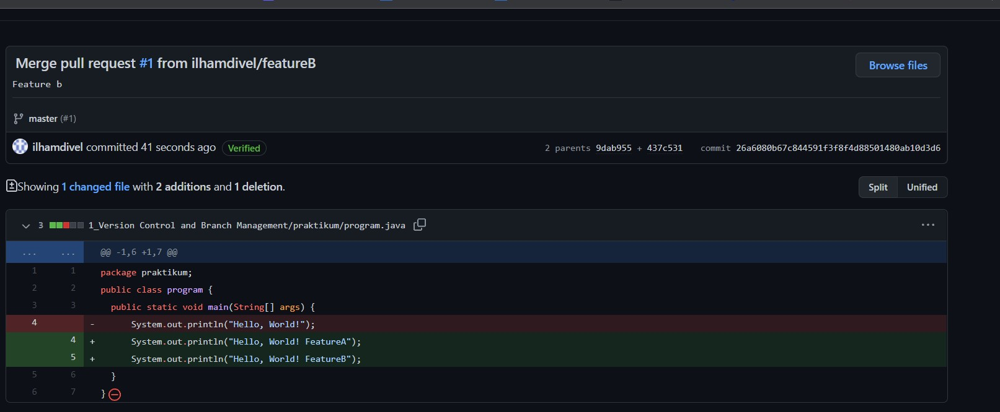
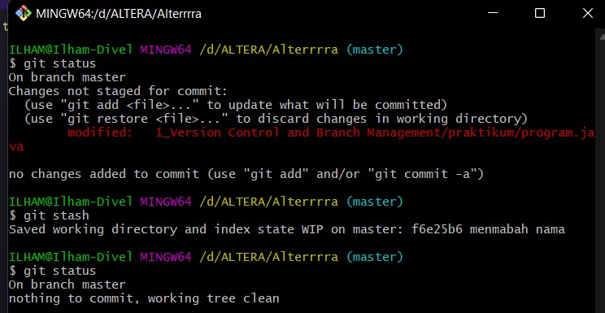

# 1 Version Control and Branch Management

## Resume

Dalam materi ini, mempelajari:

  1. Apa itu Git?
  2. Apa itu Version Control System?
  3. Repositori dan Branch

## Apa itu Git

Git adalah sistem kendali versi terdistribusi, yang berarti semua codebase dan riwayat kode akan tersedia di komputer setiap developer untuk memudahkan pembuatan branch dan penggabungan. Git dikembangkan oleh Linus Torvalds pada tahun 2005, dan merupakan inti atau jantung GitHub. 

 

## Apa itu Version Control System?

 Sistem kendali versi atau version control system adalah sistem yang mencatat perubahan yang dilakukan pada file sehingga semua riwayatnya akan terekam dan bisa dilihat kembali nanti. Saat kita membuat proyek baru, kita pasti melakukan pembaruan terhadap kodenya. Bahkan, setelah proyeknya online, kita tetap harus memperbarui versinya, memperbaiki bug, menambahkan fitur baru, dan lain sebagainya. 

 

## Repositori dan Branch

 Repositori atau repo adalah direktori penyimpanan file proyek. Di sini, kita bisa menyimpan apa pun yang berkaitan dengan proyek yang sedang kita buat, misalnya file kode, gambar, atau audio. Repo sendiri bertempat di penyimpanan atau storage GitHub atau repositori lokal di komputer kita. 
  
Branch merupakan salinan dari repositori. Kita bisa menggunakan branch ketika akan melakukan suatu pengembangan atau development secara terpisah.Pekerjaan atau task yang kita kerjakan di branch tidak akan memengaruhi repositori pusat atau branch lainnya. Jika pengembangannya sudah selesai, kita bisa menggabungkan branch saat ini ke branch lainnya dah juga repositori pusat dengan menggunakan pull request.

 

## Task

## 1. Membuat Repositori Baru
Pada task ini, kita akan membuat repositori  baru yang nanti akan digunakan untuk mengumpulkan semua tugas dari Alterra Academy.

 

## 2. Implementasi Branch Master, Development, featureA, featureB

Branch master tidak perlu kita buat karna sudah dibuatkan dari github. Pada branch master saya menambahkan folder praktikum dan screenshot dan juga file summary.md

Selanjutnya kita membuat branch dengan nama development, featureA dan featureB

 

## 3. Push, Pull, Stash, Merge
Disini saya mencoba push branch yang telah dibuat sebelumnya

Berikutnya saya melakukan perubahan pada program.java dan melakukan pull request

Berikutnya saya mencoba melakukan git stash. Fitur stash ini berperan untuk menyimpan semua progress yang sudah kita lakukan sejak commit terakhir tanpa membuat sebuah commit untuk state itu sendiri.

Berikutnya saya mencoba merge branch master dengan branch development. Merge Berfungsi untuk meleburkan dua state dari dua branch.

## 4 & 5 Merge Conflict No Fast Forward

Jadi Merge Conflict terjadi jika terdapat perubahan pada line kode yang sama. Disini saya akan merge featureB dengan featureA 

.jpg)

Berikutnya pada text editor akan muncul perubahan seperti ini. Kita bisa memilih akan menggunakan yang mana

.jpg)

Setelah itu saya melakukan add dan commit ke repository
.jpg)