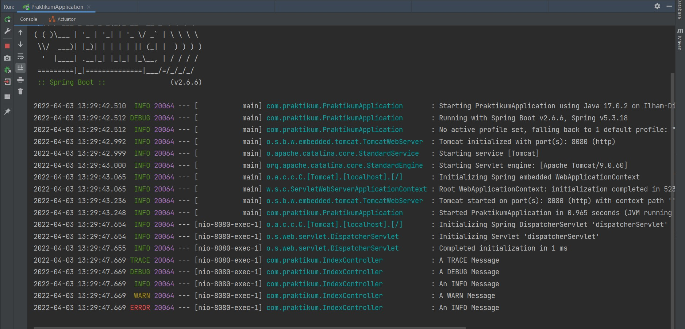

# 30_Logging in Spring Boot

## Resume
Dalam materi ini mempelajari:
1. Logging
2. Logging Libary in Java
3. Benefits Using Logging

### 1. Logging
Logging merupakan proses pengumpulan dan penyimpanan data dalam suatu periode waktu terentu untuk menganalisa trend tertentu atau menyimpan kejadian berbasis data dari sebuah sistem, jaringan atau lingkungan IT.

### 2. Logging Libary in Java
Java mempunyai beberapa library seperti java util logging, Log4j2 dan Logback. Secara default, jika kita menggunakan starters, Logback akan digunakan untuk Logging.

### 3. Benefits Using Logging
- Resource Management
- Application Troubleshooting
- Regulator compliance
- Bussiness Analytics
- Marketing Insights

## Task

Pada task kali ini saya disuruh melakukan customize terhadap log menggunakan spring logging. Dependencies yang saya gunakan adalah SLF4J.

Saya menambahkan beberapa konfigurasi di [application.properties](./praktikum/src/main/resources/application.properties) agar log Trace dan Debug tampil ketika di run.

Berikut outputnya:
