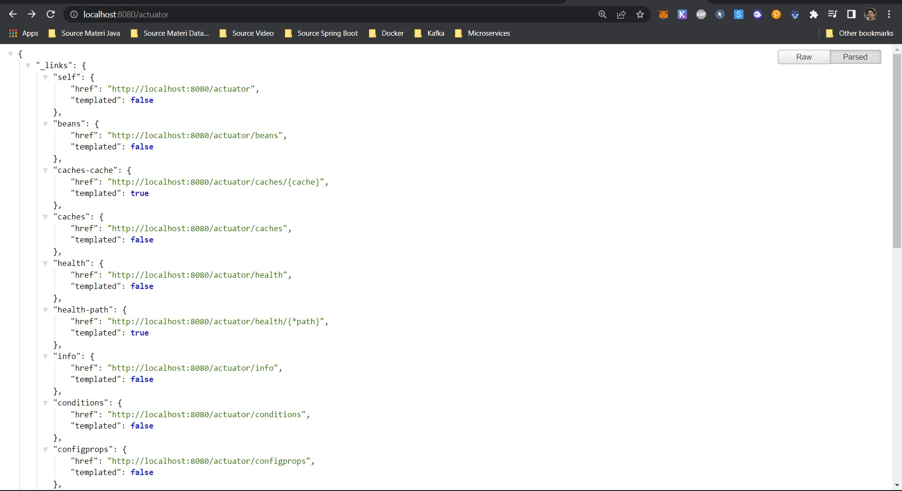

# 31_Spring Boot Actuator

## Resume
Dalam materi ini mempelajari:
1. Spring Boot Actuator
2. SDLC
3. Development Stages

### 1. Spring Boot Actuator

Spring Boot Actuator , adalah library yang berfungsi untuk memonitor dan mengatur aplikasi kita yang berbasis HTTP sehingga kita bisa memonitor health, metrics, info dari endpoint yang kita buat nantinya.

### 2. SDLC

SDLC adalah kependekan dari Systems development life cycle atau dalam bahasa Indonesia disebut siklus hidup pengembangan sistem. SDLC adalah siklus yang digunakan dalam pembuatan atau pengembangan sistem informasi yang bertujuan untuk menyelesaikan masalah secara efektif. Dalam pengertian lain, SDLC adalah tahapan kerja yang bertujuan untuk menghasilkan sistem berkualitas tinggi yang sesuai dengan keinginan pelanggan atau tujuan dibuatnya sistem tersebut. SDLC menjadi kerangka yang berisi langkah-langkah yang harus dilakukan untuk memproses pengembangan suatu perangkat lunak. Sistem ini berisi rencana lengkap untuk mengembangkan, memelihara, dan menggantikan perangkat lunak tertentu.

### 3. Development Stages

Terdapat 6 stages dalam development stages yaitu
- Planning
- Analysis
- Design
- Coding
- Testing
- Patching/Maintenance

## Task

### Task 1
Pada task ini saya disuruh menambahkan spring actuator pada applikasi spring boot saya.

Pertama tambahkan dependencies actuator pada [pom.xml](./praktikum/pom.xml)

Lalu tambahkan beberapa config di [application.properties](./praktikum/src/main/resources/application.properties)

Berikut tampilan outputnya

