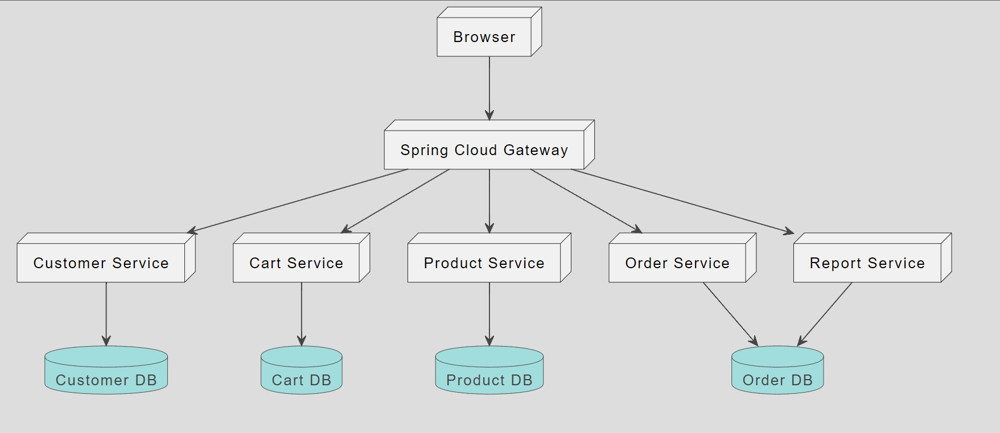
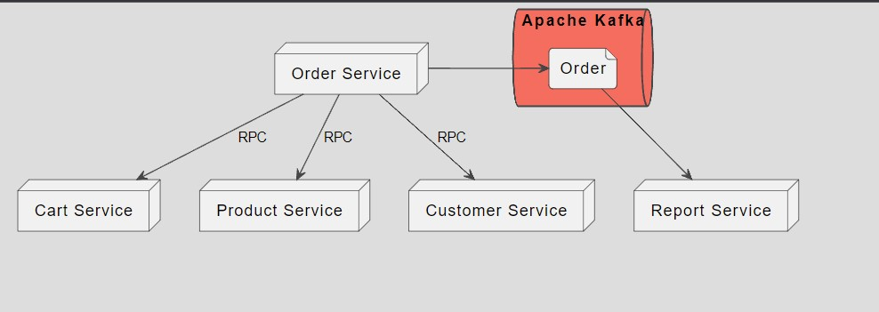

# 32_Introduction Microservices and Spring Cloud

## Resume
Dalam materi ini mempelajari:
1. Arsitektur Microservices
2. Database per Service
3. Remote Procedure Call (RPC)

### 1. Arsitektur Microservices

Arsitektur Microservices merupakan aplikasi-aplikasi kecil yang saling bekerja sama. Setiap komponen pada sistem dibuat dalam service dan komunikasi antar service biasanya melalui network-call.

Kelibihan Arsitektur Microservices
- Mudah dimengerti, karena relative kecil ukuran service nya
- Lebih mudah di develop, di maintain, di test dan di deploy
- Lebih mudah bergonta-ganti teknologi
- Mudah di scale sesuai kebutuhan

### 2. Database per Service

Berikut alasan kenapa harus menggunakan database per service:
- Memastikan bahwa antar service tidak ketergantungan
- Tiap service bisa menggunakan aplikasi database sesuai dengan kebutuhan
- Service tidak perlu tahu kompleksitas internal database service lain

### 3. Remote Procedure Call (RPC)

Idealnya komunikasi dilakukan melalui RPC, tidak direkomendasikan komunikasi via database.

Contoh Remote Procedure Call
- RESTfull API
- gRPC
- Apache Thrift

Keuntungan menggunakan RPC
- Sederhana dan Mudah
- Biasanya digunakan untuk komunikasi Request - Reply
- Biasanya digunakan untuk proses Sync (yang butuh menunggu jawaban)

## Task

Semua Link Design pada tugas ini dapat dilihat di [Link](./praktikum/Link.txt)

### Task 1

Pada task pertama ini saya disuruh membuat design microservices yang menampilkan
- Sebuah arsitektur aplikasi
- Memiliki minimum 5 services
- Terdapat services yang melakukan shared database
- Terdapat services yang melakukan database per service

Berikut hasil dari design yang saya buat

### Task 2

Pada task kedua ini saya disuruh membuat services communication menggunakan rancangan yang telah saya buat sebelummnya.

Berikut hasilnya

