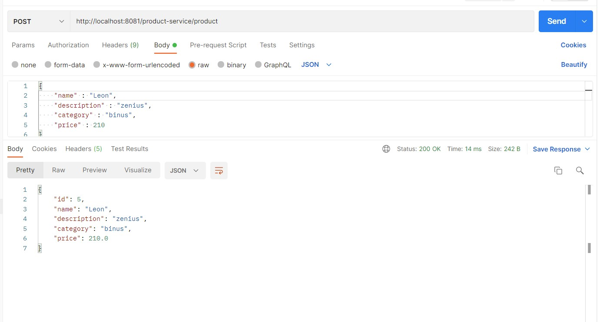
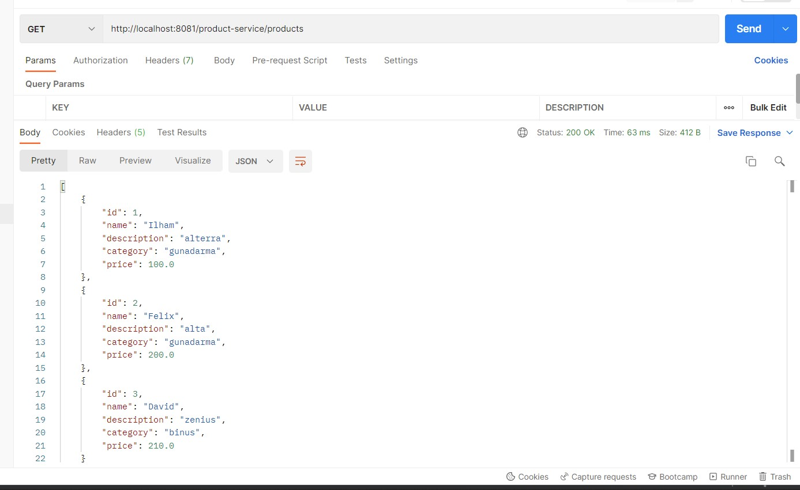
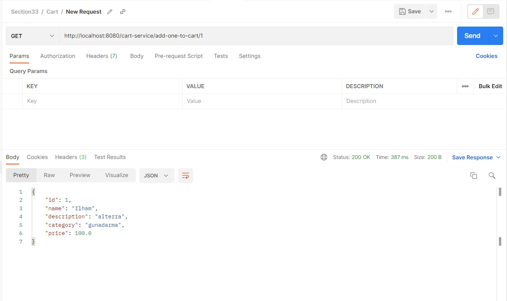
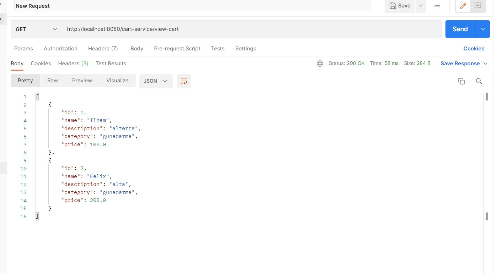
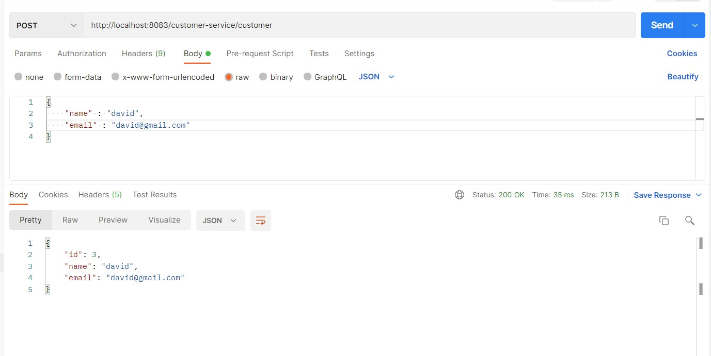
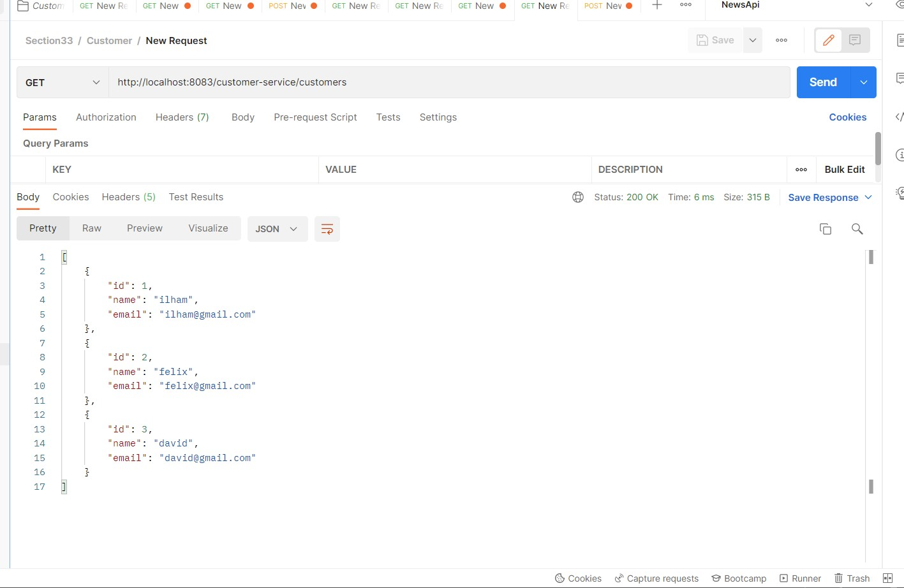

# 33_Implementation Spring Cloud (Microservices)

## Resume
Dalam materi ini mempelajari:
1. Spring Cloud Gateway
2. Spring Cloud Eureka
3. Rest Template

### 1. Spring Cloud Gateway
Spring cloud gateway merupakan aplikasi API Gateway. API Gateway adalah aplikasi yang bertugas sebagai gerbang dari luar ke dalam. Jadi user tidak akses langsung ke service tetapi akses menggunakan public API menggunakan spring cloud gateway. Salah satu keuntungan menggunakan API Gateway adalah jika terdapat proses autentikasi, tidak perlu implementasi di semua service, cukup di lakukan di API Gateway

### 2. Spring Cloud Eureka
Spring cloud Eureka merupakan aplikasi Service Registry. Service Registry  adalah aplikasi yang digunakan sebagai tempat untuk menyimpan semua informasi yang berhubungan dengan lokasi service. Semua service akan meregistrasikan alamat lokasi nya di Service Registry  ketika pertama kali nyala. Semua service akan laporan ke Service Registry  jika akan berhenti beroperasi, sehingga Service Registry  akan menghilangkan informasi service tersebut agar tidak mendapat traffic dari service yang bertanya

### 3. Rest Template

Rest template digunakan untuk membuat aplikasi yang mengconsume http methods. Rest template juga diguanakn untuk komunikasi antar service secara syncrounus.

## Task

### Task 1

Pada task kali ini saya disuruh menerapkan microservices yang terdiri dari minimum 3 service, lalu buktikan screenshots menggunakan postman.

Pada task yang saya buat terdapat 5 service

1. GATEWAY-SERVICE

Berfungsi sebagai APT gateway, jadi user tidak direct langsung ke service tetapi melelui public api menggunakan api gateway

2. EUREKA-SERVICE

Berfungsi sebagai service registry, jadi jika antar service ingin berkomunakasi, maka service ( eureka client) hanya perlu mengakses melalui server eureka.

3. CUSTOMER-SERVICE

Berfunsi mengolah data customer

4. PRODUCT-SERVICE

Berfungsi mengolah data products

5. CART-SERVICE

Dalam cart service berisi list dari product yang telah ditambahkan, jadi cart service akan mengambil data dari product service, disini kedua service ini berkomunasi menggunakan rest template, cart-service bertindak sebagai consumer sedangkan product-service bertindak sebagai producer.

Source bisa dilihat di [source](./praktikum/Ilham)

Berikut hasil screenshots menggunakan postman

POST PRODUCTS

GET ALL PRODUCTS

ADD ONE PRODUCT TO CART

VIEW CART

POST CUSTOMER

GET ALL CUSTOMERS

