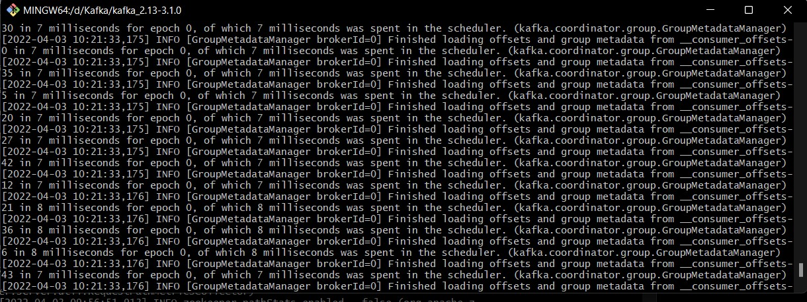
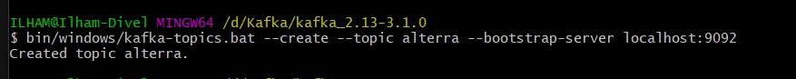
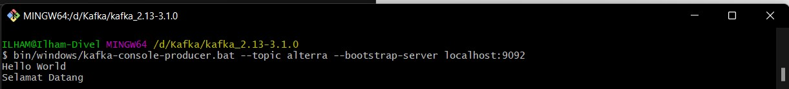
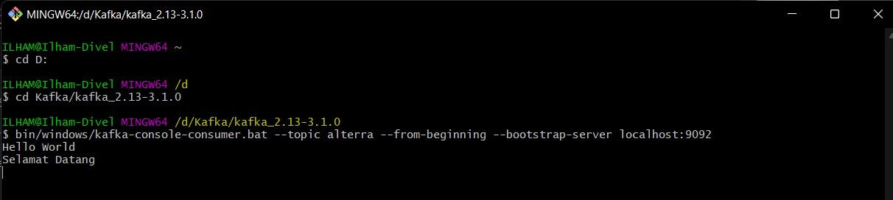
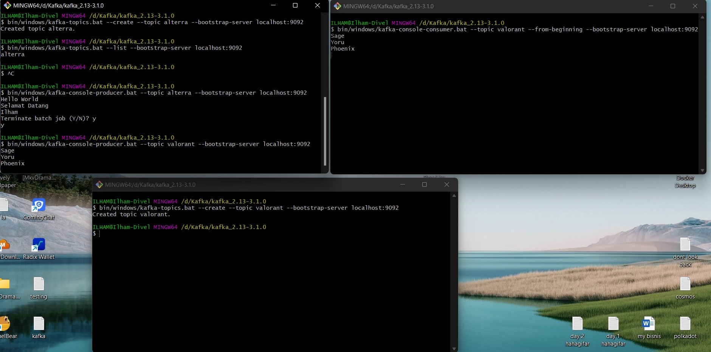
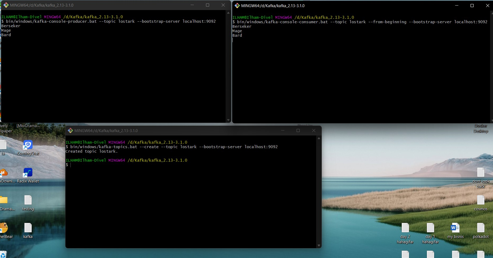
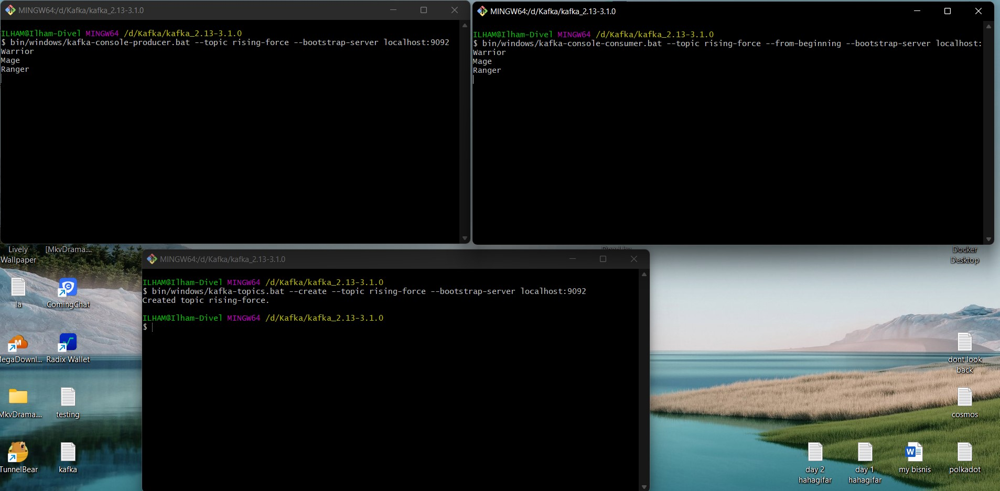

# 34_Introduction Apache Kafka

## Resume
Dalam materi ini mempelajari:
1. Apa itu Apache Kafka
2. Aplikasi yang ada di dalam kafka
3. Partition

### 1. Apa itu Apache Kafka

Kafka merupakan aplikasi message broker, yaitu aplikasi yang bisa digunakan untuk melakukan pemrorsesan publish dan subscribe. Publish mengirim data,subscribe menerima atau mengambil data.

### 2. Aplikasi yang ada di dalam kafka

Dalam kafka terdapat 4 aplikasi

- Producer

Producer adalah pihak yang mengirim data ke message broker

- Consumer

Consumer adalah pihak yang menerima data dari message broker

- Connectors

Integrasi dengan existing aplikasi contohnya database 

- Stream Processors

Mengolah data yang mengalir terus

### 3. Partition

Partition memecah topic menjadi beberapa bagian. Pada saat membuat topic kita bisa menentukan jumlah partisi. 1 Consumer hanya bisa mengkonsumsi atau subscribe satu partisi. Disarankan membuat partisi minimal sama dengan jumlah consumer, jika lebih nanti akan ada consumer yang menkonsumsi 2 partisi.

## Task

### Task 1
Pada task pertama ini saya disuruh menjalankan server kafka dan mengirimkan pesan menggunakan kafka publisher, lalu selanjutnya saya disuruh mengambil pesan tersebut menggunakan kafka consumer.

START ZOOKEEPER

START KAFKA BROKER

CREATE TOPIC

CREATE PRODUCER

CREATE CONSUMER

### Task 2
Pada task kedua ini saya disuruh mesimulasikan ulang task pertama dengan menambahkan topic baru, minimum 3 topics

TOPIC 1

TOPIC 2

TOPIC 3

