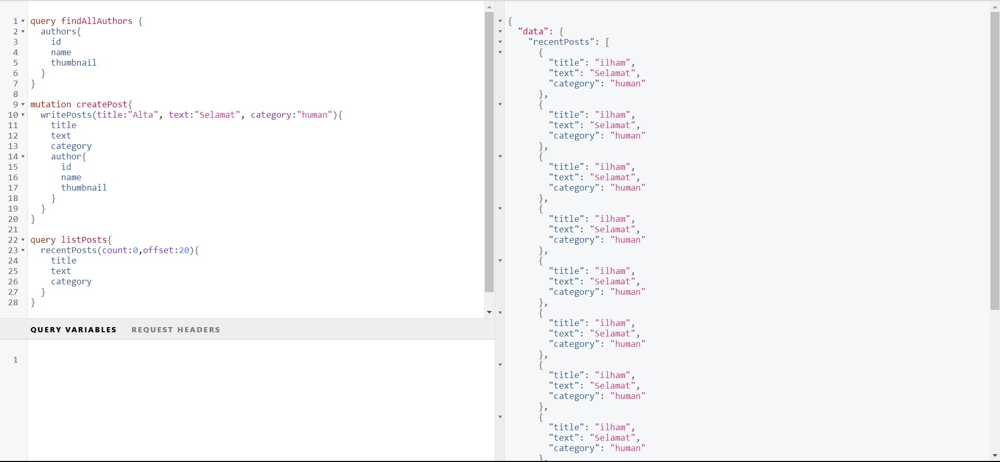
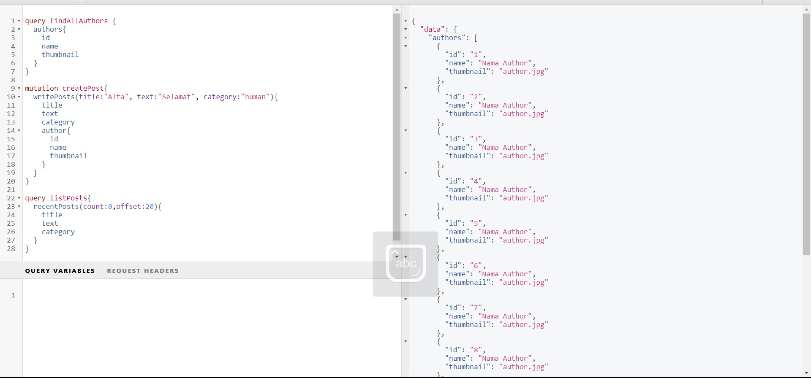
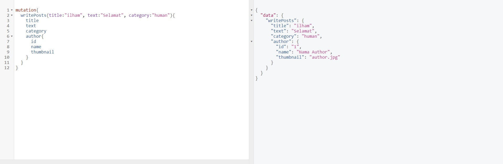

# 36_Graph QL with Spring Boot

## Resume
Dalam materi ini mempelajari:
1. Pengertian GraphQL
2. Konsep GraphQL
3. Schema

### 1. Pengertian GraphQL
Graphql adalah Bahasa query untuk API dan waktu proses untuk memenuhi query dengan data yang sudah ada.

### 2. Konsep GraphQL
Service GraphQL terbuat dari mendefinisikan tipe dan bidang pada tipe tersebut, kemudian menyediakan fungsi untuk setiap bidang pada setiap tipe

### 3. Schema
Schema adalah bagaimana bentuk data yang diinginkan didefinisikan. Sebuah schema terdiri dari satu atau banyak Type. Jenis Type yang banyak digunakan di GraphQL:

- Object Type
- Scalar Type
- Query Type
- Mutation Type
- Input Type

## Task

### Task 1
Pada task ini saya disuruh membuat project spring boot menggunakan schema yang telah disediakan.

Berikut outputnya

Query FindAllPosts

Query FindAllAuthors

Mutations writePosts

