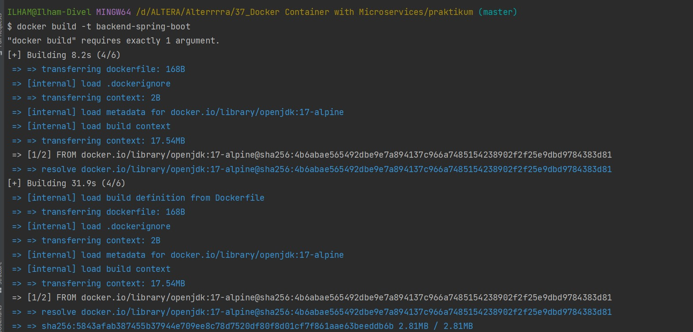
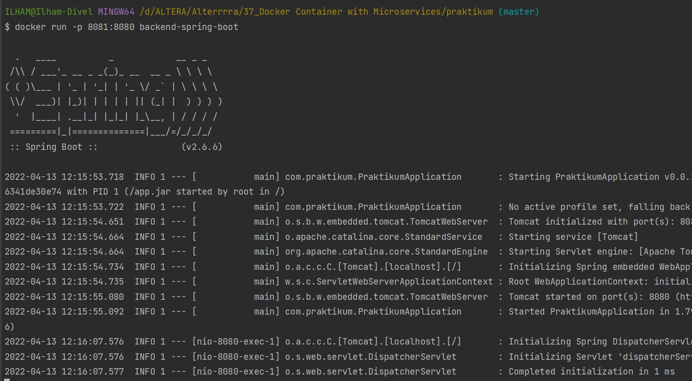
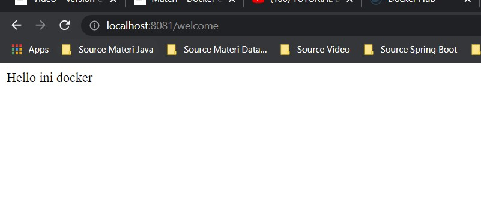

# 37_Docker Container with Microservices

## Resume
Dalam materi ini mempelajari:
1. Docker Container
2. Docker Images
3. Docker Daemon

### 1. Docker Container
Docker container bisa dianggap sebagai sebuah folder, docker container dibuat menggunakan docker daemon. Docker container ini nantinya dapat dibuild sehingga akan menghasilkan sebuah docker image dan docker image yang dihasilkan dari docker container ini dapat kita gunakan kembali untuk membuat docker container yang baru.

### 2. Docker Images
Docker images adalah sebuah template yang bersifat read only. Template ini sebenarnya adalah sebuah OS atau OS yang telah diinstall berbagai aplikasi. Fungsi dari docker images sendiri adalah membuat docker container, hanya dengan satu docker image kita dapat membuat banyak docker container.

### 3. Docker Daemon
Docker daemon adalah sebuah service yang dijalankan di dalam host dalam Operating System (OS) kita. Fungsinya adalah membangun, mendistribusikan, dan menjalankan container docker. Pengguna tidak dapat langsung menggunakan docker daemon, akan tetapi untuk menggunakan docker daemon maka pengguna menggunakan docker client sebagai perantara atau CLI.

## Task

### Task 1
Pada tugas ini saya disuruh membuat docker image dari project spring boot.

Disini saya membuat project spring boot sederhana untuk menampilkan pesan "Halo ini adalah Docker".

Pertama saya membuat file [Dockerfile](./praktikum/Dockerfile) lalu menambahkan beberapa kode.

Berikutnya saya menjalankan perintah untuk membuat docker image dengan nama backend-spring-boot

Setelah docker image berhasil dibuat selanjutnya saya jalankan docker image tersebut

Berikut hasilnya jika diakses lewat browser

