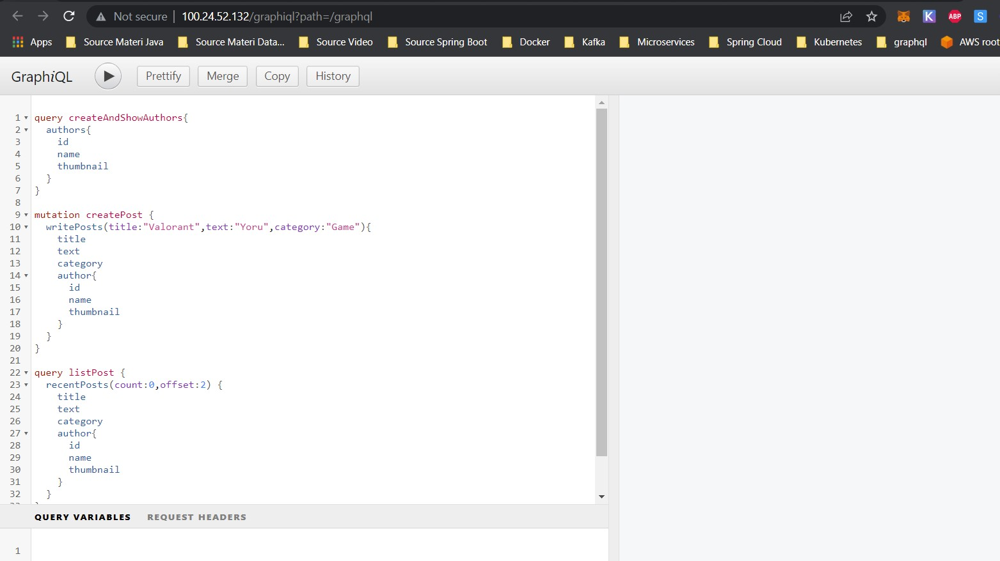

# 39_CI CD with Microservices

## Resume

Dalam materi ini, mempelajari :
1. Continuous Integration
2. Continuous Deployment
3. Automatic Deployment

### Continuous Integration
Continuous Integration (CI) adalah pengintegrasian kode ke dalam repositori kode kemudian menjalankan pengujian secara otomatis, cepat, dan sering. Kamu dapat melakukan CI ini dengan menggunakan perintah  commit.

### Continuous Deployment
Continuous Deployment (CD) adalah praktik yang dilakukan setelah proses CI selesai dan seluruh kode berhasil terintegrasi, sehingga aplikasi bisa dibangun lalu dirilis secara otomatis.

### Automatic Deployment
Automatic Deployment adalah sebuah teknik yang memungkin pengembang untuk mengirimkan kodenya baik secara full-otomatis ataupun semi-otomatis melalui beberapa tahap pengembangan, mulai dari tahap pengembangan awal sampai produksi.

## Task

Pada Task kali ini saya akan mendeploy project spring boot saya ke aws, tetapi kali ini saya menggunakan akan menggunakan github actions.

Saya telah membuat repository yang berisi project spring boot dan github workflownya, link repository ada di [Link](./praktikum/Link%20Repository.txt)

Untuk melihat workflow dalam repository tersebut  ada di folder .github/workflows

Berikut hasil akhirnya 

Proses CI ( Test , Build ) dan CD ( Deploy ) success

Project spring boot kita telah berhasil di deploy ke aws, kita bisa akses ip public lewat browser

