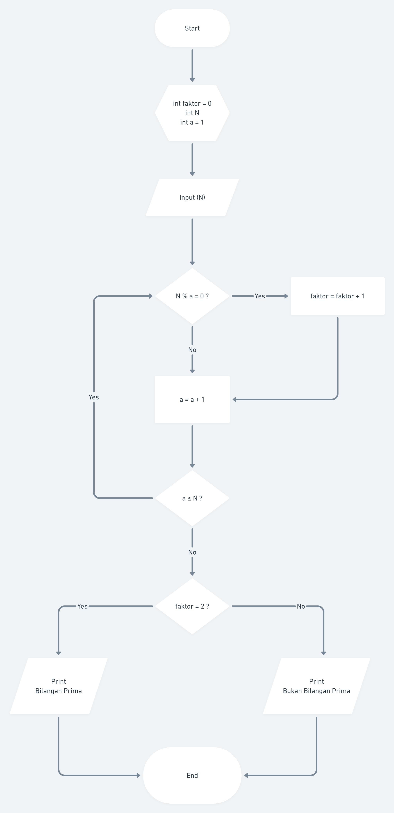
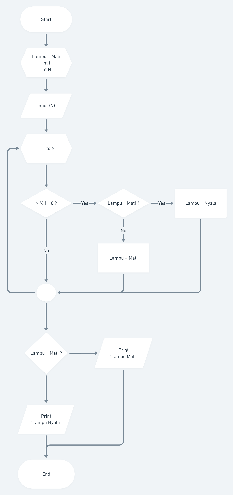

# 3_Introduction Algorithm

## Resume
Dalam materi ini mempelajari:
1. Algoritma
2. Psuedocode
3. Flowchart

### 1. Algoritma
Algoritma adalah prosedur komputasi yang didefinisikan dengan baik yang mengambil beberapa nilai sebagai <strong>input</strong> dan menghasilkan beberapa nilai sebagai <strong>output</strong>. 

### 2. Psuedocode
Pseudocode adalah istilah dalam pemograman untuk menuliskan sebuah sintaks, statment, algoritma, dan lainnya dalam bahasa yang bisa dipahami oleh manusia. Sederhananya, pseudocode merupakan bentuk representasi dari kode kita nantinya dengan versi human readable, bukan computer readable.

### 3. Flowchart
Flowchart adalah suatu bagan dengan simbol tertentu yang menggambarkan urutan dan hubungan antar proses secara mendetail.

## Task
Link Whimsical bisa dilihat di:
[Whimsical](./praktikum/file.txt)
### 1. Bilangan Prima
Dalam task ini saya disuruh membuat flowchart untuk menentukan apakah sebuah bilangan itu prima atau tidak.
Pertama saya deklarasikan variabel faktor = 0, variabel N dan variabel a = 1.
 
Pertama Algoritma ini menerima input N.

Berikutnya, melakukan pengkondisian, dimana jika N modulus a sama dengan 0,maka tambah 1 untuk nilai variabel faktor.

Selanjutnya tambah 1 untuk nilai a dan cek kondisinya,jika a kecil atau sama dengan N maka looping lagi. Jika tidak maka kita lanjut cek kondisi faktornya.

Jika variabel faktor = 2, cetak "Bilangan Prima", jika tidak, cetak "Bukan Bilangan Prima".

### 2. Tombol dan Lampu
Dalam task ini saya disuruh membuat flowchart untuk menentukan keadaan akhir dari sebuah lampu apakah mati atau menyala.

Pertama saya deklarasikan keadaan awal lampu yaitu mati, lalu variabel i dan variabel N.

Lalu algoritma ini menerima input N.

Berikutnya melakukan looping dari i=1 sampai N. Setelah itu melakukan pengkondisian N modulus i = 0, jika iya lalu kondisi lampu di cek lagi,jika lampu mati maka lampu akan dinyalakan, tapi jika lampu nyala akan dimatikan.

Selanjutnya setelah looping akan dilakukan pengkondisian akhir. Jika lampu mati maka cetak "Lampu Mati", jika lampu nyala cetak "Lampu Nyala".

