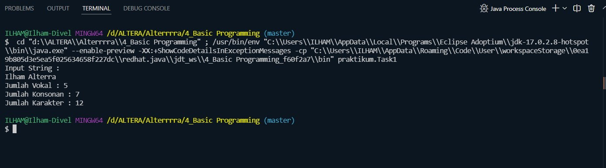
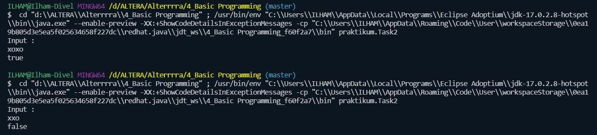
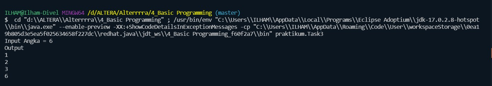
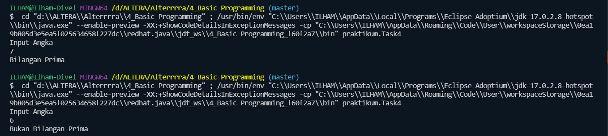
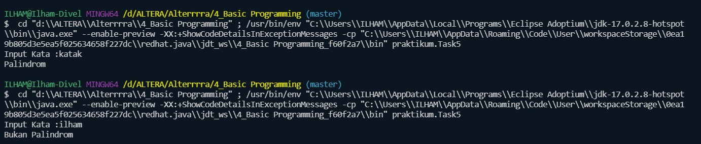
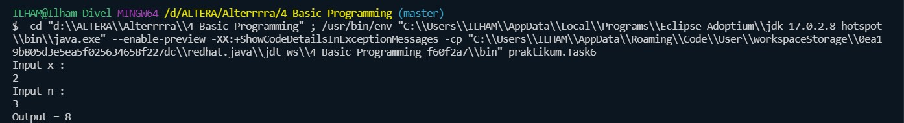
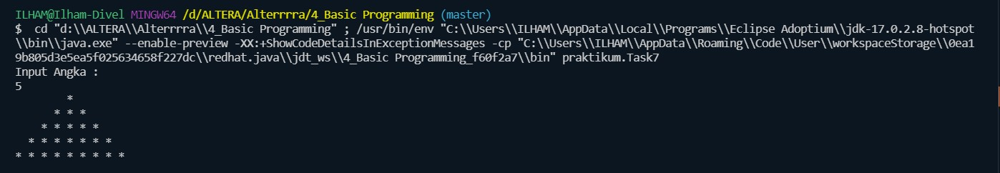
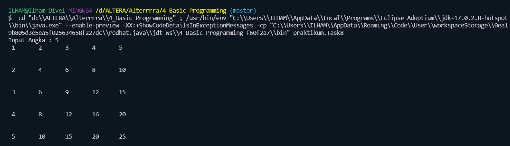

# 4_Basic Programming

## Resume

Dalam materi ini mempelajari:
1. Tipe Data
2. Branching (Percabangan)
3. Looping (Perulangan)

### 1. Tipe Data
Tipe data pada java ada 2 jenis yaitu tipe data primitif dan tipe data non primitif.

Perbedaan tipe data primitif dan non primitif pada Java adalah pada saat mengirimkan parameter ke method.

Data bertipe primitif akan dikirimkan by value (pass by value) ke method. Sedangkan non primitif akan dkirimkan by reference (pass by reference).

Bedanya adalah apabila data dikirimkan by value, maka data tersebut akan dibuat salinannya, sehingga data yang di luar method dan data yang dikirimkan ke method menempati dua variable yang berbeda dan perubahan ke salah satu variable tidak akan mempengaruhi nilai variable lainnya.

Sedangkan jika dikirimkan by reference, maka sebenarnya yang dikirimkan ke method adalah acuan/reference lokasi memory di mana data tersebut disimpan di memory. Karena itu, data yang di luar method dan data yang dikirimkan ke method mengacu ke variable yang sama. Sehingga apabila ada perubahan nilai variable di salah satu lokasi (di luar maupun di dalam method), maka nilai variable di lokasi yang lain akan ikut berubah.

Selain itu, tipe data juga terbagi kedalam beberapa kelompok, yaitu Integer, Decimal, Boolean, Char, String. Tipe data Integer digunakan untuk menampung bilangan bulat dan terdiri atas byte, short, int, long. Tipe data Decimal digunakan untuk menampung bilangan tidak bulat seperti bilangan desimal dan terdiri atas float dan double.
### 2. Branching (Percabangan)

Branching atau percabangan pada java dapat dilakukan dengan menggunakan perintah If then, If then else, dan Switch.

### 3. Looping (Perulangan)

Looping atau perulangan pada java dapat dilakukan dengan menggunakan perintah For, While, Do-while, dan For each. Untuk mengatur apakah ingin keluar atau lanjut ke perulangan selanjutnya dapat digunakan perintah break dan continue.

## Task

### Task 1
Dalam Task pertama ini saya disuruh membuat program untuk menghitung jumlah karakter vokal, konsonan dan jumlah semua karakter yang ada.

Source code dari program ini :
[Task1](./praktikum/Task1.java)

Output dari program ini :

### Task 2
Task kedua saya disuruh membuat program untuk menentukan jumlah karakter o dan karakter x pada sebuah string. Outputnya true jika jumlah karakter o sama dengan jumlah karakter x. Outputnya false jika jumlah karakter o dan x berbeda. 

Source code dari program ini :
[Task2](./praktikum/Task2.java)

Output dari program ini :

### Task 3
Pada task ketiga saya disuruh membuat program untuk mencetak faktor bilangan dari sebuah input.

Source code dari program ini :
[Task3](./praktikum/Task3.java)

Output dari program ini :

### Task 4
Pada task keempat saya disuruh menentukan apakah sebuah bilangan itu prima atau tidak.

Source code dari program ini :
[Task4](./praktikum/Task4.java)

Output dari program ini :

### Task 5
Pada task kelima ini saya disuruh membuat program untuk menentukan apakah sebuah kata itu palindrom atau tidak. Palindrom adalah sebuah kata, frasa, angka maupun susunan lainnya yang dapat dibaca dengan sama baik dari depan maupun belakang. 

Source code dari program ini :
[Task5](./praktikum/Task5.java)

Output dari program ini :

### Task 6
Pada task keenam ini saya disuruh membuat program eksponensial. Dimana program ini akan menerima dua buah input yaitu x dan n. Kemudian program akan menghitung hasil dari x^n

Source code dari program ini :
[Task6](./praktikum/Task6.java)

Output dari program ini :

### Task 7
Pada task ketujuh ini saya disuruh membuat program untuk membuat segitiga asterik dengan jumlah barisnya sesuai nilai yang di inputkan diawal.

Source code dari program ini :
[Task7](./praktikum/Task7.java)

Output dari program ini :

### Task 8
Pada task kedelapan ini saya disuruh membuat program untuk membuat tabel perkalian berdasarkan nilai yang diinputkan.

Source code dari program ini :
[Task8](./praktikum/Task8.java)

Output dari program ini :
