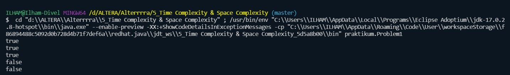
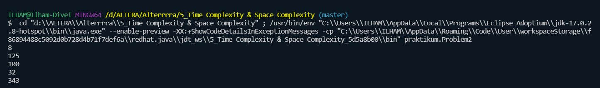

# 5_Time Complexity & Space Complexity

## Resume
Dalam materi ini mempelejari:
1. Time Complexity
2. Space Complexity
3. Constant Time O(1) dan Linear Time O(n)

### 1. Time Complexity
Time Complexity adalah suatu cara sederhana untuk mengetahui berapa lama waktu yang dibutuhkan untuk menjalankan suatu algoritma dengan input tertentu (n). Biasanya lebih dikenal dengan sebutan Big-O Notation.
Big O Notation digunakan untuk mengukur tingkat kompleksitas suatu algoritma.

### 2. Space Complexity
Space Complexity adalah seberapa besar memori yang kita gunakan untuk menjalankan suatu algoritma.

### 3. Constant Time O(1) dan Linear Time O(n)
Constant Time artinya banyaknya input yang diberikan kepada sebuah algoritma, tidak akan mempengaruhi waktu proses (runtime) dari algoritma tersebut.

Linear Time adalah ketika runtime dari fungsi kita berbanding lurus dengan jumlah input yang diberikan. Jadi semakin banyak jumlah input yang diberikan, maka waktu proses/runtime dari fungsi tersebut akan semakin besar.

## Task
## Task 1
Pada task pertama ini saya disuruh membuat solusi yang lebih optimal pada bilangan prima, dengan kompleksitas lebih cepat dari O(n)

Source code dari program ini : [Task1](./praktikum/Problem1.java)

Output dari program ini :

## Task 2
Pada task kedua ini saya disuruh membuat solusi yang lebih optimal pada bilangan eksponensial, dengan kompleksitas lebih cepat dari O(n)

Source code dari program ini : [Task2](./praktikum/Problem2.java)

Output dari program ini :
