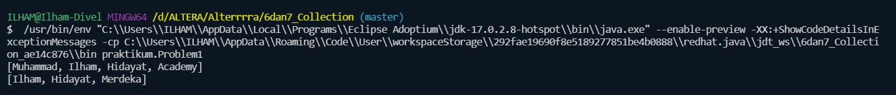
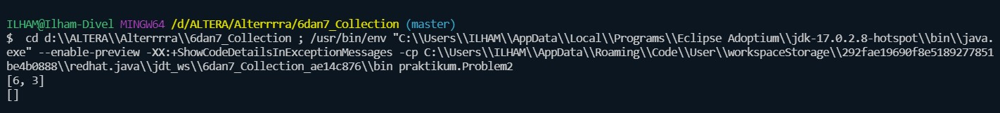
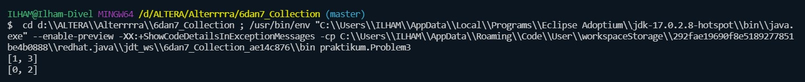
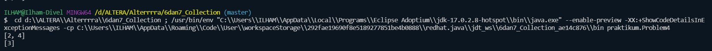
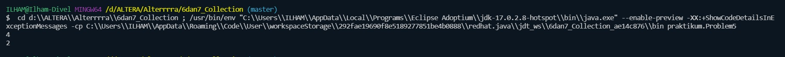
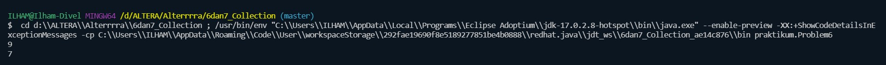

# 6 dan 7_Collection

## Resume
Dalam materi ini mempelajari:
1. Collection
2. ArrayList
3. HashMap

### 1. Collection
Collection adalah sebuah objek yang mewakili kumpulan dari suatu objek. Java menyediakan framework collection yang berfungsi untuk mengolah kumpulan data yang dapat digunakan dalam program kita.

Adapaun objek-objek collection yang terdapat pada java adalah List, Set, Map, Queue, Stack.

### 2. ArrayList
Array list merupakan sebuah class yang memungkinkan kita membuat sebuah objek untuk menampung apapun. Beberapa method dari ArrayList adalah add(), remove(), size(), get(id).

### 3. HashMap
Class HashMap merupakan class turunan dari class AbstractMap dan implementasi dari interface Map.

HashMap adalah sebuah class yang berisi sekumpulan pasangan nilai (value) dan kunci (key).

Nilai bisa dalam bentuk string, integer, boolean, float, double, dan objek. Sedangkan untuk key biasanya dalam bentuk string dan integer.

HashMap bisa dibilang seperti Array asosiatif dalam Java.

## Task

### Task 1
Pada task pertama saya disuruh membuat program untuk menggabungkan 2 array dan jangan sampai terdapat data yang sama.

Source code dari program ini: [Task1](./praktikum/Problem1.java)

Output dari program ini :

### Task 2
Pada task kedua saya disuruh membuat program, yang mana input dari programnya adalah kumpulan angka. Outputnya merupakan list/array berisi angka yang hanya muncul sekali pada input.

Source code dari program ini: [Task2](./praktikum/Problem2.java)

Output dari program ini :

### Task 3
Pada task ketiga ini menerima 2 input. Pertama adalah array yang sudah diurutkan, lalu jumlah target. Saya disuruh membuat function untuk mengembalikan index dari dua angka yang mana jika nilai dari kedua index ini dijumlahkan maka hasilnya akan sama dengan jumlah target.

Source code dari program ini: [Task3](./praktikum/Problem3.java)

Output dari program ini :

### Task 4
Pada task keempat ini saya disuruh membuat program ArrayUnique yang menerima 2 input parameter berupa array angka. Output dari program adalah satu array berupa kumpulan angka di array pertama tetapi tidak memiliki duplikasi di array kedua.

Source code dari program ini: [Task4](./praktikum/Problem4.java)

Output dari program ini :

### Task 5
Pada task kelima ini saya disuruh membuat program RemoveDuplicates dari sebuah array yang diberikan. Output dari program ini adalah panjang dari array yang telah di hapus duplikatnya.

Source code dari program ini: [Task5](./praktikum/Problem5.java)

Output dari program ini :

### Task 6
Pada task keenam ini menerima 2 input. Array dengan bilangan positif dan k bilangan positif. Saya disuruh membuat program untuk menentukan jumlah maksimum dari setiap subarray yang bersebelahan sesuai panjang k.

Source code dari program ini: [Task6](./praktikum/Problem6.java)

Output dari program ini :

