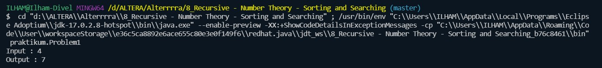
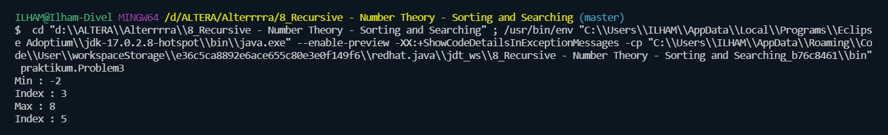
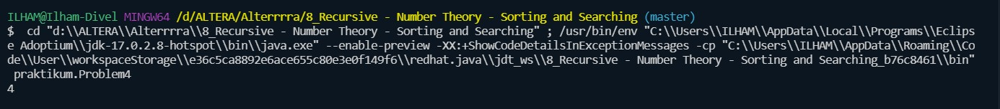
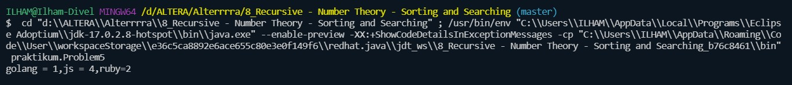

# 8_Recursive - Number Theory - Sorting and Searching

## Resume
Dalam materi ini mempelajari:
1. Recursive
2. Searching
3. Sorting

### 1. Recursive
Rekursif merupakan teknik memanggil dirinya sendiri secara berulang-ulang sampai ada kondisi yang menghentikannya. Biasanya rekursif ini dipakai untuk sesuatu yang membutuhkan perulangan seperti faktorial atau fibonacci.

### 2. Searching
Searching adalah pencarian data dengan menelusuri tempat pencarian data tersebut. Tempat pencarian data tersebut dapat berupa array dalam memori, bisa juga pada file pada external storage.

### 3. Sorting
Sorting adalah proses menyusun kembali data yang sebelumnya telah disusun dengan suatu pola tertentu, sehingga tersusun secara teratur menurut aturan tertentu. Pengurutan dapat dilakukan secara ascending (menaik) dan descending (menurun). Dalam struktur data, pengurutan data sangat penting untuk data yang bertipe data numerik ataupun karakter.

## Task

### Task 1
Pada task pertama ini saya disuruh membuat program unutk menampilkan bilangan prima sesuai dengan deret urutannya.

Source code dari program ini : [Task1](./praktikum/Problem1.java)

Output dari program ini :

### Task 2
Pada task kedua ini saya disuruh membuat program untuk mencetak bilangan fibonacci sesuai nilai input.

Source code dari program ini : [Task2](./praktikum/Problem2.java)

Output dari program ini :

### Task 3
Pada task ketiga ini saya disuruh membuat program untuk mencari bilangan minimum dan maksimum dari sebuah array dan munculkan index dari bilangan minimum dan maximum tersebut.

Source code dari program ini : [Task3](./praktikum/Problem3.java)

Output dari program ini :

### Task 4
Pada task keempat ini saya disuruh membuat program untuk menentukan maximum barang yang bisa dibeli dengan uang yang kita miliki, dengan catatan tidak boleh ada barang  yang berulang.

Source code dari program ini : [Task4](./praktikum/Problem4.java)

Output dari program ini :

### Task 5
Pada task kelima ini saya disuruh membuat program untuk menampilkan total kemunculan barang.

Source code dari program ini : [Task5](./praktikum/Problem5.java)

Output dari program ini :
