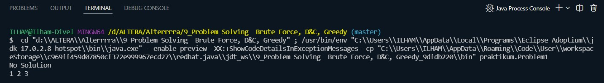
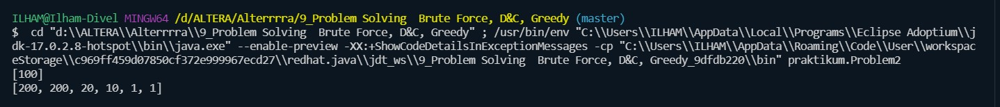
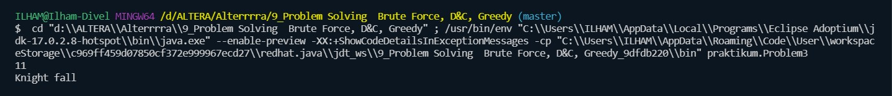
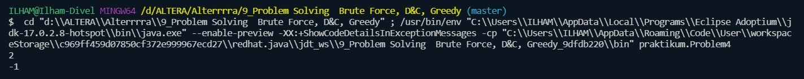

# 9_Problem Solving  Brute Force, D&C, Greedy

## Resume
Dalam materi ini mempelajari:
1. Brute Force
2. Divide & Conguer
3. Greedy

### 1. Brute Force
Alogritma Brute force adalah sebuah pendekatan yang sangat jelas(straightforward) untuk memecahkan suatu masalah, biasanya didasarkan pada pernyataan masalah (problem statement) dan definisi konsep yang dilibatkan. Algoritma brute force memecahkan masalah dengan sangat sederhana, langsung dan dengan cara yang jelas (obvious way).

### 2. Divide & Conguer
Divide and Conquer merupakan algoritma yang berprinsip memecah-mecah permasalahan yang terlalu besar menjadi beberapa bagian kecil sehingga lebih mudah untuk diselesaikan. Langkah-langkah umum algoritma Divide and Conquer :

Divide : Membagi masalah menjadi beberapa upa-masalah yang memiliki kemiripan dengan masalah semula namun berukuran lebih kecil ( idealnya berukuran hampir sama ).

Conquer : Memecahkan ( menyelesaikan ) masing-masing upa-masalah ( secara rekursif ).

Combine : Menggabungkan solusi masing-masing upa-masalah sehingga  membentuk solusi masalah semula.

### 3. Greedy
Algoritma greedy membentuk solusi langkah per langkah (step by step). Terdapat banyak pilihan yang perlu dieksplorasi pada setiap langkah solusi. Oleh karena itu, pada setiap langkah harus dibuat keputusan yang terbaik dalam menentukan pilihan. Keputusan yang telah diambil pada suatu langkah tidak dapat diubah lagi pada langkah selanjutnya.
## Task

### Task 1
Pada task pertama ini, kita memiliki tiga bilangan bulat berbeda x,y dan z yang memenuhi tiga persamaan berikut : 
x + y + z = A
xyz = B
x^2 + y^2 + z^2 = C
Saya diminta untuk membuat program untuk menyelesaikan x y z untuk nilai A, B dan C yang diberikan.

Source code dari program ini: [task1](/praktikum/Problem1.java)

Ouput dari program ini:

### Task 2
Pada task kedua ini kita diberikan sebuah array yang berisi pecahan uang. Saya diminta untuk membuat program untuk meng generate hasil penukaran uang, dan hasil penukaran uang harus memenuhi hasil paling optimal dengan jumlah minimum.

Source code dari program ini: [task2](/praktikum/Problem2.java)

Ouput dari program ini:

### Task 3
Pada task ketiga ini yaitu Dragon of Loowater, terdapat n dragon dan m knight. Setiap kepala naga memiliki diameter dan setiap knight memiliki tinggi. Kepala naga dapat dipenggal oleh knight jika diamater kepala naga lebih kecil atau sama dengan tinggi knight. Setiap knight hanya bisa memenggal 1 kepala naga. Saya disuruh membuat program untuk menentukan total minimal tinggi yang dibutuhkan untuk memenggal kepala naga.

Source code dari program ini: [task3](/praktikum/Problem3.java)

Ouput dari program ini:

### Task 4
Pada task keempat ini saya disuruh membuat program untuk mencari nilai index dalam array berdasarkan nilai x. Program ini menggunakan algoritma binary search

Source code dari program ini: [task4](/praktikum/Problem4.java)

Ouput dari program ini:

